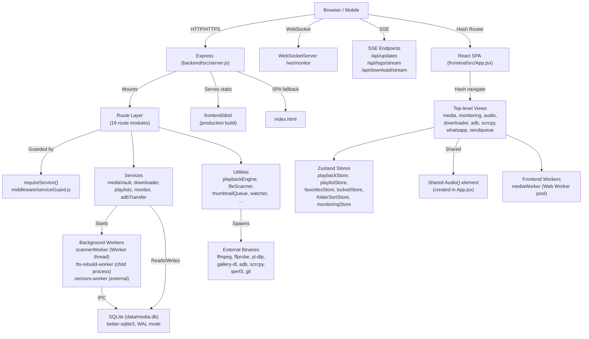

# Architecture Reference — Homelab Media Server

> **Audience:** Developers, debuggers, and anyone planning to modify or modularize this codebase.
>
> **Source of truth:** The current codebase only. Claims below are verified against actual source files. Where something could not be verified, it is marked **"Not verified from the current codebase."**
>
> **Status:** Actively developed. Major subsystems are functional but the architecture is still evolving.
>
> **Warning:** This is a single-developer, trusted-local-network application. There is **no authentication or authorization**. Do not expose it to untrusted networks.

---

# Table of Contents

1. [Project Overview](#1-project-overview)
2. [Current Feature / Module Map](#2-current-feature--module-map)
3. [Architecture at a Glance](#3-architecture-at-a-glance)
4. [Runtime / Process Model](#4-runtime--process-model)
5. [Frontend Architecture](#5-frontend-architecture)
6. [Module-by-Module Architecture](#6-module-by-module-architecture)
7. [Music Player Architecture](#7-music-player-architecture)
8. [State and Data Flow](#8-state-and-data-flow)
9. [Event Architecture](#9-event-architecture)
10. [Backend Architecture](#10-backend-architecture)
11. [File Scanner / Worker Architecture](#11-file-scanner--worker-architecture)
12. [Database Architecture](#12-database-architecture)
13. [API Reference](#13-api-reference)
14. [External Dependencies](#14-external-dependencies)
15. [Persistence and Recovery](#15-persistence-and-recovery)
16. [Realtime Architecture](#16-realtime-architecture)
17. [Security Model](#17-security-model)
18. [Deployment](#18-deployment)
19. [Development Guide](#19-development-guide)
20. [Modularity / Extraction Roadmap](#20-modularity--extraction-roadmap)
21. [Known Risks / Fragile Areas](#21-known-risks--fragile-areas)
22. [Future Architecture](#22-future-architecture)
23. [Appendix](#23-appendix)

---

# 1. Project Overview

## What It Is

Homelab Media Server is a self-hosted web application for managing, streaming, downloading, and sharing media files on a local network. It also provides system monitoring, Android file transfer, WhatsApp automation, and a precision music player with A/V sync.

## Primary Purpose

- Browse and stream video, audio, and image files from multiple media roots via a web UI.
- Automatically scan, index, and thumbnail a media library.
- Download media from YouTube, TikTok, Twitter/X, Instagram, and torrents.
- Send media to Telegram and WhatsApp with queue management and rate limiting.
- Mirror Android screens (scrcpy), transfer files via ADB, and monitor system health.
- Play music with a custom dual-video A/V sync engine.

## Current Development Status

Actively developed. The backend is at v1.0.0, the frontend at v1.0.0. No stable release boundary is enforced; the codebase is in continuous flux.

## Major Capabilities

| Capability | Status | Notes |
|---|---|---|
| Media browsing & streaming | Active | Cursor-paginated grid, HLS, direct, remux, faststart |
| Full-text search | Active | FTS5 on filenames |
| Thumbnail generation | Active | ffmpeg-based, queued |
| Playlists (XSPF) | Active | Import, CRUD, folder-based |
| Metadata editing | Active | Tags, cover art, lyrics |
| Music player | Active | Dual-video A/V sync, lyrics, queue |
| Monitoring dashboard | Active | WebSocket + SSE, system stats, Docker, processes |
| Downloader | Active | yt-dlp, gallery-dl, Telegram inbound |
| ADB transfer | Active | Push/pull with worker pool and crash recovery |
| Scrcpy | Active | Screen mirroring via node-pty |
| Send queue | Active | Telegram, WhatsApp status, channels |
| WhatsApp bot | Active | In-process, whatsapp-web.js |
| Video cache | Active | YouTube video caching with short-GOP re-encode |
| Settings | Active | ~60+ runtime-configurable settings |
| AI backend tables | Backend only | DB tables exist, no frontend UI connected |
| Git integration | Implemented, **not mounted** | Routes defined in `backend/src/routes/git.js`, frontend `GitView.jsx` exists but hits 404 |

## Design Philosophy

- Single backend process, single frontend SPA.
- Synchronous SQLite for simplicity.
- Worker threads for CPU-heavy scanning; main-thread fallback.
- "Good enough" performance over micro-optimization, with adaptive pausing when resources are scarce.
- Hash-based routing on the frontend to avoid SPA/static-server conflicts.

## Current Architectural Maturity

The system is functional but has known architectural debt:

- `App.jsx` is a 3,143-line god-object that owns routing, audio lifecycle, keyboard shortcuts, search, upload, and view orchestration.
- The sync engine in `Music.jsx` is a real-time closed-loop controller with no formal test harness; it is correct only when verified with the SYNC DEBUG overlay.
- Multiple subsystems share global `window` custom events without a formal event bus.
- Zustand stores are partially persisted to `localStorage` with no versioning or migration strategy.
- Database migrations are purely additive `ALTER TABLE … ADD COLUMN` wrapped in try/catch.

## Important Limitations

- **No authentication.** The server is intended for trusted local networks only.
- **Linux-only monitoring features.** `nbfc` (fan control) is Linux-only. No AMD-specific `ryzenadj` usage was found in the current codebase (the old documentation mentions it, but it is not present in the current source).
- **No Intel/NVIDIA GPU acceleration path.** The video cache uses VAAPI (`/dev/dri/renderD128`) when available; otherwise CPU encoding.
- **Single SQLite connection.** All queries run synchronously on the main thread.
- **No horizontal scaling.** The architecture assumes a single host.

---

# 2. Current Feature / Module Map

| Module | Frontend | Backend | Database | Realtime | External Deps | Status | Shared Dependencies |
|---|---|---|---|---|---|---|---|
| Media Vault (browse/stream) | Active (`MediaGrid`, `MediaModal`, `VideoPlayer`) | Active (`files.js`, `file.js`, `stream.js`, `thumbnails.js`) | `folders`, `files`, `files_fts` | SSE `/api/updates` | ffmpeg, ffprobe | Active | `playbackStore`, `mediaRepository`, watcher SSE |
| Playlists | Active (`PlaylistView`, `PlaylistGrid`) | Active (`playlists.js`) | `playlists`, `playlist_tracks` | — | — | Active | `favoritesStore`, `playbackStore` |
| Music Player | Active (`Music.jsx`, `MiniPlayer.jsx`) | Partial (`playback.js` stats only) | — | — | — | Active | `playbackStore`, `syncCore`, `videoSyncEngine`, `listeningTracker`, `audioOutput` |
| Monitoring | Active (`MonitoringView` + 20 pages) | Active (`monitoring.js`, `engine.js`, `websocket.js`) | `historical_metrics` | WebSocket `/ws/monitor`, SSE sessions | iperf3, nbfc, dockerode | Active | `useWebSocket`, `monitoringStore` |
| Downloader | Active (`DownloaderPage`) | Active (`downloader.js`, `downloader/manager.js`) | `send_queue` (shared), download task JSON | SSE `/api/download/stream` | yt-dlp, gallery-dl | Active | `sendRateLimit` |
| Send Queue | Active (`SendQueueView`) | Active (`send.js`, `sendRateLimit.js`) | `send_queue`, `send_settings`, `send_counters`, `send_rate_limit` | SSE `/api/download/stream` (reused) | — | Active | Telegram/WhatsApp bots |
| ADB Transfer | Active (`AdbTransfer`) | Active (`adb.js`, `adbManager.js`) | `adb_jobs`, `adb_transactions` | SSE per-job | adb | Active | — |
| Scrcpy | Active (`ScrcpyView`) | Active (`scrcpy.js`) | — | — | scrcpy, adb, node-pty | Active | — |
| WhatsApp | Active (`WhatsAppView`) | Active (`whatsapp.js`, `whatsapp-bot/`) | WhatsApp bot's own DB (separate from `media.db`) | SSE `/api/whatsapp/logs/stream` | whatsapp-web.js | Active | `botEvents` EventEmitter |
| Upload | Active (in `MediaGrid` + `App.jsx`) | Active (`upload.js`, `uploadManager.js`) | `uploads` | — | — | Active | `watcher` (auto-scan trigger) |
| Metadata | Active (in `Music.jsx`, `MediaModal`) | Active (`metadata.js`) | `files` columns | — | MusicBrainz, LRCLIB, Genius, NetEase | Active | `coverSources`, `lyricsSources` |
| Video Cache | Active (in `Music.jsx`, `CachedVideoPlayer`) | Active (`videoCache.js`) | `files.youtube_id` | SSE `/api/video-cache/progress/:id` | yt-dlp, ffmpeg | Active | `playbackEngine` |
| File Scanner | Background | Active (`watcher.js`, `fileScanner.js`, `scannerClient.js`, `scannerWorker.js`) | `folders`, `files`, `folder_generation` | SSE `/api/updates` | ffprobe | Active | `thumbnailQueue`, `maintenance` |
| Thumbnails | — | Active (`thumbnails.js`, `thumbnailQueue.js`, `thumbnailUtils.js`) | `files.has_thumb`, `files.thumb_cache_path` | — | ffmpeg | Active | `fileScanner` |
| Maintenance | Background | Active (`maintenance.js`) | All tables | — | — | Active | `adaptiveController` |
| Git | Implemented, **not mounted** (`GitView.jsx` exists) | Defined in `git.js` but **not registered in `server.js`** | — | — | git CLI | Implemented but unused | — |
| AI (backend) | **No frontend UI** | Backend tables exist (`conversations`, `messages`, `ai_*`) | `conversations`, `messages`, `ai_provider_status`, `ai_conversation_settings`, `ai_memories`, `ai_context_summaries`, `ai_pinned_messages`, `ai_model_preferences` | — | — | Backend-only | — |

**Legend:**
- **Active**: Implemented and mounted/running.
- **Implemented but unused/unmounted**: Code exists but is not reachable or not wired up.
- **Experimental**: Features flagged in code or settings as under development.
- **Planned**: Mentioned in docs or code comments but not implemented.
- **Deprecated**: None identified in current code.

---

# 3. Architecture at a Glance



## Layer Explanations

### Browser Layer
The single entry point is the backend. In production, the backend serves the built frontend (`frontend/dist/`) and handles all API, WebSocket, and SSE connections. In development, Vite proxies `/api`, `/stream`, `/file`, `/thumbnails`, `/ws`, and `/api/audio` to `https://127.0.0.1:3001`.

### Frontend Layer
`App.jsx` is the application shell. It owns hash-based routing, the shared `Audio` element, keyboard shortcuts, search, upload orchestration, and view switching. It is 3,143 lines and is the most coupled file in the project.

### Route Layer
Express routes are mounted at fixed prefixes in `server.js`. Many are wrapped with `requireService(name)` which returns 503 if the named service is stopped. Route modules are pure routers; they delegate to services and utilities.

### Service / Utility Layer
Services are lifecycle-managed (start/stop/restart) via `services/registry.js`. Utilities are plain modules that encapsulate business logic: scanning, thumbnailing, playback decisions, send scheduling, ADB transfers, etc.

### Worker Layer
- **scannerWorker**: A Node.js `Worker` thread that offloads directory traversal from the main thread. Falls back to main-thread scanning if the worker fails to initialize.
- **fts-rebuild-worker**: A child process (forked via `child_process.fork`) that rebuilds the FTS5 index. Communicates via `process.send()` IPC.
- **sensors-worker**: An external process (not started by the server) that reads `/sys/class/hwmon` and writes `/tmp/homelab_sensors.json`.
- **mediaWorker (frontend)**: Web Worker pool for offloading merge/filter/shuffle/carousel computations.

### Data Layer
A single SQLite database (`data/media.db`) accessed synchronously via `better-sqlite3`. WAL mode is enabled. All access runs on the calling thread; there is no async query API.

---

# 4. Runtime / Process Model

## What Runs At Runtime

### Single Node.js Process
The backend is a **single Node.js process** (`backend/src/server.js`). It owns:
- Express HTTP/HTTPS server
- WebSocket server (`/ws/monitor`)
- SSE endpoints
- All route handlers
- All background jobs
- The in-process WhatsApp bot
- Telegram inbound bots

### External Processes
| Process | How Started | Purpose |
|---|---|---|
| `scannerWorker` | `new Worker(...)` from `scannerClient.js` | Offloaded file scanning |
| `fts-rebuild-worker` | `fork(...)` from `db.js` | FTS5 index rebuild |
| `sensors-worker` | **Not started by server** (external/systemd/cron) | Hardware sensor reads |
| `ffmpeg` / `ffprobe` | `spawn` / `spawnSync` from utilities | Transcode, thumbnail, probe |
| `yt-dlp` | `execFile` from `downloader/manager.js`, `videoCache.js` | Downloads |
| `gallery-dl` | `spawn` from `downloader/manager.js` | Instagram/Twitter gallery downloads (fallback) |
| `adb` | `spawn` from `adbManager.js`, `scrcpy.js` | Android transfer/mirroring |
| `scrcpy` | `spawn` from `scrcpy.js` | Screen mirroring |
| `iperf3` | `spawn` from `monitoring.js` | Network benchmark |
| `nbfc` | `spawnSync` from `monitoring.js` | Fan control (Linux) |
| `git` | `spawnSync` from `routes/git.js` | Git operations (not mounted) |
| `whatsapp-bot` (Chromium) | `puppeteer` via `whatsapp-web.js` | WhatsApp automation |

### Frontend Process
In development: Vite dev server (`frontend/` directory).
In production: Served as static files by the backend Express server.

## Startup Sequence

The startup sequence in `server.js` (`startServerWithPortFallback`) is:

1. **Validate startup** — SQLite reachable, writable directories, ffmpeg/ffprobe in PATH. Abort on critical failures; warn on missing binaries.
2. **Listen on PORT** (default `3001`) with up to 5 port-fallback retries.
3. **Register all services** (`registerAllServices()` from `routes/services.js`).
4. **Start WebSocket server** (`/ws/monitor`).
5. **Start monitoring cache** (1.5s delayed) — background hardware/sensor reads.
6. **Init historical table** (0.5s delayed).
7. **Deferred DB init** (1s delayed) — seed ~60 default settings, apply migrations, deduplicate folders, create indexes, apply dynamic cache size.
8. **FTS setup** (2s delayed) — attempt rebuild via `fts-rebuild-worker`; fall back to `deltaSyncFTS()` on failure.
9. **Start monitoring engine** — begins polling collectors every 3s.
10. **Start watcher** (`startWatcher()` from `watcher.js`).
11. **Start maintenance scheduler** — WAL checkpoints, orphan cleanup, HLS cleanup, etc.
12. **Start adaptive controller** — memory/CPU-based adaptive pausing.
13. **Optimize all cached videos** (8s delayed) — faststart remux for seekability.
14. **Scan playlists** (5s delayed).
15. **Run initial incremental scan** (20s delayed) — skipped if DB is fresh (< 24h since last scan) and engine has stats.
16. **Initialize WhatsApp bot** (10s delayed, up to 5 retries) — dynamically imports `whatsapp-bot/src/connection.js`, `listener.js`, `utils.js`.

## Runtime Responsibilities

### Main Thread (Node.js)
- Express request/response lifecycle
- SQLite queries (synchronous)
- Route handlers and middleware
- WebSocket message broadcast
- SSE client management
- Service lifecycle management
- File watcher event handling
- Maintenance scheduling
- Adaptive controller decisions
- Playback engine job queue (ffmpeg concurrency limited to 2)

### Worker Threads
- `scannerWorker`: directory traversal and file hashing
- `fts-rebuild-worker`: bulk FTS5 index rebuild

### External Processes
- ffmpeg/ffprobe: spawned per-task for thumbnails, remux, transcode, probe
- yt-dlp: spawned per-download task
- gallery-dl: spawned as fallback for Instagram/Twitter galleries
- adb: spawned per ADB command
- scrcpy: spawned per session
- iperf3, nbfc, git: spawned per-request

## Shutdown Behavior

Graceful shutdown on `SIGINT`, `SIGTERM`, `SIGQUIT`:

1. Stop file watcher.
2. Stop maintenance scheduler.
3. Stop monitoring engine.
4. Stop WebSocket server.
5. Request playback shutdown + drain active ffmpeg jobs + persist playback LRU.
6. Close HTTP server (15s force timeout).

## Main-Thread Responsibilities

- All Express middleware and route handling
- All SQLite access
- SSE client writes
- WebSocket broadcast orchestration
- Service start/stop/restart
- File watcher debouncing and scan triggering
- Maintenance task scheduling
- Adaptive pausing decisions
- Playback job queuing and ffmpeg slot management

## Worker-Thread Responsibilities

- `scannerWorker`: `streamFileSystem()` directory traversal, content hashing. Returns progress/finished/error messages via `parentPort.postMessage()`.
- `fts-rebuild-worker`: Opens its own SQLite connection, creates `files_fts`, inserts missing rowids in chunks of 10,000, cleans orphans. Reports progress via `process.send()`.

---

# 5. Frontend Architecture

## Application Shell

`frontend/src/App.jsx` (3,143 lines) is the single root component and the application shell. It:

- Creates and owns the shared `Audio()` element.
- Manages hash-based routing via `utils/routeParser.js`.
- Renders one of several top-level views based on a `view` state variable.
- Renders global chrome: sidebar, header, bottom search/upload bar, MiniPlayer, FilterPanel, notifications panel.
- Listens for global keyboard shortcuts (`Space`, `L`, `M`, `N`, `B`, `J`, `G`, `H`, `K`).
- Orchestrates audio lifecycle events (`ended`, `play`, `pause`, `seeked`, `timeupdate`, `volumechange`).
- Dispatches `CustomEvent` on `window` for cross-component communication.

## App.jsx Responsibilities

| Responsibility | Mechanism |
|---|---|
| Routing | Hash-based `parseHash()` + `history.pushState`/`replaceState` |
| Audio element creation | `useRef` + `useEffect` — singleton `new Audio()` |
| Audio event handling | `addEventListener` on the shared audio element |
| Keyboard shortcuts | `keydown` listener on `window` (capture phase) |
| Global media controls | `CustomEvent` dispatch (`global-media-toggle-play`, etc.) |
| Search | Local state + `api.js` dedup fetch |
| Upload orchestration | `useUploadQueueLogic` hook + `CustomEvent('media-upload-complete')` |
| Playback resume | `sessionStorage` snapshot + `CustomEvent('audio-reload-resume')` |
| Scroll persistence | `sessionStorage` keyed by path |
| View switching | `view` state: `media`, `monitoring`, `audio`, `downloader`, `adb`, `scrcpy`, `whatsapp`, `sendqueue` |

## Routing

The frontend uses **hash-based routing** (no `react-router-dom` for the main shell). `utils/routeParser.js` exports `parseHash(hash, storage)` which returns a typed route object:

| Hash Pattern | View | Notes |
|---|---|---|
| `#/media` or `#/f/<folderId>` | Media Vault | Grid view |
| `#/f/<folderId>/v/<fileId>` | Media Vault | Folder with file selected |
| `#/media/v/<fileId>` | Media Vault | Root with file selected |
| `#/monitoring[/<subPath>]` | Monitoring | Uses `react-router-dom` internally |
| `#/downloader` | Downloader | Standalone view |
| `#/adb` | ADB Transfer | Standalone view |
| `#/scrcpy` | Scrcpy | Standalone view |
| `#/whatsapp` | WhatsApp | Standalone view |
| `#/sendqueue` | Send Queue | Standalone view |
| `#/playlists[/<playlistId>]` | Music | Playlist list/detail |
| `#/audio[/playlist/<id>/track/<fileId>]` or `#/audio/single/<fileId>` | Audio | Full music player |
| `#/vault/audio[/<fileId>]` | Vault Audio | Vault-specific audio player |

Inside `MonitoringView`, `react-router-dom` `MemoryRouter` is used with these sub-routes:
`/`, `/metrics`, `/service-control`, `/services`, `/processes`, `/tasks`, `/storage`, `/network`, `/logs`, `/alerts`, `/media`, `/settings`, `/charts`, `/queue`, `/whatsapp`, `/audio-player`, `/jobs`, `/docker`, `/sessions`, `/status`, `/downloader`.

## Component Hierarchy

```
App.jsx (shell)
├── Sidebar
├── HeaderComponents
├── MediaGrid (virtualized infinite scroll)
├── MediaModal (full-screen viewer)
│   ├── VideoPlayer
│   ├── VaultAudioPlayer
│   ├── ImageViewer
│   └── SendProgressPills
├── Music.jsx (MusicPlayer — 3,129 lines)
│   ├── Carousel
│   ├── QueuePanel
│   ├── LyricsDisplay
│   ├── MetadataEditor
│   ├── SyncOverlay (debug)
│   └── SpeakerOutputButton
├── MiniPlayer.jsx (floating bottom bar)
├── MonitoringView
│   ├── MonitoringLayout
│   │   ├── Sidebar
│   │   ├── TopBar
│   │   └── Outlet (pages)
│   └── 20 page components
├── PlaylistView.jsx (2,542 lines)
├── SendQueueView.jsx (1,806 lines)
├── AdbTransfer
├── ScrcpyView
├── WhatsAppView
├── DownloaderPage
├── FilterPanel
├── Toast
└── ServiceStoppedBanner
```

## State Management

### Zustand Stores

| Store | File | Persistence | Purpose |
|---|---|---|---|
| `playbackStore` | `store/playbackStore.js` | `localStorage` (partial) | Queue, currentTrackIndex, isPlaying, shuffle, loopMode, audioRef |
| `playlistStore` | `store/playlistStore.js` | `localStorage` (partial) | Playlist list, current playlist detail |
| `favoritesStore` | `store/favoritesStore.js` | None (in-memory) | Favorite status map |
| `lockedStore` | `store/lockedStore.js` | None (in-memory) | Lock status map |
| `folderSortStore` | `store/folderSortStore.js` | `localStorage` | Per-path filter type |
| `folderMetaSortStore` | `store/folderMetaSortStore.js` | `localStorage` | Per-path sort field + order |
| `monitoringStore` | `monitoring/stores/monitoringStore.js` | `localStorage` | Monitoring stats, connection state |
| `useDebugStore` | `debug/useDebugStore.js` | None | Debug mode state |

### Module-Level Caches (Outside React)

| Cache | File | Persistence | Purpose |
|---|---|---|---|
| `mediaRepository` | `utils/mediaRepository.js` | IndexedDB | Ordered ID indexes + LRU object cache for navigation |
| `pageCache` | `utils/pageCache.js` | None (in-memory, 256MB budget) | LRU page cache for infinite scroll |
| `thumbCache` | `utils/thumbCache.js` | None (in-memory) | Thumbnail blob cache |
| `listeningTracker` | `utils/listeningTracker.js` | `localStorage` | Per-track listening statistics |
| `trackProfileStore` | `utils/trackProfileStore.js` | None (in-memory) | Per-track sync profiles |
| `workerPool` | `utils/workerPool.js` | None | Web Worker pool for heavy computations |

## Hooks

| Hook | Purpose |
|---|---|
| `useUploadQueueLogic` | Polls `/api/upload/status` + `/api/upload/history`; cross-instance sync via `CustomEvent('upload-queue-sync')` |
| `useSendProgress` | Polls `/api/send/progress?qid=` every 500ms while send is in flight |
| `useWebSocket` | WebSocket to `/ws/monitor` with exponential backoff reconnection, heartbeat, HTTP fallback polling |
| `useDocumentHidden` | Returns `document.hidden` state |
| `useVaultMediaActions` | Per-file actions: send, favorite, lock, WA compatibility check |
| `useWaUnsupported` | Checks if video codec is unsupported by WhatsApp |
| `useServiceControl` | Fetches `/api/services`, provides start/stop/restart |
| `useToast` | Toast notification state |
| `useIsFavorite` | Reads favorite status from global store |
| `useIsLocked` | Reads lock status from global store |

## Utilities

| Utility | Purpose |
|---|---|
| `api.js` | REST API layer with request deduplication (`inFlight` Map) and response cache (`responseCache` Map, 2s TTL) |
| `playlistApi.js` | Higher-level playlist CRUD operations |
| `adbApi.js` | ADB device operations |
| `audioOutput.js` | Audio output device routing via `setSinkId()` |
| `mediaRepository.js` | Index-driven navigation with IndexedDB persistence and LRU object cache |
| `syncCore.js` | 1,665-line A/V sync core (EMA drift, adaptive thresholds, decision engine) |
| `videoSyncEngine.js` | 1,141-line video sync engine factory with memory + decision layers |
| `syncHelpers.js` | `circularDiff`, `isValidTelemetrySample` |
| `listeningTracker.js` | Per-track play-count tracking with 30s threshold |
| `pageCache.js` | LRU page cache for infinite scroll |
| `thumbCache.js` | Thumbnail blob cache with priority queue |
| `trackFilter.js` | Track search/filter parsing |
| `trackProfileStore.js` | In-memory per-track sync profile store |
| `trackSyncProfile.js` | Per-track sync profile data structure |
| `playlistQueue.js` | Queue builders for playlists |
| `routeParser.js` | Pure hash router parser |
| `workerPool.js` | Web Worker pool manager |
| `autoPlayPending.js` | Autoplay pending flag (cancellation + retry) |
| `format.js` | Bytes/speed formatting |
| `grouping.js` | Group label generation for sorted lists |
| `filenameSearch.js` | Filename-to-search-term parsing |
| `codec.js` | WhatsApp codec compatibility checks |
| `lrcParser.js` | LRC lyrics parser |
| `resourceManager.js` | Frontend resource tracking (thumbnails, worker heap) |

## Shared UI

- **Icons**: `components/icons/` — simple SVG wrappers (AudioIcon, FolderIcon, ImageIcon, TelegramLogo, VideoIcon, WaLogo).
- **Shared components**: `Carousel.jsx` (horizontal scroll strip), `QueuePanel.jsx`, `MediaControls.jsx`, `NetworkImage.jsx`, `Toast.jsx`, `ConfirmModal.jsx`, `FilterPanel.jsx`, `ServiceStoppedBanner.jsx`, `ErrorBoundary.jsx` (class component with source-map stack rewriting).
- **Monitoring shared**: `GlassCard.jsx`, `Skeleton.jsx`, `GradientBar.jsx`, `DiskIoGauge.jsx`, `StatusBadge.jsx`, `MiniGauge.jsx`.

## Global Event System

The application uses `window.dispatchEvent(new CustomEvent(...))` and `window.addEventListener(...)` for cross-component communication. There is no formal event bus library.

### Events Dispatched

| Event | Producer | Purpose |
|---|---|---|
| `audio-reload-resume` | `App.jsx` | Signals audio should resume after page reload |
| `media-upload-complete` | `App.jsx` | Triggers grid refresh after upload |
| `global-media-toggle-play` | `App.jsx` | Toggle play/pause in media/sendqueue views |
| `global-media-next` | `App.jsx` | Skip next |
| `global-media-previous` | `App.jsx` | Skip previous |
| `global-media-skip-minus5` | `App.jsx` | Seek back 5s |
| `global-media-skip-plus5` | `App.jsx` | Seek forward 5s |
| `global-media-send-status` | `App.jsx` | Trigger send status check |
| `global-media-toggle-shuffle` | `App.jsx` | Toggle shuffle in sendqueue view |
| `global-media-toggle-loop` | `App.jsx` | Cycle loop mode |
| `music-skip-next` | `App.jsx` | Skip next in audio view |
| `music-skip-prev` | `App.jsx` | Skip previous in audio view |
| `runtime-setting` | `useWebSocket.js` | Runtime setting change from backend |
| `upload-queue-sync` | `useUploadQueueLogic.jsx` | Cross-instance upload queue sync |
| `media-vault:send-changed` | `utils/api.js` | Send queue changed |

### Events Listened To

| Event | Consumer | Purpose |
|---|---|---|
| `popstate` | `App.jsx` | Browser back/forward navigation |
| `keydown` (capture) | `App.jsx` | Space/L/M/N/B/J/G/H/K shortcuts |
| `beforeunload`, `pagehide`, `visibilitychange` | `App.jsx` | Snapshot persistence, autoplay scheduling |
| `media-upload-complete` | `App.jsx` | Grid refresh |
| `audio-reload-resume` | `Music.jsx` | Clear reload resume state |
| `upload-queue-sync` | `useUploadQueueLogic.jsx` | Cross-tab sync |
| `online`, `offline`, `visibilitychange` | `useWebSocket.js` | Connection awareness |
| `devicechange` | `App.jsx` | Re-apply audio output device |

## Shared Audio Lifecycle

The shared `Audio()` element is created once in `App.jsx` and stored in both a `useRef` and `playbackStore.audioRef`. All audio players (`Music.jsx`, `MiniPlayer.jsx`, `VaultAudioPlayer.jsx`) read from the same DOM element.

- **Volume** persisted to `localStorage` (`audio.volume` as 0–100 integer).
- **Output routing** via `setSinkId()` — enforced on `play`, `loadstart`, `loadedmetadata`, `canplay`, `seeked`, `playing`, and throttled `timeupdate` (≤1/s). Re-applies on `devicechange`.
- **Ended handler** advances to next track via `playbackStore.next()`, respecting `loopMode` (`off`, `all`, `one`).
- **Snapshot on unload**: saves queue, track index, position, wasPlaying to `sessionStorage` every 5s + on `beforeunload`/`pagehide`/`visibilitychange`.
- **Reload resume**: restores snapshot on mount, schedules delayed `play()` if `wasPlaying` was true. If browser blocks autoplay (`NotAllowedError`), waits for first user `pointerdown`/`keydown`.

## Persistence

| Data | Mechanism | Key |
|---|---|---|
| Playback queue, shuffle, loop, position | `localStorage` (Zustand persist) | `playbackStore` |
| Volume, output device | `localStorage` | `audio.volume`, `audio.outputDevice` |
| Playlist state | `localStorage` | `playlistQueue`, `playlistMetadata`, `currentTrackIndex`, `currentAudioFileId` |
| Playback resume snapshot | `sessionStorage` | `playbackResumeSnapshot` |
| Listening statistics | `localStorage` | `listeningStats` |
| Folder sort/filter | `localStorage` | `folderSortState`, `folderMetaSortState` |
| Scroll positions | `sessionStorage` | `scroll:{path}` |
| Media index | IndexedDB | `media-repo` / `indexes` |
| Monitoring state | `localStorage` | `mediavault-monitoring` |

## Data Fetching

All API calls go through `utils/api.js`, which provides:
- **Request deduplication**: `inFlight` Map — concurrent identical requests share one promise.
- **Response caching**: `responseCache` Map with 2s TTL.
- **Cache invalidation**: `clearResponseCache()` on sort/filter changes.

Pagination is cursor-based (`next_cursor`, `prev_cursor`). `pageCache.js` stores fetched pages by key (`${folderId}:${sortBy}:${sortOrder}:${pageIndex}`) with a 256MB budget.

`mediaRepository.js` fetches binary 16-byte ID indexes from `/api/files/folders/<id>/index`, hydrates objects via `/api/files/batch`, and prefetches a ±60-item window around the active item.

## Realtime Updates

| Data | Mechanism | Polling / Push |
|---|---|---|
| Monitoring stats | WebSocket `/ws/monitor` + HTTP fallback | Push (WS) / 1s foreground, 15s background (poll) |
| Upload status | HTTP polling | 3s interval when active |
| Send progress | HTTP polling | 500ms interval while in flight |
| Service status | HTTP polling | 10s interval |
| File changes | SSE `/api/updates` | Push (watcher broadcasts) |
| Logs | SSE `/api/logs/stream` | Push |
| WhatsApp logs | SSE `/api/whatsapp/logs/stream` | Push |
| Sessions | SSE `/api/monitoring/sessions/stream` | Push (3s interval) |
| Download progress | SSE `/api/download/stream` | Push (1s interval) |

---

# 6. Module-by-Module Architecture

## 6.1 Media Vault (Browse & Stream)

### Responsibility
Browse folders/files with cursor pagination, stream video/audio/images, search via FTS5, generate thumbnails, toggle favorites/locks.

### Frontend
- `MediaGrid.jsx` — virtualized infinite-scroll grid (`react-window` `VariableSizeList`).
- `MediaModal.jsx` — full-screen modal viewer with carousel, send actions, send progress pills.
- `VideoPlayer.jsx` — HLS.js player with send actions, favorite toggle.
- `VaultAudioPlayer.jsx` — lightweight audio player for vault files (independent from MusicPlayer).
- `MediaControls.jsx`, `MediaControls.css` — playback controls.
- `Carousel.jsx` — horizontal track strip (virtualized, lock-to-active re-centering).
- `FilterPanel.jsx` — filter type + sort selection.
- `VaultActionBar.jsx`, `VaultBottomCluster.jsx` — vault chrome.

### Backend
- `routes/files.js` — folder listing, cursor pagination (6 sort fields × asc/desc), FTS search, batch resolve, favorites, locks, delete.
- `routes/file.js` — raw file serve with range support.
- `routes/stream.js` — playback decision engine, direct/remux/faststart/transcode/HLS serving.
- `routes/thumbnails.js` — thumbnail generation and serving.
- `utils/fileScanner.js` — streaming `opendir` traversal, `incrementalSync`, `probeVideoMetadata`.
- `utils/thumbnailQueue.js` — bounded concurrency thumbnail generation.
- `utils/thumbnailUtils.js` — ffmpeg-based thumbnail extraction.
- `utils/playbackEngine.js` — video playback decision, LRU cache, ffmpeg concurrency limiter.
- `utils/hlsGenerator.js` — HLS segment generation.
- `utils/watcher.js` — file watcher with debounced rescans and SSE broadcast.

### Database
- `folders`, `files`, `files_fts`, `folder_generation`.
- Indexes: `idx_files_cursor`, `idx_files_name`, `idx_files_mtime`, `idx_files_size`, `idx_folders_parent`, `idx_folders_path`, `idx_files_favorite`, `idx_files_locked`.

### External Dependencies
- `ffmpeg`, `ffprobe` — thumbnails, probing, remux, transcode.

### State
- Local: `App.jsx` `state` object (items, folders, loading, sort, cursors).
- Global: `favoritesStore`, `lockedStore`, `folderSortStore`, `folderMetaSortStore`, `playbackStore` (for vault audio).
- Module-level: `mediaRepository`, `pageCache`, `thumbCache`.

### Events
- SSE `/api/updates` — `folder_updated`, `stats_updated`.
- Custom: `media-upload-complete`, `audio-reload-resume`, `global-media-*`.

### API
See [API Reference](#13-api-reference) for `/api/files`, `/file`, `/stream`, `/thumbnails`.

### Shared Dependencies
- `playbackStore` (for vault audio playback)
- `mediaRepository` (for carousel navigation)
- `watcher` SSE (for live updates)

### Coupling
`App.jsx` tightly couples the vault grid, search, upload, audio lifecycle, and view routing. Extracting the vault into a standalone module would require extracting audio, routing, and state management simultaneously.

### Extraction Difficulty
**High** — `App.jsx` owns the vault lifecycle, audio, and routing. Extracting requires decoupling from the god-object shell.

---

## 6.2 Playlists

### Responsibility
XSPF playlist import, CRUD, track management, folder-based playlist creation, playlist scanning.

### Frontend
- `PlaylistView.jsx` (2,542 lines) — playlist list, detail, add-music panel, track management.
- `PlaylistGrid.jsx`, `PlaylistGridCard.jsx`, `PlaylistListRow.jsx`, `PlaylistListItemRow.jsx`, `PlaylistRow.jsx` — playlist display variants.
- `AddMusicPanel.jsx` — add tracks to playlist.

### Backend
- `routes/playlists.js` — playlist CRUD, track add/remove, XSPF import, folder-based creation.
- `utils/playlistScanner.js` — filesystem scan for XSPF files, parse and cache.
- `utils/xspfParser.js` — XSPF parser.

### Database
- `playlists`, `playlist_tracks`.

### External Dependencies
- `fast-xml-parser` — XSPF parsing.

### State
- Global: `playlistStore` (playlists, current playlist, tracks).
- Local: `App.jsx` `playlistQueue`, `currentTrackIndex`, `playlistMetadata`.

### Events
- Custom: `music-skip-next`, `music-skip-prev` (from `App.jsx`).

### API
See [API Reference](#13-api-reference) for `/api/playlists`.

### Shared Dependencies
- `playbackStore` (for playback)
- `favoritesStore` (for favorite toggling in playlist view)
- `fileScanner` (for folder-based playlist creation)

### Coupling
Playlist data flows through `App.jsx` local state to survive view transitions to MiniPlayer. The playlist view and music player are tightly coupled through shared `App.jsx` state.

### Extraction Difficulty
**Medium** — Playlist CRUD is self-contained, but the playback bridge through `App.jsx` local state creates coupling.

---

## 6.3 Music Player

### Responsibility
Full-featured music playback for playlists: cover art, lyrics, queue management, A/V sync, listening tracking, metadata editing.

### Frontend
- `Music.jsx` (3,129 lines) — full-screen music player.
- `MiniPlayer.jsx` (527 lines) — floating bottom bar.
- `Carousel.jsx` — horizontal track strip.
- `QueuePanel.jsx` — slide-up queue list.
- `LyricsDisplay.jsx`, `LyricsEditor.jsx`, `LyricsScrollController.js` — lyrics.
- `MetadataEditor.jsx` — inline metadata editing.
- `SyncOverlay.jsx` (757 lines) — A/V sync debug overlay.
- `SpeakerOutputButton.jsx` — audio output device selection.

### Backend
- `routes/playback.js` — playback stats, config, health, cleanup.
- No dedicated backend playback service; the backend serves raw audio/video and the frontend manages all playback logic.

### Database
- `files` (duration, codec_info, youtube_id, video_offset, lyrics, title, artist, album, genre).
- `listeningStats` is stored in `localStorage`, not in the database.

### External Dependencies
- None directly; uses browser `Audio` API.

### State
- Global: `playbackStore` (queue, currentTrackIndex, isPlaying, shuffle, loopMode, audioRef).
- Module-level: `listeningTracker` (singleton), `trackProfileStore` (singleton), `SharedSyncCore` (singleton), `mediaRepository`.

### Events
- Audio element events: `ended`, `play`, `pause`, `seeked`, `timeupdate`, `volumechange`, `loadstart`, `loadedmetadata`, `canplay`.
- Custom: `audio-reload-resume`, `music-skip-next`, `music-skip-prev`.

### API
- `/stream/audio/:id` — audio stream.
- `/stream/video/:id` — video stream (for background sync video).
- `/api/playback/stats` — playback stats.
- `/api/metadata/*` — metadata, cover, lyrics.

### Shared Dependencies
- `playbackStore` (shared with MiniPlayer, VaultAudioPlayer, App.jsx)
- `SharedSyncCore` (shared between MV and BG engines)
- `listeningTracker` (attached to shared audio element)
- `audioOutput.js` (device routing)

### Coupling
`Music.jsx` imports and orchestrates `SharedSyncCore`, `videoSyncEngine`, `listeningTracker`, `trackProfileStore`, `DecisionEngine`, `ExecutionQueue`, `DriftMemory`, and all analyzer modules. It is the most complex component in the frontend. It also receives props from `App.jsx` and communicates back via store updates and custom events.

### Extraction Difficulty
**High** — The music player depends on the shared audio element, shared store, shared sync core, and `App.jsx` orchestration.

---

## 6.4 Monitoring

### Responsibility
System metrics collection, alerting, Docker management, process listing, service control, network benchmarks, hardware sensors, power control.

### Frontend
- `MonitoringView.jsx` — shell with sidebar and top bar.
- 20 page components in `monitoring/pages/`.
- 7 widget components in `monitoring/widgets/`.
- Shared components: `GlassCard.jsx`, `Skeleton.jsx`, `GradientBar.jsx`, `DiskIoGauge.jsx`, `StatusBadge.jsx`, `MiniGauge.jsx`.
- `monitoring/stores/monitoringStore.js` — stats, connection state, settings.

### Backend
- `routes/monitoring.js` — 60+ endpoints for stats, history, Docker, services, processes, logs, alerts, hardware, network, sessions, queues.
- `routes/jobs.js` — background job status.
- `monitor/engine.js` — polling loop (3s interval), broadcasts via WebSocket, records snapshots every 30s.
- `monitor/websocket.js` — WebSocket server at `/ws/monitor`.
- `monitor/historical.js` — SQLite-backed historical metrics storage.
- `monitor/alerts.js` — threshold-based alerting.
- `monitor/docker.js` — Docker integration via `dockerode`.
- `monitor/services.js` — systemd service management via `systemctl`.
- `monitor/processes.js` — process listing.
- `monitor/logs.js` — log file reading.
- `monitor/platdetect.js` — platform detection.
- `monitor/webStats.js` — web request tracking.
- `monitor/monitoringCache.js` — in-memory cache for hardware sensors.
- `monitor/collectors/` — CPU, memory, disk, GPU, network, system collectors.

### Database
- `historical_metrics` — monitoring snapshots.

### External Dependencies
- `dockerode` — Docker management.
- `iperf3` — network benchmarks.
- `nbfc` — fan control (Linux).
- `cpupower` / `ryzenadj` — CPU frequency (Linux/AMD). **Not verified from the current codebase** whether `ryzenadj` is actually invoked; `nbfc` is confirmed in `monitoring.js` and `monitoringCache.js`.
- `smartctl` — SMART health.

### State
- Global: `monitoringStore` (stats, connected, refresh interval, smoothing).
- Backend: in-memory stats object, `historical_metrics` table.

### Events
- WebSocket `/ws/monitor` — JSON `{type: 'stats', data: {...}}` broadcast every 3s.
- SSE `/api/monitoring/sessions/stream` — active session updates.
- SSE `/api/monitoring/network/iperf/stream/:id` — iperf3 output.
- HTTP fallback polling (1s foreground, 15s background).

### API
See [API Reference](#13-api-reference) for `/api/monitoring`.

### Shared Dependencies
- `useWebSocket` hook (shared with no other module, but uses `monitoringStore`).
- `sessionTracker` (shared with backend logging).

### Coupling
The monitoring frontend uses `react-router-dom` internally while the rest of the app uses hash routing. This is an isolated island.

### Extraction Difficulty
**Low** — Monitoring is a self-contained module with its own layout, pages, store, and backend routes.

---

## 6.5 Downloader

### Responsibility
Download media from YouTube, TikTok, Twitter/X, Instagram, and torrents. Manage concurrent download tasks with retry logic.

### Frontend
- `DownloaderPage` inside `monitoring/pages/`.

### Backend
- `routes/downloader.js` — task CRUD, format selection, playlist download, progress SSE.
- `downloader/manager.js` (2,222 lines) — yt-dlp wrapper with format presets, concurrent limiting, error classification, retry logic, task persistence to `data/download-tasks.json`.
- `utils/ytdlp.js` — yt-dlp argument builder.
- `utils/youtube.js` — YouTube-specific helpers.

### Database
- No dedicated tables; task state is persisted to `data/download-tasks.json` (file system).
- `telegram_bot_tasks`, `telegram_task_link`, `telegram_ephemeral`, `telegram_processed` — Telegram inbound download bot state.

### External Dependencies
- `yt-dlp` — primary downloader.
- `gallery-dl` — Instagram/Twitter gallery fallback (confirmed in `downloader/manager.js`).
- `aria2c` — referenced in old docs but not found in current code. **Not verified from the current codebase.**

### State
- Backend: in-memory task map + `data/download-tasks.json` persistence.
- Frontend: no dedicated store; uses `api.js` for data.

### Events
- SSE `/api/download/stream` — task progress (1s interval).

### API
See [API Reference](#13-api-reference) for `/api/download`.

### Shared Dependencies
- `sendRateLimit` (for Telegram bot task mapping).
- `watcher` (debounced rescan after download completes).

### Coupling
Download tasks are loosely coupled; the manager is self-contained. Telegram inbound bot coupling exists through `telegramBot.js`.

### Extraction Difficulty
**Medium** — The downloader is self-contained but shares Telegram infrastructure and watcher triggers.

---

## 6.6 Send Queue

### Responsibility
Queue outbound sends to Telegram and WhatsApp (status, channel, direct). Manage retries, scheduling, captions, rate limiting, and tick-based daily posting.

### Frontend
- `SendQueueView.jsx` (1,806 lines) — queue management, status cards, reschedule, caption editing.
- `SendProgressPills.jsx`, `SendStatusPill.jsx`, `WaSendPopover.jsx`.

### Backend
- `routes/send.js` — send endpoints, queue CRUD, progress, settings.
- `utils/sendRateLimit.js` — rate limiting, scheduling, timeline building, dedup, retry.
- `utils/sendCounter.js` — Telegram/WhatsApp send counters + separator logic.
- `utils/sendDebug.js` — send lifecycle instrumentation.
- `utils/waCompat.js` — WhatsApp codec preflight and transcoding.
- `utils/telegramBot.js` — Telegram bot API wrapper, message handler, URL extraction.
- `utils/telegramAudioBot.js` — Telegram audio bot (separate instance).

### Database
- `send_queue`, `send_settings`, `send_counters`, `send_rate_limit`.
- `telegram_allowed_chats`, `telegram_bot_tasks`, `telegram_task_link`, `telegram_ephemeral`, `telegram_processed`.
- `telegram_audio_bot_tasks`, `telegram_audio_task_link`, `telegram_audio_ephemeral`, `telegram_audio_processed`.

### External Dependencies
- `node-telegram-bot-api` — Telegram bot.
- `whatsapp-web.js` (via `waCompat.js` and WhatsApp bot) — WhatsApp sending.

### State
- Backend: SQLite-backed queue with `status`, `hold_until`, `retry_count`, `pinned`, `scheduled_at`.
- Frontend: no dedicated store; uses `api.js` + `useSendProgress`.

### Events
- SSE `/api/download/stream` (reused for send progress).
- Custom `media-vault:send-changed` (from `api.js`).

### API
See [API Reference](#13-api-reference) for `/api/send`.

### Shared Dependencies
- Telegram/WhatsApp bot infrastructure.
- `sendRateLimit` (shared with downloader Telegram tasks).

### Coupling
Send queue tightly couples with Telegram and WhatsApp bots. The tick-based scheduler (`send_settings.per_day`) is a specialized subsystem.

### Extraction Difficulty
**Medium** — Queue logic is self-contained, but bot integrations create external coupling.

---

## 6.7 ADB Transfer

### Responsibility
Push/pull files between host and Android devices via ADB. Concurrent worker pool, crash recovery, conflict resolution.

### Frontend
- `AdbTransfer.jsx` — device list, directory browser, transfer UI.

### Backend
- `routes/adb.js` — device listing, directory ops, push/pull job creation, progress SSE, conflict resolution.
- `utils/adbManager.js` — ADB transfer manager with worker pool.
- `utils/adbTransaction.js` — per-file transaction state machine with crash recovery.
- `utils/adbWorkerPool.js` — worker pool for parallel ADB transfers.
- `utils/adbMetadata.js` — ADB metadata helpers.

### Database
- `adb_jobs`, `adb_transactions`.

### External Dependencies
- `adb` — Android Debug Bridge.

### State
- Backend: in-memory job map + SQLite persistence.
- Frontend: no dedicated store; uses `api.js` + `adbApi.js`.

### Events
- SSE per-job via `AdbManager.subscribeJob`.

### API
See [API Reference](#13-api-reference) for `/api/adb`.

### Shared Dependencies
- `adb` CLI.

### Coupling
ADB subsystem is relatively isolated. Crash recovery logic in `adbTransaction.js` is coupled to the SQLite schema.

### Extraction Difficulty
**Low** — Self-contained with clear boundaries.

---

## 6.8 Scrcpy

### Responsibility
Remote screen mirroring of Android devices via scrcpy.

### Frontend
- `ScrcpyView.jsx` — device selection, scrcpy session management.

### Backend
- `routes/scrcpy.js` — device listing, scrcpy start/stop/input.

### Database
- None.

### External Dependencies
- `scrcpy`, `adb`, `node-pty` — PTY shell execution.

### State
- Backend: in-memory scrcpy process map.

### API
See [API Reference](#13-api-reference) for `/api/scrcpy`.

### Shared Dependencies
- `adb` CLI (shared with ADB Transfer).

### Coupling
Low. Scrcpy is a thin wrapper around `node-pty` + `scrcpy`.

### Extraction Difficulty
**Low** — Self-contained.

---

## 6.9 WhatsApp

### Responsibility
WhatsApp Web pairing, bot message listening, outbound send to channel/status, log streaming.

### Frontend
- `WhatsAppView.jsx` — connection status, QR display, bot controls, stats.

### Backend
- `routes/whatsapp.js` — `/api/whatsapp/*` endpoints, SSE log streaming.
- Dynamically imports `whatsapp-bot/src/connection.js`, `listener.js`, `utils.js` at startup.
- `whatsapp-bot/` is a separate npm package with its own `node_modules` and SQLite database.

### Database
- WhatsApp bot uses its **own** SQLite database (not `media.db`).
- Backend `send_queue`, `send_settings`, `send_counters` are shared with the send queue.

### External Dependencies
- `whatsapp-web.js` + `puppeteer` (headless Chromium) — WhatsApp automation.
- `qrcode-terminal` — QR display in terminal (not used by frontend).

### State
- Backend: in-memory client state, bot's own SQLite.
- Frontend: no dedicated store; uses `api.js`.

### Events
- SSE `/api/whatsapp/logs/stream` — bot log streaming.
- `botEvents` EventEmitter (in `whatsapp-bot/src/connection.js`) — emits `qr`, `ready`, `disconnected`, `auth_failure`, `event`.

### API
See [API Reference](#13-api-reference) for `/api/whatsapp/*`.

### Shared Dependencies
- `pushLog` (from `utils/logCapture.js`) — bot logs forwarded to backend SSE.
- `send_queue` (shared with Send Queue).

### Coupling
The WhatsApp bot is dynamically imported at startup, creating a hard runtime dependency. The bot's own SQLite database is separate but the send queue tables in `media.db` are shared.

### Extraction Difficulty
**Medium** — The bot is a separate package but is glued into the backend via dynamic import and shared routes.

---

## 6.10 Upload

### Responsibility
Multipart file upload with Busboy, progress tracking, auto-scan, auto-thumbnail, metadata repair.

### Frontend
- Upload button in `App.jsx` bottom bar.
- `useUploadQueueLogic.jsx` — polls `/api/upload/status` + `/api/upload/history`.

### Backend
- `routes/upload.js` — upload endpoint, status, history, repair.
- `utils/uploadManager.js` — Busboy-based multipart handling, concurrent limiting, duplicate strategy, auto-scan trigger.

### Database
- `uploads` — upload session state.

### External Dependencies
- `busboy` — multipart parsing.

### State
- Backend: in-memory `activeUploads` Map.
- Frontend: no dedicated store; uses `useUploadQueueLogic`.

### Events
- Custom `media-upload-complete` (from `App.jsx`).
- Custom `upload-queue-sync` (from `useUploadQueueLogic`).

### API
See [API Reference](#13-api-reference) for `/api/upload`.

### Shared Dependencies
- `watcher` (auto-scan trigger via `startScan`).
- `thumbnailQueue` (auto-thumbnail via `addFile`).

### Coupling
Upload triggers scanner and thumbnail generation, creating implicit coupling.

### Extraction Difficulty
**Low** — Self-contained with clear boundaries.

---

## 6.11 Metadata Editing

### Responsibility
Read/write audio tags, search cover art, search/embed lyrics.

### Frontend
- `MetadataEditor.jsx` — inline metadata editing in `Music.jsx`.
- `CoverArtSearch.jsx` — cover art search.
- `LyricsDisplay.jsx`, `LyricsEditor.jsx` — lyrics display and editing.

### Backend
- `routes/metadata.js` — read metadata, update tags, cover art embed, lyrics CRUD.
- `utils/metadataWriter.js` — ffprobe + atomicparsley cover embed.
- `utils/coverSources.js` — multi-source cover art search (MusicBrainz, etc.).
- `utils/lyricsSources.js` — multi-source lyrics search (lrclib, Genius, NetEase, PyJLyric).
- `utils/lrcParser.js` — LRC parser/builder.
- `utils/lrcmux.js` — LRC muxing.
- `utils/musicbrainz.js`, `utils/genius.js`, `utils/netease.js`, `utils/pyjlyric.js` — source-specific wrappers.
- `utils/embed_cover.py`, `utils/romaji_convert.py`, `utils/pyjlyric_search.py` — Python helpers.

### Database
- `files` columns: `title`, `artist`, `album`, `genre`, `lyrics`, `codec_info`.

### External Dependencies
- `ffprobe` — metadata extraction.
- Python scripts — cover embed, romaji conversion, PyJLyric search.
- MusicBrainz, LRCLIB, Genius, NetEase APIs — cover/lyrics sources.

### State
- Backend: `files` columns.
- Frontend: `Music.jsx` local `trackMetadata`, `lyricsSynced` state.

### API
See [API Reference](#13-api-reference) for `/api/metadata`.

### Shared Dependencies
- `fileScanner` (for `getFileId`, `ensureFolder`).

### Coupling
Metadata editing is tightly coupled to `Music.jsx` UI. Backend metadata routes are isolated.

### Extraction Difficulty
**Medium** — UI is coupled to MusicPlayer; backend is self-contained.

---

## 6.12 Video Cache

### Responsibility
Download YouTube videos to local cache, optimize for seekability (short-GOP re-encode or faststart), stream cached videos.

### Frontend
- `CachedVideoPlayer.jsx` — plays cached YouTube videos.
- `Music.jsx` — YouTube ID search integration.

### Backend
- `routes/videoCache.js` — search, download, delete, stream, status.
- `utils/videoCache.js` (506 lines) — yt-dlp download, short-GOP re-encode (VAAPI or CPU), faststart optimization, cache management.

### Database
- `files.youtube_id`, `files.video_offset` — link files to cached videos.

### External Dependencies
- `yt-dlp` — download.
- `ffmpeg` — short-GOP re-encode, faststart.

### State
- Backend: in-memory `downloadProgress`, `activeDownloads`, `activeOptimizations` Maps.
- Persistence: `cache/videos/` directory.

### Events
- SSE `/api/video-cache/progress/:youtubeId`.

### API
See [API Reference](#13-api-reference) for `/api/video-cache`.

### Shared Dependencies
- `playbackEngine` (for `getPlaybackDecision`).
- `ytdlp` (shared with downloader).

### Coupling
Video cache shares `files.youtube_id` with the media vault, creating a DB coupling.

### Extraction Difficulty
**Medium** — Cache logic is self-contained but shares DB schema with media vault.

---

## 6.13 File Scanner / Maintenance

### Responsibility
Incremental filesystem scan, orphan cleanup, folder reconciliation, WAL checkpoint, HLS cleanup, metadata enrichment, FTS sync.

### Frontend
- No direct UI; triggered by `watcher.js` SSE.

### Backend
- `utils/watcher.js` — `fs.watch` recursive watcher, debounced rescans, periodic full scan, SSE broadcast.
- `utils/fileScanner.js` — `streamFileSystem()` async generator, `incrementalSync()`, `computeContentHash()`, `probeVideoMetadata()`.
- `utils/scannerClient.js` — main→worker IPC bridge.
- `utils/scannerWorker.js` — worker thread directory traversal.
- `utils/maintenance.js` — periodic maintenance tasks.
- `utils/adaptiveController.js` — memory/CPU adaptive pausing.
- `utils/thumbnailQueue.js` — thumbnail generation queue.
- `utils/thumbnailUtils.js` — thumbnail extraction helpers.

### Database
- `folders`, `files`, `folder_generation`, `files_fts`.

### External Dependencies
- `ffprobe` — video metadata probing.
- `ffmpeg` — thumbnail generation.

### State
- Backend: in-memory `watchers` array, `sseClients` array, `scanQueue` array.
- Persistence: `data/.last-scan-time`, `data/media.db`.

### Events
- SSE `/api/updates` — `folder_updated`, `stats_updated`.

### API
- `POST /api/files/refresh` — trigger incremental scan.
- `GET /api/debug/stress/scanner` — trigger scan (debug).

### Shared Dependencies
- `thumbnailQueue` (triggered after scan).
- `maintenance` (periodic cleanup).
- `adaptiveController` (resource-aware pausing).

### Coupling
Scanner tightly couples to `fileScanner`, `thumbnailQueue`, and `maintenance`. The watcher broadcasts via SSE to all connected clients.

### Extraction Difficulty
**Medium** — Scanner logic is self-contained but deeply embedded in the startup sequence and SSE broadcast chain.

---

## 6.14 Settings

### Responsibility
Runtime configuration CRUD, change history, rollback.

### Frontend
- `monitoring/pages/SettingsPage.jsx` — settings UI.

### Backend
- `routes/settings.js` — settings CRUD, history, rollback.

### Database
- `settings`, `settings_history`.

### External Dependencies
- None.

### State
- Backend: SQLite `settings` table.
- Frontend: `monitoringStore` caches settings; `runtimeSettings.js` provides in-memory cache with `reload()`.

### Events
- Custom `runtime-setting` (from `useWebSocket.js` when backend pushes setting changes).

### API
See [API Reference](#13-api-reference) for `/api/settings`.

### Shared Dependencies
- `runtimeSettings.js` (in-memory cache used by almost every backend utility).

### Coupling
Settings are a central dependency; almost every backend module reads settings via `runtimeSettings.get()`.

### Extraction Difficulty
**Low** — Self-contained CRUD module.

---

## 6.15 Services (Service Registry)

### Responsibility
Lifecycle management of background services: start, stop, restart, status.

### Frontend
- `monitoring/pages/ServiceControlPage.jsx`, `ServicesPage.jsx`.

### Backend
- `routes/services.js` — service registry + CRUD endpoints.
- `middleware/serviceGuard.js` — `requireService(name)` middleware.

### Database
- None (services are in-memory boolean flags).

### External Dependencies
- None.

### State
- Backend: in-memory service state map.

### API
See [API Reference](#13-api-reference) for `/api/services`.

### Shared Dependencies
- `requireService` middleware (used by 10+ route prefixes).

### Coupling
Service gating is a cross-cutting concern. Removing it would require removing middleware from all guarded routes.

### Extraction Difficulty
**Low** — Simple registry, but cross-cutting.

---

## 6.16 Git (Not Mounted)

### Responsibility
Full Git operations: status, diff, log, branches, tags, stash, commit, push, pull, checkout, merge, file editor, tree browser.

### Frontend
- `GitView.jsx` — exists but currently returns 404 because backend routes are not mounted.

### Backend
- `routes/git.js` — complete router with path traversal protection, but **never imported or mounted in `server.js`**.

### Database
- None (uses Git's own `.git` directory).

### External Dependencies
- `git` CLI.

### API
See [API Reference](#13-api-reference) for `/api/git/*` (implemented but not mounted).

### Shared Dependencies
- None.

### Coupling
None — the code is fully isolated but unreachable.

### Extraction Difficulty
**Low** if mounted; currently **N/A** because it is not mounted.

---

# 7. Music Player Architecture

## Overall Architecture

The Music Player is a frontend-centric subsystem with no dedicated backend playback service. The backend serves raw audio/video bytes; all playback logic, queue management, sync, and tracking lives in the browser.

```
App.jsx
  → creates shared Audio() element
  → stores in playbackStore.audioRef
  → passes to Music.jsx / MiniPlayer.jsx / VaultAudioPlayer.jsx

Music.jsx
  → reads queue from playbackStore
  → sets audio.src = /file/${fileId}
  → attaches SharedSyncCore (MV + BG video engines)
  → attaches listeningTracker
  → manages local UI state (cover, lyrics, metadata, queue panel)

MiniPlayer.jsx
  → reads same playbackStore
  → reads same sharedAudioRef
  → shows compact UI, expand button

VaultAudioPlayer.jsx
  → reads same playbackStore
  → reads same sharedAudioRef
  → lightweight, no sync engine
```

## Playback Store

`frontend/src/store/playbackStore.js` — Zustand store with `localStorage` persistence.

**Persisted state:**
- `queue` — array of track objects.
- `currentTrackIndex` — index into `queue`.
- `isPlaying` — boolean.
- `shuffle` — boolean.
- `shuffleOrder` — array of queue indices.
- `shufflePosition` — current position in shuffle order.
- `loopMode` — `'off'`, `'all'`, `'one'`.
- `playerMode` — `'full'` or `'mini'`.
- `position` — current playback position (seconds).
- `activePlaybackId` — currently playing file ID.

**Non-persisted state:**
- `audioRef` — shared `Audio()` element ref.
- `videoPlaying` — boolean for video playback state.
- `hasPlaylist`, `playlistId`, `playlistTracks` — playlist context.

**Key actions:**
- `setQueue(queue, startIndex)` — resets queue and index.
- `play()` / `pause()` / `togglePlay()`.
- `next()` / `previous()` — advance track respecting `loopMode` and `shuffleOrder`.
- `setCurrentTrackIndex(index)` — jump to track.
- `setShuffle(shuffle)` — builds or clears `shuffleOrder`.
- `clearPlayback()` — resets all state.
- `setActiveFile(fileId)` — sets `activePlaybackId`.

## Queue Lifecycle

1. User selects a playlist or track → `App.jsx` calls `setQueue(tracks, startIndex)`.
2. `Music.jsx` `useEffect` on `currentTrackIndex` (store) or `activePlaybackId` fires.
3. `audio.src = /file/${fileId}` is set, `audio.load()` called.
4. `loadGenerationRef` coalesces rapid next/prev into a single physical load.
5. `switchingRef` suppresses audio's synthetic `pause`/`emptied` events.
6. On `ended` event, `playbackStore.next()` is called.

## Active Track Lifecycle

```
Track change
  → loadGenerationRef++ (coalesce rapid changes)
  → switchingRef = true
  → audio.src = new URL
  → audio.load()
  → audio.play()
  → switchingRef = false (after 'playing' or 'canplay')
  → listeningTracker finalizes previous session, starts new session
  → SharedSyncCore resets (MV + BG engines reattach)
```

## Shared Audio Element

Created in `App.jsx` once:
```js
const sharedAudioRef = useRef(null);
useEffect(() => {
  if (sharedAudioRef.current) return;
  const audio = new Audio();
  audio.preload = 'metadata';
  audio.style.cssText = 'position:fixed;width:0;height:0;opacity:0;pointer-events:none;left:-9999px;top:-9999px;';
  document.body.appendChild(audio);
  sharedAudioRef.current = audio;
  setAudioRef(audio); // → playbackStore
  // ... volume, sinkId, ended handler setup
}, [setAudioRef]);
```

**Ownership:** `App.jsx` creates and owns the element. `Music.jsx`, `MiniPlayer.jsx`, and `VaultAudioPlayer.jsx` are consumers.

**Detach/attach pattern:** Components do not detach the audio element. They read `sharedAudioRef` from props or store. Only `App.jsx` attaches event listeners (`ended`, `play`, `pause`, `seeked`, `timeupdate`, `volumechange`, `loadstart`, `loadedmetadata`, `canplay`).

## MiniPlayer and Full Music View

- **MiniPlayer** (`MiniPlayer.jsx`): Fixed floating bar. Shows cover, play/pause, next/prev, shuffle, loop, volume. Expand button calls `onMinimize` → `App.jsx` switches `view` to `'audio'`.
- **MusicPlayer** (`Music.jsx`): Full-screen view rendered when `view === 'audio'`. Contains cover, lyrics, carousel, queue panel, metadata editor, sync overlay, video sync engines.
- **Context tracking:** `audioContextRef` in `App.jsx` records whether playback originated from `'vault'` or `'music'`:
```js
if (item.type === 'audio') {
  audioContextRef.current = 'vault';
  currentAudioFileIdRef.current = item.id;
}
```
- **Expand path:** If `audioContextRef.current === 'vault'`, expand navigates to `#/vault/audio/{fileId}` (opens `VaultAudioPlayer`). Otherwise opens Music view.

## Backend Playback Services

There is no dedicated backend playback service. The backend provides:
- `GET /stream/audio/:id` — raw audio stream with range support.
- `GET /stream/video/:id` — video stream (direct/remux/faststart).
- `GET /stream/video/:id/hls/playlist.m3u8` — HLS playlist.
- `GET /api/playback/stats` — playback cache stats (LRU, ffmpeg jobs).
- `GET /api/playback/config` — playback configuration.
- `GET /api/playback/health` — playback health check.
- `POST /api/playback/cleanup` — clean playback cache.

`utils/playbackEngine.js` manages an LRU cache of remuxed/faststarted videos, ffmpeg concurrency (max 2), and playback decisions (direct/remux/transcode/faststart).

## Listening Tracker

`frontend/src/utils/listeningTracker.js` — singleton `ListeningTracker` class.

- Attaches to the shared `<audio>` element via standard media events.
- Uses `performance.now()` for monotonic clock.
- A "session" starts on play-after-pause or fresh track load.
- `sessionAccumulated` grows each `requestAnimationFrame` tick.
- When `sessionAccumulated >= computePlayThreshold(duration)`:
  - Default threshold: **30 seconds** (`MIN_PLAY_SECONDS = 30`).
  - For tracks shorter than 60 seconds: **50% of duration**.
  - `playCount` is incremented **once per session** (guarded by `sessionPlayCounted`).
- Persists to `localStorage` key `listeningStats` with 2s debounce.
- `forcePersist()` is called on unmount and on `pagehide`/`beforeunload`.

**Important:** Listening statistics are stored in `localStorage`, not in the database. They are per-browser and not synced across devices.

## Play Count Logic

```
computePlayThreshold(duration):
  if duration <= 0: return 30
  if duration < 60: return max(1, floor(min(30, duration * 0.5)))
  return 30
```

A track must be listened to for at least the threshold duration in a single session to count as a play. Pause/resume continues the same session. Seek does not create a new session but finalizes the pre-seek interval.

## Leaderboard Integration

**Not verified from the current codebase.** The old ARCHITECTURE.md mentions leaderboard integration, but no leaderboard code was found in the current frontend or backend source.

## Persistence

### Playback State
1. **Zustand persist** → `localStorage` key `playbackStore` (queue, shuffle, loop, position, activePlaybackId).
2. **App.jsx** mirrors `playlistQueue`, `playlistMetadata`, `currentTrackIndex`, `currentAudioFileId` to `sessionStorage` and `localStorage`.
3. **Resume snapshot** on unload/reload:
```js
const snapshot = {
  queue: store.queue,
  currentTrackIndex: store.currentTrackIndex,
  activePlaybackId: store.activePlaybackId,
  position: audio ? audio.currentTime : store.position,
  wasPlaying: audio ? !audio.paused : store.isPlaying,
  playlistQueue: playlistQueueRef.current,
  playlistMetadata: playlistMetadataRef.current,
};
sessionStorage.setItem('playbackResumeSnapshot', JSON.stringify(snapshot));
```
4. **Volume** and **output device** persisted separately to `localStorage`.

## Reload Recovery

1. On mount, `App.jsx` checks `sessionStorage.getItem('playbackResumeSnapshot')`.
2. If present, hydrates store and sets `audioReloadWasPlaying` / `audioReloadResumeAt`.
3. `useEffect` detects reload via `performance.getEntriesByType('navigation')`.
4. Schedules delayed `play()`:
```js
const wasPlaying = sessionStorage.getItem('audioReloadWasPlaying') === 'true';
setTimeout(() => {
  if (wasPlaying) usePlaybackStore.getState().play();
  sessionStorage.removeItem('audioReloadWasPlaying');
  window.dispatchEvent(new CustomEvent('audio-reload-resume'));
}, 0);
```
5. `Music.jsx` listens for `audio-reload-resume` to clear `reloadResumeAtRef`.
6. If browser blocks `audio.play()` (`NotAllowedError`), `autoPlayPending` is set. First user `pointerdown`/`keydown` retries play.

## Autoplay Recovery

`utils/autoPlayPending.js` — module-level `canceled` flag.
- `cancelAutoPlayPending()` — sets `canceled = true`.
- `isAutoPlayPendingCanceled()` — checks flag.
- `resetAutoPlayPending()` — clears flag.

On first user interaction after a blocked autoplay:
```js
if (isAutoPlayPendingCanceled()) return;
resetAutoPlayPending();
audio.play().catch(() => { /* handle */ });
```

## Sync Engine

### Overall Architecture

`SharedSyncCore` (`utils/syncCore.js`) is the "brain" shared between two `videoSyncEngine` instances:
- **MV** (main video, non-looping)
- **BG** (background/blur video, looping)

It tracks per-engine statistics with:
- `EMATracker` (α=0.02 for drift, α=0.005 for bias)
- `RollingStats` — mean, sigma, sample count
- `Histogram` — drift distribution
- `DecisionCounter` — action counts
- `SeekTelemetry` — seek pipeline latencies
- `VideoLifecycleTracker` — first-frame, decode-stable latencies

### Key Adaptive Behaviors

- **Bias compensation:** learned only in stable states; subtracted from raw drift.
- **Adaptive thresholds:** soft = 2σ (clamped 8–40ms), hard = 4σ (clamped 200–500ms) once `isFullyAdaptive` (≥100 samples).
- **Confidence-Graduated Startup:** composite confidence = min(decoder, render, scheduler, clock). Learning rate for bias scales with confidence.
- **Seek pipeline tracking:** records `seekStart → seeked → stable` latencies.
- **Spike attribution:** classifies drift spikes as `SEEK_COMPLETE`, `SEEK_LATENCY`, `SCHEDULER`, `DECODER`, `DRIFT_ACCUMULATION`, `CLOCK_AUDIO`, `CLOCK_VIDEO`, `CLOCK_BOTH`.
- **Replay log:** ring buffer of 100k events for debugging.

### Sync Overlay / Debugging

`SyncOverlay.jsx` (757 lines) — debug overlay rendered inside `Music.jsx` when enabled. Registers global singletons:
```js
export function registerSyncCore(core) { _coreRef = core; }
export function registerAudioRef(ref) { _audioRef = ref; }
export function registerMvRef(ref) { _mvRef = ref; }
export function registerBgRef(ref) { _bgRef = ref; }
// ... etc
```

Displays: drift triangle diagram, EMA values, sigma, adaptive thresholds, confidence scores, decision output, seek telemetry, memory snapshots, analyzer evidence.

### Sync Profiles

`utils/trackProfileStore.js` — `TrackProfileStore` class, in-memory per-track `TrackSyncProfile`.
`utils/trackSyncProfile.js` — per-track sync profile data structure.

**Not verified from the current codebase** whether these are persisted to the database or only in-memory.

### Event Flow

```
audio.play()
  → listeningTracker._onPlay() → starts session
  → SharedSyncCore tick (30ms interval)
    → videoSyncEngine (MV) tick
      → read drift sensor (audio.currentTime vs video.currentTime)
      → compute drift
      → DriftMemory.record()
      → computeDerivedMetrics()
      → getConstraints()
      → decide() → HOLD / SET_RATE / SOFT_SEEK / HARD_SEEK
      → ExecutionQueue.execute() → setRate() / seek()
    → videoSyncEngine (BG) tick (same loop)
  → SyncOverlay reads registrations → renders telemetry
```

### Seek Behavior

- `softSeek`: `video.currentTime = target` (relies on keyframe proximity).
- `hardSeek`: `video.currentTime = target` with `video.pause()` → `video.play()` after `seeked` event.
- Seek pipeline tracked: `seekStart → seeked → stable`.
- Spike attribution distinguishes seek-induced drift from sustained drift.

### Pause/Resume Behavior

- `audio.pause()` → `listeningTracker._onPause()` → finalizes current session interval.
- `audio.play()` → `listeningTracker._onPlay()` → starts new session.
- Sync engines continue ticking during pause (they track drift even when paused, for re-stabilization).

### Track Transitions

- `ended` event on audio → `playbackStore.next()` → `Music.jsx` reacts to store change → loads next track.
- Guard against double-advance via `switchingRef` and `loadGenerationRef`.
- Shuffle order respects `shuffleOrder` array; loop modes (`off`, `all`, `one`) control end-of-queue behavior.

### Failure Modes

1. **Bang-bang rate oscillation**: `playbackRate` stuck at extreme values (0.85 / 1.15). Usually caused by threshold misconfiguration or insufficient adaptation samples.
2. **Persistent drift**: Sync sits at 10ms+ drift forever. Usually indicates decoder starvation or missing bias compensation.
3. **Soft-seek artifacts**: Frame repeats/strobe on sparse-keyframe videos. Soft-seek should be avoided when keyframe distance > soft threshold.
4. **Sync engine crash**: No crash recovery; if `videoSyncEngine` throws, the overlay stops updating and audio/video drift silently.
5. **Memory leak**: `SharedSyncCore` replay log is a ring buffer of 100k events; if not pruned, it grows unbounded.

### Important Invariants

1. There is exactly **one** shared `Audio()` element for the entire app.
2. `SharedSyncCore` is a singleton shared between exactly two engines (MV + BG).
3. `listeningTracker` is a singleton attached to the shared audio element.
4. Play count is incremented at most **once per session**.
5. `switchingRef` must be `true` during programmatic `audio.src` changes to prevent store flicker.
6. `loadGenerationRef` ensures only the latest track change is honored.

### Safe Modification Rules

- Do not change `alpha` values in `EMATracker` without verifying with the SYNC DEBUG overlay.
- Do not change threshold clamping ranges without verifying adaptive behavior.
- Do not modify `ExecutionQueue` coalescing logic without understanding the 100ms cooldown.
- Do not remove `switchingRef` or `loadGenerationRef` guards.
- Always test with the SYNC DEBUG overlay after any sync engine change.

---

# 8. State and Data Flow

## Important State Table

| State | Owner | Persistence | Producers | Consumers | Notes |
|---|---|---|---|---|---|
| Playback queue | `playbackStore` + `App.jsx` | `localStorage` + `sessionStorage` | `App.jsx` (view change, playlist select) | `Music.jsx`, `MiniPlayer.jsx`, `VaultAudioPlayer.jsx`, `listeningTracker` | Queue survives view transitions via `App.jsx` local state |
| Current track index | `playbackStore` | `localStorage` | `playbackStore.next/previous/setCurrentTrackIndex` | `Music.jsx`, `MiniPlayer.jsx` | |
| Playback position | `playbackStore` + `audio.currentTime` | `localStorage` (store only) | `audio.timeupdate` (throttled) | `Music.jsx`, resume logic | `audio.currentTime` is the source of truth; store is a mirror |
| isPlaying | `playbackStore` | `localStorage` | `audio.play/pause/ended` events | `Music.jsx`, `MiniPlayer.jsx`, `VaultAudioPlayer.jsx` | `switchingRef` suppresses false toggles during track changes |
| Shuffle order | `playbackStore` | `localStorage` | `setShuffle(true)` → `buildShuffleOrder(queue)` | `playbackStore.next/previous` | Fixed order generated once per queue |
| Loop mode | `playbackStore` | `localStorage` | UI toggle | `playbackStore.next/previous` | `'off'`, `'all'`, `'one'` |
| Favorites | `favoritesStore` | None (in-memory) | `PATCH /api/files/:id/favorite` | `MediaGrid`, `MediaModal`, `PlaylistView` | Optimistic; refetched on folder load |
| Locks | `lockedStore` | None (in-memory) | `PATCH /api/files/:id/lock` | `MediaGrid`, `MediaModal` | Optimistic; refetched on folder load |
| Folder sort/filter | `folderSortStore`, `folderMetaSortStore` | `localStorage` | UI selection | `App.jsx` fetch logic | Per-path key |
| Media index | `mediaRepository` | IndexedDB | `/api/files/folders/:id/index` | `Carousel.jsx`, `MediaModal.jsx`, navigation | Revalidated via `folder_generation` |
| Object cache | `mediaRepository` | None (in-memory, LRU 300) | `/api/files/batch` hydration | `MediaModal.jsx`, `VideoPlayer.jsx` | 256MB page cache for infinite scroll |
| Listening stats | `listeningTracker` | `localStorage` | `requestAnimationFrame` ticks | `Music.jsx` (leaderboard — not verified) | Per-browser, not synced |
| Scanner state | `watcher.js` + `scannerClient.js` | None (in-memory) | `fs.watch` events, periodic timer | SSE clients via `/api/updates` | Single-flight scan queue |
| Thumbnail queue | `thumbnailQueue.js` | None (in-memory) | `scanForMissing()` + post-scan | `thumbnailQueue.js` drain | Rebuilt from DB on startup |
| Send queue | SQLite `send_queue` | SQLite | `/api/send/*` endpoints | `SendQueueView.jsx`, `useSendProgress` | Persistent across restarts |
| Monitoring stats | `monitoringStore` + backend in-memory | `localStorage` (frontend) + `historical_metrics` (backend) | WebSocket `/ws/monitor` | Monitoring pages | 1s throttle on frontend |
| Service state | Backend in-memory | None | `POST /api/services/:name/:action` | `ServiceControlPage.jsx`, `ServiceStoppedBanner.jsx` | Gated by `requireService` middleware |
| Settings | SQLite `settings` | SQLite | `/api/settings/*` | All modules via `runtimeSettings.get()` | ~60+ defaults, additive migrations |
| ADB jobs | SQLite `adb_jobs` + in-memory | SQLite | `/api/adb/*` | `AdbTransfer.jsx` | Crash recovery via `adb_transactions` |
| Download tasks | `data/download-tasks.json` | File system | `/api/download/*` | `DownloaderPage` | Not in SQLite |
| WhatsApp client state | In-process memory + bot's own SQLite | Bot's SQLite | `whatsapp-web.js` events | `WhatsAppView.jsx` | Separate DB from `media.db` |

## Key Data Flows

### Folder Browse Flow
```
User clicks folder
  → App.jsx: setState({ currentFolderId, loading: true })
  → App.jsx: fetchNextPage(folderId, sortBy, sortOrder)
    → api.js: cachedFetch('/api/files?dir_id=...')
      → backend: filesRouter GET /
        → stmts.getFilesByCursor.get()
        → JSON response
  → App.jsx: setState({ items, hasMore, nextCursor })
  → MediaGrid.jsx: re-renders with virtualized list
```

### Video Playback Flow
```
User clicks video
  → App.jsx: view = 'media', selectedFile = file
  → MediaModal.jsx: renders VideoPlayer.jsx
  → VideoPlayer.jsx: hls.js or <video> src = /file/${fileId}
    → backend: fileRouter GET /:id
      → sendFile(path, { Accept-Ranges: true })
  → User plays
    → VideoPlayer.jsx: <video>.play()
    → If HLS: HLS.js handles segment fetches
    → If direct: browser streams with range requests
```

### Audio Playback Flow
```
User clicks audio
  → App.jsx: audioContextRef = 'vault' or 'music'
  → App.jsx: setQueue(tracks, index) or setActiveFile(fileId)
  → Music.jsx / VaultAudioPlayer.jsx: audio.src = /file/${fileId}
  → audio.load() → audio.play()
  → App.jsx audio 'ended' event → playbackStore.next()
  → listeningTracker tracks session via RAF
  → (if Music.jsx) SharedSyncCore attaches MV + BG video engines
```

### Scan Flow
```
fs.watch event / periodic timer
  → watcher.js: debounce 2s
  → watcher.js: runIncrementalScan()
    → scannerClient.startScan('periodic')
      → if worker ready: postMessage({type:'scan', source:'periodic'}) to scannerWorker
        → scannerWorker: streamFileSystem() + incrementalSync()
        → scannerWorker: postMessage({type:'scan_finished', ...})
      → if worker failed: runScanMainThread('periodic')
        → fileScanner.incrementalSync()
    → buildThumbCacheAsync()
    → addFile() for newFiles → thumbnailQueue
    → broadcastFolderUpdate() → SSE clients
    → broadcast stats_updated → SSE clients
```

### Send Flow
```
User clicks "Send to Telegram"
  → MediaModal.jsx: sendToTelegram(fileId)
    → api.js: POST /api/send/telegram { fileId }
      → backend: sendRouter POST /telegram
        → sendRateLimit.enqueue()
        → SQLite send_queue INSERT
        → startSendScheduler() (if not running) processes queue
          → telegramBot.sendMedia()
          → update send_queue status
    → useSendProgress: poll /api/send/progress?qid=...
```

---

# 9. Event Architecture

## Browser Custom Events

| Event | Producer | Consumer | Purpose |
|---|---|---|
| `audio-reload-resume` | `App.jsx` | `Music.jsx` | Resume audio after page reload |
| `media-upload-complete` | `App.jsx` | `App.jsx` (self) | Refresh grid after upload |
| `global-media-toggle-play` | `App.jsx` | `MediaModal.jsx`, `SendQueueView.jsx` | Toggle play/pause |
| `global-media-next` | `App.jsx` | `MediaModal.jsx`, `SendQueueView.jsx` | Skip next |
| `global-media-previous` | `App.jsx` | `MediaModal.jsx`, `SendQueueView.jsx` | Skip previous |
| `global-media-skip-minus5` | `App.jsx` | `MediaModal.jsx`, `SendQueueView.jsx` | Seek back 5s |
| `global-media-skip-plus5` | `App.jsx` | `MediaModal.jsx`, `SendQueueView.jsx` | Seek forward 5s |
| `global-media-send-status` | `App.jsx` | `MediaModal.jsx` | Trigger send status check |
| `global-media-toggle-shuffle` | `App.jsx` | `SendQueueView.jsx` | Toggle shuffle |
| `global-media-toggle-loop` | `App.jsx` | `SendQueueView.jsx` | Cycle loop mode |
| `music-skip-next` | `App.jsx` | `Music.jsx` | Skip next in audio view |
| `music-skip-prev` | `App.jsx` | `Music.jsx` | Skip previous in audio view |
| `runtime-setting` | `useWebSocket.js` | `MonitoringView.jsx` | Backend pushed setting change |
| `upload-queue-sync` | `useUploadQueueLogic.jsx` | `useUploadQueueLogic.jsx` (cross-instance) | Sync upload mutations across tabs |
| `media-vault:send-changed` | `utils/api.js` | `MediaModal.jsx`, `SendQueueView.jsx` | Send queue mutation notification |

## SSE Streams

| Stream | Producer | Consumer | Purpose |
|---|---|---|
| `/api/updates` | `watcher.js` | `App.jsx` (not directly used) | File change notifications, stats updates |
| `/api/logs/stream` | `utils/logCapture.js` | Debug/log viewers | Application log stream |
| `/api/whatsapp/logs/stream` | `routes/whatsapp.js` | `WhatsAppView.jsx` | WhatsApp bot log stream |
| `/api/monitoring/sessions/stream` | `routes/monitoring.js` | `SessionsPage.jsx` | Active session updates (3s interval) |
| `/api/download/stream` | `routes/downloader.js` | `DownloaderPage.jsx`, `SendQueueView.jsx` | Download task progress (1s interval) |
| `/api/monitoring/network/iperf/stream/:id` | `routes/monitoring.js` | `NetworkPage.jsx` | iperf3 benchmark output |
| ADB job progress | `AdbManager.subscribeJob` | `AdbTransfer.jsx` | Per-ADB-job SSE |

## WebSocket

| Channel | Producer | Consumer | Purpose |
|---|---|---|
| `/ws/monitor` | `monitor/websocket.js` | `useWebSocket.js` → `monitoringStore` | Live monitoring stats (3s broadcast) |

## Worker Messages

### Backend Scanner Worker

| Message | Sender | Receiver | Purpose |
|---|---|---|
| `{type:'scan', source}` | `scannerClient.js` | `scannerWorker.js` | Start scan |
| `{type:'scan_started', source}` | `scannerWorker.js` | `scannerClient.js` | Scan started |
| `{type:'scan_progress', source, phase}` | `scannerWorker.js` | `scannerClient.js` | Progress update |
| `{type:'scan_finished', source, stats, newFiles}` | `scannerWorker.js` | `scannerClient.js` | Scan complete |
| `{type:'scan_error', source, error}` | `scannerWorker.js` | `scannerClient.js` | Scan failed |
| `{type:'worker_ready'}` | `scannerWorker.js` | `scannerClient.js` | Worker initialized |

### Backend FTS Rebuild Worker

| Message | Sender | Receiver | Purpose |
|---|---|---|
| `{type:'progress', done, total}` | `fts-rebuild-worker.mjs` | `db.js` | Rebuild progress |
| `{type:'done', ok, count, error}` | `fts-rebuild-worker.mjs` | `db.js` | Rebuild complete |

### Frontend Media Worker

| Message | Sender | Receiver | Purpose |
|---|---|---|
| `{id, type, payload}` | `workerPool.js` | `mediaWorker.js` | Task request (merge/filter/shuffle/carouselSetup) |
| `{id, result, error}` | `mediaWorker.js` | `workerPool.js` | Task result |

---

# 10. Backend Architecture

## Express Application

`backend/src/server.js` creates the Express app, mounts middleware and routes, and manages the full lifecycle.

### Middleware Stack
1. `cors()` — CORS headers.
2. `compression({ threshold: 1024 })` — gzip/deflate for responses > 1KB.
3. `express.json()` — JSON body parsing.
4. `sessionMiddleware` (from `utils/sessionTracker.js`) — tracks active sessions by IP + User-Agent. Auto-cleans stale sessions (>5 min) every 30s.
5. `trackRequest` (from `monitor/webStats.js`) — records method + path for live metrics.
6. `requireService(name)` (from `middleware/serviceGuard.js`) — returns 503 if named service is stopped.

### Route Layer

17 mounted route modules + inline handlers:

| Prefix | Module | Guard |
|---|---|---|
| `/api/files` | `routes/files.js` | `requireService('mediaVault')` |
| `/api/search` | `routes/files.js` (alias) | `requireService('mediaVault')` |
| `/file` | `routes/file.js` | `requireService('mediaVault')` |
| `/thumbnails` | `routes/thumbnails.js` (after static) | `requireService('mediaVault')` |
| `/stream` | `routes/stream.js` | `requireService('mediaVault')` |
| `/api/monitoring` | `routes/monitoring.js` | none |
| `/api/monitoring/jobs` | `routes/jobs.js` | none |
| `/api/services` | `routes/services.js` | none |
| `/api/settings` | `routes/settings.js` | none |
| `/api/playback` | `routes/playback.js` | none |
| `/api/download` | `routes/downloader.js` | `requireService('downloader')` |
| `/api/upload` | `routes/upload.js` | none |
| `/api/adb` | `routes/adb.js` | `requireService('adbTransfer')` |
| `/api/playlists` | `routes/playlists.js` | none (scan/refresh guarded) |
| `/api/playlists/scan` | — | `requireService('playlists')` |
| `/api/playlists/:id/refresh` | — | `requireService('playlists')` |
| `/api/metadata` | `routes/metadata.js` | `requireService('mediaVault')` |
| `/api/scrcpy` | `routes/scrcpy.js` | none |
| `/api/send` | `routes/send.js` | none |
| `/api/video-cache` | `routes/videoCache.js` | none |
| `/api/whatsapp/*` | `routes/whatsapp.js` (via `setupWhatsAppRoutes`) | none |
| `/health` | inline | none |
| `/api/ready` | inline | none |
| `/api/updates` | inline (SSE) | none |
| `/api/logs/stream` | inline (SSE) | none |
| `/api/logs` | inline | none |
| `/api/folders/:id` | inline | none |
| `/api/debug` | inline | none |
| `/api/debug/resources` | inline | none |
| `/api/debug/stress/scanner` | inline | none |
| `/api/debug/stress/folders` | inline | none |

**Note:** `routes/git.js` is defined but **never imported or mounted** in `server.js`.

### Service Layer

`services/registry.js` — simple lifecycle registry:
- `mediaVault` — watcher + maintenance + thumbnail queue
- `downloader` — yt-dlp manager
- `playlists` — playlist scanner
- `monitor` — monitoring engine + WebSocket
- `adbTransfer` — ADB push/pull manager

Services are started/stopped via `POST /api/services/:name/:action`.

### Utility Layer

Utilities are plain modules imported by routes and other utilities. Key utilities:

| Utility | Purpose |
|---|---|
| `db.js` | SQLite connection + prepared statements + FTS setup |
| `runtimeSettings.js` | In-memory settings cache with `get()`/`reload()` |
| `fileScanner.js` | Directory traversal, incremental sync, probing |
| `scannerClient.js` / `scannerWorker.js` | Worker-thread scanner bridge |
| `thumbnailQueue.js` / `thumbnailUtils.js` | Thumbnail generation |
| `playbackEngine.js` | Video playback decisions, LRU cache, ffmpeg limiter |
| `hlsGenerator.js` | HLS segment generation |
| `videoCache.js` | YouTube video caching + optimization |
| `ytdlp.js` / `youtube.js` | yt-dlp wrappers |
| `metadataWriter.js` | Embedded metadata read/write |
| `coverSources.js` / `lyricsSources.js` | Cover/lyrics search |
| `sendRateLimit.js` / `sendCounter.js` / `sendDebug.js` | Send queue logic |
| `telegramBot.js` / `telegramAudioBot.js` | Telegram bots |
| `waCompat.js` | WhatsApp codec compatibility |
| `adbManager.js` / `adbTransaction.js` / `adbWorkerPool.js` | ADB transfer |
| `maintenance.js` | Periodic maintenance |
| `adaptiveController.js` | Memory/CPU adaptive pausing |
| `resourceManager.js` | Subsystem resource tracking |
| `sessionTracker.js` | Active session tracking |
| `logCapture.js` | In-memory log buffer for SSE |
| `watcher.js` | File watcher with SSE broadcast |
| `playlistScanner.js` / `xspfParser.js` | Playlist discovery |
| `uploadManager.js` | Multipart upload handling |
| `deterministicShuffle.js` | Seedable shuffle |
| `avSync.js` | A/V sync drift store |
| `fileResolver.js` | Multi-root file path resolution |

### Middleware

| Middleware | Purpose |
|---|---|
| `serviceGuard.js` (`requireService`) | 503 if service stopped |
| `sessionTracker.js` (`sessionMiddleware`) | Track active sessions |
| `compression` | Gzip/deflate |
| `cors` | CORS headers |
| `express.json` | JSON body parsing |
| `trackRequest` (inline) | Request counting for monitoring |

### Service Registry

Services are registered in `routes/services.js` via `registerAllServices()`. Each service has `start()`, `stop()`, `restart()`, `getStatus()` methods.

### Background Jobs

| Job | Trigger | Interval | Purpose |
|---|---|---|---|
| Monitoring collection | `startEngine()` | 3s | Poll system stats |
| Monitoring broadcast | `engine.js` | 3s | WebSocket broadcast |
| Historical snapshot | `engine.js` | 30s | Record to `historical_metrics` |
| Alert check | `engine.js` | 3s | Check thresholds |
| Maintenance | `startMaintenanceScheduler()` | Configurable | WAL checkpoint, orphan cleanup, HLS cleanup, ANALYZE |
| Scanner periodic | `watcher.js` | 15min | Full incremental scan |
| Adaptive controller | `startAdaptiveController()` | Configurable | Memory/CPU pausing |
| Watcher debounced | `watcher.js` | 2s after fs event | Incremental scan on file change |
| Playlist scan | `server.js` setTimeout | 5s after listen | Scan for XSPF playlists |
| FTS setup | `server.js` setTimeout | 2s after listen | FTS index build |
| Cached video optimize | `server.js` setTimeout | 8s after listen | Faststart remux for cached videos |
| Send scheduler | `startSendScheduler()` | Tick-based | Process send queue |
| WhatsApp init | `server.js` setTimeout | 10s after listen | Connect WhatsApp bot |

### File Scanner

See [Section 11](#11-file-scanner--worker-architecture).

### File Watcher

`utils/watcher.js`:
- Uses `node:fs.watch()` recursively on each `MEDIA_ROOT`.
- Debounces filesystem events by 2s.
- Runs periodic full scan every 15 minutes.
- First scan at 6 minutes after startup.
- Broadcasts SSE updates to connected clients.
- Falls back from worker-based scan to main-thread scan if worker fails.

### Thumbnail System

`utils/thumbnailQueue.js` + `utils/thumbnailUtils.js`:
- `scanForMissing()` queries DB for files where `has_thumb = 0 OR has_thumb = 2` and `thumb_cache_path IS NULL`.
- Batches of 20 queued, processed with configurable concurrency (default 4).
- Between batches: 500ms delay to avoid overwhelming ffmpeg.
- Images: `generateImageThumbnail`.
- Audio: `hasEmbeddedCover` → `extractEmbeddedThumbnail` or `generateAudioPlaceholder`.
- Video: `hasEmbeddedCover` → `extractEmbeddedThumbnail` or `extractFrameThumbnail`.
- All via ffmpeg `spawn`.

### Upload System

`utils/uploadManager.js` + `routes/upload.js`:
- Busboy-based multipart parsing.
- Concurrent limiting (configurable via `upload.concurrent` setting).
- Max file size (configurable via `upload.maxSizeGB`).
- Duplicate strategy: skip/overwrite/rename.
- Auto-scan trigger after upload.
- Auto-thumbnail after upload.
- Metadata repair modes: fast/balanced/full.

### Playback System

`utils/playbackEngine.js`:
- LRU cache of remuxed/faststarted videos (max 10,000 entries).
- ffmpeg concurrency limiter (max 2 active jobs).
- Playback decision logic: direct → remux → faststart → transcode → WebM → HLS.
- Cache cleanup based on age and size settings.
- Integrity verification via content hash.

### External Process Execution

| Binary | Invoked From | Purpose | Failure Mode |
|---|---|---|
| `ffmpeg` | `thumbnailQueue.js`, `playbackEngine.js`, `stream.js`, `videoCache.js` | Thumbnails, remux, transcode, faststart, short-GOP re-encode | Logs error, falls back or returns failure |
| `ffprobe` | `fileScanner.js`, `playbackEngine.js` | Codec probing, duration extraction | Duration stays 0, compatibility checks skipped |
| `yt-dlp` | `downloader/manager.js`, `videoCache.js`, `youtube.js` | Downloads | Silent failure, returns `[]` |
| `gallery-dl` | `downloader/manager.js` | Instagram/Twitter gallery fallback | Silent failure, returns error |
| `adb` | `adbManager.js`, `scrcpy.js` | Android transfer/mirroring | Returns error, job marked failed |
| `scrcpy` | `scrcpy.js` | Screen mirroring | Returns error, process killed |
| `iperf3` | `routes/monitoring.js` | Network benchmark | Returns "iperf3 not found" |
| `nbfc` | `routes/monitoring.js` | Fan control | Silent failure |
| `git` | `routes/git.js` | Git operations | Returns error (not mounted anyway) |
| `smartctl` | `monitor/collectors/disk.js` | SMART health | Silent failure |

### Error Handling

- Global `unhandledRejection` handler in `server.js` logs errors.
- Route handlers use try/catch and return 500 on unexpected errors.
- `validateStartup()` aborts on critical failures (SQLite unreachable, unwritable directories); warns on missing ffmpeg/ffprobe.
- Worker failures fall back to main-thread execution (`scannerClient.js`, `db.js` FTS).
- WhatsApp bot initialization retries up to 5 times with exponential backoff.

### Logging

`utils/logger.js` — structured logger with category-based log levels. Logs are written to files under `logs/` (e.g., `logs/backend/`, `logs/playback/`, `logs/monitoring/`). `utils/logCapture.js` maintains an in-memory buffer for `/api/logs/stream` SSE.

---

# 11. File Scanner / Worker Architecture

## Current Implementation

### Components

| Component | File | Role |
|---|---|---|
| Watcher | `utils/watcher.js` | `fs.watch` recursive watcher, debounced rescans, periodic scan, SSE broadcast |
| Scanner client | `utils/scannerClient.js` | Main→worker IPC bridge, scan queue |
| Scanner worker | `utils/scannerWorker.js` | Worker thread: directory traversal + incremental sync |
| File scanner | `utils/fileScanner.js` | Core scanning logic (also used for main-thread fallback) |
| Thumbnail queue | `utils/thumbnailQueue.js` | Post-scan thumbnail generation |
| Maintenance | `utils/maintenance.js` | Periodic cleanup |

### Flow

```
fs.watch event on MEDIA_ROOT
  → watcher.js: debounce 2s
  → watcher.js: runIncrementalScan()
    → scannerClient.startScan('incremental')
      → if worker ready:
        → postMessage({type:'scan', source:'incremental'}) → scannerWorker
          → scannerWorker: streamFileSystem() [opendir async generator]
          → scannerWorker: incrementalSync()
            → ensureFolder() for each directory
            → batch compare filesystem vs DB (size + mtime)
            → upsert new/changed files
            → delete orphans
          → postMessage({type:'scan_finished', newFiles, stats})
        → scannerClient: resolve promise
        → buildThumbCacheAsync()
        → addFile() for newFiles → thumbnailQueue
      → if worker failed:
        → runScanMainThread('incremental')
          → fileScanner.incrementalSync()
          → buildThumbCache()
    → broadcast stats_updated → SSE clients
    → broadcast folder_updated → SSE clients
```

### Worker Contract

**Main → Worker:**
```js
{ type: 'scan', source: 'periodic' | 'incremental' | 'manual' }
```

**Worker → Main:**
```js
{ type: 'worker_ready' }
{ type: 'scan_started', source, timestamp }
{ type: 'scan_progress', source, phase: 'scanning' | 'hashing', timestamp }
{ type: 'scan_finished', source, stats, newFiles, elapsed, timestamp }
{ type: 'scan_error', source, error, timestamp }
```

### Concurrency Control

- Only one scan runs at a time (`scanInProgress` flag in `scannerClient.js`).
- If a scan is requested while another is running, `pendingRescan` is set so another runs immediately after.
- `fileScanner.js` processes directory entries in batches of 16 via `Promise.all`.
- DB upserts happen inside a single transaction per batch.

### Single-Flight Behavior

`scannerClient.js` maintains a `scanQueue` (in-memory FIFO) and `scanInProgress` flag. Only one scan is active; additional requests are serialized via `pendingRescan`.

### Queueing

- **Scan queue:** in-memory array in `scannerClient.js`.
- **Thumbnail queue:** in-memory array in `thumbnailQueue.js` (bounded concurrency, default 4).

### Fallback Behavior

If `scannerWorker` fails to initialize or crashes:
1. `useWorker` flag set to `false`.
2. All subsequent scans run on the main thread via `fileScanner.incrementalSync()`.
3. A warning is logged: `"[watcher] Scanner worker init failed, falling back to main-thread scan"`.

### Thumbnail Handling

- After each scan, `buildThumbCacheAsync()` scans `THUMBNAIL_DIR` to build `existingThumbs` Set.
- `thumbnailQueue.scanForMissing()` queries DB for files needing thumbnails.
- `thumbnailQueue.drainQueue()` processes items with configurable concurrency.
- Between batches: 500ms delay to avoid overwhelming ffmpeg.

### Why the Worker Exists

Directory traversal with `opendir` and content hashing can be CPU-intensive for large libraries. The worker thread prevents blocking the main thread's Express request handlers during scans.

### What Must Remain on the Main Thread

- SQLite writes (better-sqlite3 is synchronous and not thread-safe across connections without careful coordination).
- SSE broadcasts (`watcher.js` writes directly to `res` objects).
- `fs.watch` event handling (Node's `fs` module is main-thread only for watchers).

### What Happens When Worker Startup Fails

`scannerClient.js` catches the error, logs a warning, and sets `useWorker = false`. All subsequent scans fall back to `fileScanner.incrementalSync()` on the main thread.

---

# 12. Database Architecture

## Database Files

| File | Purpose |
|---|---|
| `data/media.db` | Primary SQLite database |
| `data/media.db-wal` | WAL (Write-Ahead Log) |
| `data/media.db-shm` | Shared memory for WAL |
| `backend/data/.scan-trigger` | Manual scan trigger (file system) |
| `data/.last-scan-time` | Last scan timestamp (BigInt, ms since epoch) |
| `data/download-tasks.json` | Download task persistence |
| `data/alerts.json` | Alert thresholds + history |
| `whatsapp-bot/.wwebjs_auth/` | WhatsApp bot session data |
| `credentials/.wwebjs_auth/` | WhatsApp bot session data (backup?) |

## SQLite Configuration

```js
db.pragma('journal_mode = WAL');
db.pragma('synchronous = NORMAL');
db.pragma('temp_store = MEMORY');
db.pragma('cache_size = -80000');   // ~80MB
db.pragma('mmap_size = 4294967296'); // 4GB
db.pragma('page_size = 32768');     // 32KB
```

- **WAL mode** enabled for concurrent reads during writes.
- **Synchronous NORMAL** — balances durability and performance.
- **80MB page cache** — sufficient for ~112K files.
- **4GB mmap** — prevents kernel over-mapping.
- **32KB pages** — larger pages for better sequential I/O.

## Connection Model

Single `better-sqlite3` connection opened at module load in `db.js`. All queries are **synchronous** prepared statements. The connection is shared globally via `globalThis.db` and `globalThis.stmts`.

**Important:** There is no connection pool. All queries block the calling thread. The scanner worker (`fts-rebuild-worker.mjs`) opens its **own** SQLite connection for bulk index rebuilds.

## Tables

### Media Core

| Table | Columns | Purpose |
|---|---|---|
| `folders` | `id` (PK), `path` (UNIQUE), `parent_id`, `depth`, `file_count`, `total_size`, `last_scanned`, `last_updated` | Directory tree |
| `files` | `id` (TEXT PK), `dir_id` → `folders.id`, `name`, `type`, `ext`, `size`, `mtime`, `duration`, `has_thumb`, `thumb_cache_path`, `last_accessed`, `access_count`, `last_verified`, `created_at`, `codec_info`, `is_stream_compatible`, `youtube_id`, `video_offset`, `faststart_state`, plus migrated: `title`, `artist`, `album`, `genre`, `lyrics`, `is_favorite`, `is_locked` | Media file records |
| `folder_generation` | `folder_id` (PK), `generation` | Per-folder index generation counter (bumped by triggers on any file mutation) |

### Search

| Table | Columns | Purpose |
|---|---|---|
| `files_fts` | FTS5 virtual table on `files(name)` | Full-text search (unicode61, diacritics removed) |

### Playlists

| Table | Columns | Purpose |
|---|---|---|
| `playlists` | `id` (PK), `path` (UNIQUE), `title`, `track_count`, `total_duration`, `total_size`, `available_tracks`, `missing_tracks`, `deleted_at` | Playlist headers |
| `playlist_tracks` | `id` (PK), `playlist_id` → `playlists.id` (ON DELETE CASCADE), `track_index`, `location`, `resolved_path`, `title`, `artist`, `album`, `duration`, `file_exists`, `file_size`, `file_mtime` | Playlist track entries |

### Send Queue / Telegram / WhatsApp

| Table | Columns | Purpose |
|---|---|---|
| `send_queue` | `id` (PK), `file_id`, `target`, `status`, `hold_until`, `completed_at`, `error`, `debug`, `caption`, `sort_order`, `scheduled_at`, `processing_started_at`, `retry_count`, `attempt_log`, `pinned` | Outbound send jobs |
| `send_settings` | `id` (PK, CHECK=1), `tick_enabled`, `debug_mode`, `share_only_target`, `per_day` | Queue behavior settings |
| `send_counters` | `id` (PK, CHECK=1), `telegram_count`, `whatsapp_count` | Send counters |
| `send_rate_limit` | `id` (PK, CHECK=1), `date`, `count`, `last_send_at` | Rate limit state |
| `telegram_allowed_chats` | `id` (PK), `chat_id` (UNIQUE), `created_at` | Authorized Telegram chats |
| `telegram_bot_tasks` | `user_msg_id` (PK), `chat_id`, `queued_msg_id`, `task_ids`, `total`, `finished`, `cleaned` | Inbound Telegram download tasks |
| `telegram_task_link` | `task_id` (PK), `user_msg_id` | Task → message mapping |
| `telegram_ephemeral` | `msg_id` (PK), `chat_id`, `delete_at` | Auto-delete Telegram messages |
| `telegram_processed` | `msg_id` (PK), `ts` | Dedup processed messages |
| `telegram_audio_bot_tasks` | Same as `telegram_bot_tasks` | Audio bot task mapping |
| `telegram_audio_task_link` | Same as `telegram_task_link` | Audio bot task mapping |
| `telegram_audio_ephemeral` | Same as `telegram_ephemeral` | Audio bot ephemeral messages |
| `telegram_audio_processed` | Same as `telegram_processed` | Audio bot dedup |

### ADB Transfers

| Table | Columns | Purpose |
|---|---|---|
| `adb_transactions` | `id` (PK), `job_id`, `device`, `src`, `dst`, `size`, `status`, `attempts`, `error_type`, `transferred_bytes`, `speed` | Per-file ADB transactions |
| `adb_jobs` | `id` (PK), `type`, `device_id`, `sources_json`, `dest`, `status`, `conflict_strategy`, `progress`, `speed` | ADB transfer jobs |

### AI (Backend Only, No Frontend UI)

| Table | Columns | Purpose |
|---|---|---|
| `conversations` | `id` (PK), `local_id`, `title`, `pinned`, `provider`, `model`, `updated_at` | AI conversations |
| `messages` | `id` (PK), `conversation_id` → `conversations.id` (ON DELETE CASCADE), `role`, `content`, `tool_calls`, `created_at` | AI chat messages |
| `ai_provider_status` | — | Provider health |
| `ai_conversation_settings` | — | Per-conversation overrides |
| `ai_memories` | — | Memory system |
| `ai_context_summaries` | — | Context compaction summaries |
| `ai_pinned_messages` | — | Pinned messages |
| `ai_model_preferences` | — | Model favorites/hidden |

### Settings

| Table | Columns | Purpose |
|---|---|---|
| `settings` | `key` (PK), `value`, `type`, `category`, `label`, `description`, `options`, `updated_at` | Runtime configuration |
| `settings_history` | `id` (PK), `setting_key`, `old_value`, `new_value`, `type`, `action`, `timestamp` | Settings change audit log |

### Monitoring

| Table | Columns | Purpose |
|---|---|---|
| `historical_metrics` | — | Monitoring snapshots (schema in `monitor/historical.js`) |

### Uploads

| Table | Columns | Purpose |
|---|---|---|
| `uploads` | — | Upload session state + metadata repair tracking |

## Relationships

```
folders (1) ──< (N) files
  ON DELETE CASCADE: deleting a folder does NOT auto-delete files (no FK declared)
  BUT: orphan cleanup in maintenance.js removes files whose dir_id no longer exists

playlists (1) ──< (N) playlist_tracks
  ON DELETE CASCADE

conversations (1) ──< (N) messages
  ON DELETE CASCADE

adb_jobs (1) ──< (N) adb_transactions
  (no explicit FK; linked by job_id string)
```

## Important Indexes

```sql
CREATE INDEX IF NOT EXISTS idx_files_cursor ON files(dir_id, created_at DESC, id DESC);
CREATE INDEX IF NOT EXISTS idx_files_name ON files(dir_id, name COLLATE NOCASE, id);
CREATE INDEX IF NOT EXISTS idx_files_mtime ON files(dir_id, mtime DESC, id);
CREATE INDEX IF NOT EXISTS idx_files_size ON files(dir_id, size DESC, id);
CREATE INDEX IF NOT EXISTS idx_folders_parent ON folders(parent_id);
CREATE INDEX IF NOT EXISTS idx_folders_path ON folders(path);
CREATE INDEX IF NOT EXISTS idx_files_favorite ON files(is_favorite DESC, id);
CREATE INDEX IF NOT EXISTS idx_files_locked ON files(is_locked DESC, id);
CREATE INDEX IF NOT EXISTS idx_playlist_tracks_playlist ON playlist_tracks(playlist_id);
CREATE INDEX IF NOT EXISTS idx_playlist_tracks_index ON playlist_tracks(playlist_id, track_index);
CREATE INDEX IF NOT EXISTS idx_playlists_deleted ON playlists(deleted_at);
CREATE INDEX IF NOT EXISTS idx_adb_tx_job ON adb_transactions(job_id);
CREATE INDEX IF NOT EXISTS idx_adb_tx_status ON adb_transactions(status);
CREATE INDEX IF NOT EXISTS idx_adb_jobs_status ON adb_jobs(status);
CREATE INDEX IF NOT EXISTS idx_send_queue_status ON send_queue(status);
CREATE INDEX IF NOT EXISTS idx_conversations_local_id ON conversations(local_id);
CREATE INDEX IF NOT EXISTS idx_conversations_pinned ON conversations(pinned);
CREATE INDEX IF NOT EXISTS idx_conversations_updated ON conversations(updated_at DESC);
CREATE INDEX IF NOT EXISTS idx_messages_conversation ON messages(conversation_id, id ASC);
CREATE INDEX IF NOT EXISTS idx_memories_conversation ON ai_memories(conversation_id);
CREATE INDEX IF NOT EXISTS idx_memories_enabled ON ai_memories(enabled, pinned DESC);
CREATE INDEX IF NOT EXISTS idx_summaries_conversation ON ai_context_summaries(conversation_id);
CREATE INDEX IF NOT EXISTS idx_pinned_conversation ON ai_pinned_messages(conversation_id);
```

## FTS

`files_fts` — FTS5 virtual table on `files(name)` with `unicode61 remove_diacritics 1` tokenizer.

Triggers keep it in sync on insert/delete/update of `files.name`.

Full rebuild is done by `fts-rebuild-worker.mjs` (child process) in chunks of 10,000 rowids. If the worker fails, `deltaSyncFTS()` inserts missing rowids and removes orphans on the main thread.

## Transactions

- DB writes in `fileScanner.js` are wrapped in explicit transactions.
- `deferredDbInit()` uses a transaction for bulk setting inserts.
- `maintenance.js` uses transactions for bulk cleanup.
- `db.js` FTS delta sync uses individual prepared statements (no explicit transaction wrapper).

## Concurrency

- **WAL mode** allows concurrent reads during writes.
- **Single connection** — all queries run synchronously on the calling thread.
- **No connection pooling** — the scanner worker opens its own connection for FTS rebuilds.
- **No async queries** — `better-sqlite3` prepared statements are synchronous.

## Worker Database Connections

- `fts-rebuild-worker.mjs` opens its own `new Database(DB_PATH)` connection.
- No other worker uses SQLite directly.

## Migration Strategy

Migrations are purely additive `ALTER TABLE … ADD COLUMN` wrapped in try/catch:
```js
try { db.prepare('ALTER TABLE files ADD COLUMN faststart_state INTEGER DEFAULT NULL').run(); } catch(e) {}
```

`deferredDbInit()` runs after `server.listen()` and:
1. Seeds default settings if empty.
2. Applies migration defaults (INSERT OR IGNORE).
3. Removes deprecated settings.
4. Deduplicates folder rows.
5. Applies dynamic `cache_size` from settings.
6. Creates missing indexes.

**No down migrations exist.** Schema changes are forward-only.

---

# 13. API Reference

## Active Routes

### Files & Search (`/api/files`, `/api/search`)

| Method | Path | Purpose |
|---|---|---|
| GET | `/` | Browse folder with cursor pagination |
| GET | `/shuffle` | Deterministic shuffled playable files |
| POST | `/refresh` | Incremental scan + orphan cleanup |
| POST | `/cleanup` | Remove orphan DB entries |
| GET | `/stats` | Quick file-type counts |
| GET | `/folders/:id` | Resolve folder ID to path metadata |
| GET | `/folders/:id/index` | Binary 16-byte ID index for folder |
| POST | `/batch` | Hydrate full objects for IDs |
| GET | `/:id/previews` | Preview file IDs for folder |
| GET | `/search` | FTS + LIKE search |
| GET | `/search/suggest` | Autocomplete suggestions |
| PATCH | `/:id/lock` | Toggle item lock |
| GET | `/:id/lock` | Read lock state |
| PATCH | `/:id/favorite` | Toggle favorite |
| GET | `/:id` | Single file by ID |
| POST | `/resolve-batch` | Batch resolve filenames to IDs |
| DELETE | `/:id` | Delete file from disk + DB |
| POST | `/batch/lock` | Bulk lock/unlock |
| POST | `/batch/delete` | Bulk delete |

### Raw File Serve (`/file`)

| Method | Path | Purpose |
|---|---|---|
| GET | `/:id` | Serve file with range support |

### Thumbnails (`/thumbnails`)

| Method | Path | Purpose |
|---|---|---|
| GET | `/:id.jpg` | Serve/generate thumbnail for file |
| GET | `/folder/:id.jpg` | Serve/generate folder preview |

### Streaming (`/stream`)

| Method | Path | Purpose |
|---|---|---|
| GET | `/video/:id/playback-info` | Probe playback decision |
| GET | `/video/:id` | Stream video (direct/remux/faststart) |
| GET | `/audio/:id` | Stream audio file |
| GET | `/video/:id/hls/playlist.m3u8` | HLS playlist |
| GET | `/video/:id/hls/segment-:segment.ts` | HLS segment |
| GET | `/video/:id/compatibility` | Codec compatibility check |
| GET | `/video/:id/webm` | Transcode to WebM |
| GET | `/video/:id/faststart` | Faststart copy |

### Monitoring (`/api/monitoring`)

| Method | Path | Purpose |
|---|---|---|
| GET | `/media` | Media stats |
| POST | `/media/thumbnails/generate` | Trigger thumbnail scan |
| GET | `/stats` | Current system stats |
| GET | `/overview` | Combined overview |
| GET | `/history` | Historical stats |
| GET | `/disk-io/daily` | Daily disk I/O summary |
| GET | `/disk-io/total` | Total disk I/O |
| GET | `/metrics/stats` | Metrics DB stats |
| POST | `/metrics/cleanup` | Cleanup old metrics |
| POST | `/metrics/optimize` | Optimize metrics table |
| GET | `/ws-status` | WebSocket client count |
| POST | `/network/iperf/start` | Start iperf3 benchmark |
| GET | `/network/iperf/stream/:id` | SSE iperf output |
| GET | `/platform` | Platform detection |
| GET | `/processes` | Process list |
| GET | `/services` | Systemd services |
| POST | `/services/:name/:action` | Service action |
| GET | `/logs` | System logs |
| GET | `/alerts` | Alerts |
| POST | `/alerts/threshold` | Set threshold |
| POST | `/alerts/check` | Trigger alert check |
| GET | `/web-stats` | Web request stats |
| GET | `/docker` | Docker containers |
| POST | `/docker/:id/:action` | Container action |
| GET | `/docker/:id/logs` | Container logs |
| GET | `/docker/:id/inspect` | Container inspect |
| GET | `/docker-images` | Docker images |
| GET | `/docker-info` | Docker info |
| POST | `/system/power` | Shutdown/reboot |
| POST | `/restart/backend` | Restart backend |
| POST | `/restart/frontend` | Rebuild frontend |
| GET | `/queues` | Queue statuses |
| POST | `/queues/:type/:action` | Queue action |
| GET | `/sessions` | Active sessions |
| GET | `/sessions/stream` | SSE session stream |
| DELETE | `/sessions/:id` | Disconnect session |
| GET | `/hardware` | Hardware sensors |
| GET | `/cpu-freq` | CPU frequency |
| POST | `/cpu-freq` | Set CPU frequency |
| POST | `/hardware/fan` | Fan control |

### Background Jobs (`/api/monitoring/jobs`)

| Method | Path | Purpose |
|---|---|---|
| GET | `/` | Background job statuses |

### Services (`/api/services`)

| Method | Path | Purpose |
|---|---|---|
| GET | `/` | All service statuses |
| GET | `/:name` | Single service status |
| POST | `/:name/start` | Start service |
| POST | `/:name/stop` | Stop service |
| POST | `/:name/restart` | Restart service |
| POST | `/restart-all` | Restart all services |

### Settings (`/api/settings`)

| Method | Path | Purpose |
|---|---|---|
| GET | `/` | All settings grouped |
| GET | `/history` | Settings change history |
| POST | `/rollback/:id` | Rollback setting |
| GET | `/:category` | Settings by category |
| PUT | `/:key` | Update setting |
| POST | `/` | Create setting |
| DELETE | `/:key` | Delete setting |

### Playback (`/api/playback`)

| Method | Path | Purpose |
|---|---|---|
| GET | `/stats` | Playback stats |
| GET | `/config` | Playback config |
| GET | `/health` | Playback health check |
| POST | `/cleanup` | Cleanup playback cache |

### Server-Level Logs & Health

| Method | Path | Purpose |
|---|---|---|
| GET | `/api/logs` | Recent logs |
| GET | `/api/logs/stream` | Live log SSE |
| GET | `/api/folders/:id` | Resolve folder ID |
| GET | `/api/updates` | Generic SSE event bus |
| GET | `/health` | Liveness probe |
| GET | `/api/ready` | Readiness probe |
| GET | `/api/debug` | Debug snapshot |
| GET | `/api/debug/resources` | Resource snapshot |
| GET | `/api/debug/stress/scanner` | Trigger incremental scan |
| GET | `/api/debug/stress/folders` | Folder count probe |

### Downloader (`/api/download`)

| Method | Path | Purpose |
|---|---|---|
| GET | `/stream` | SSE download task progress |
| GET | `/config` | Get max concurrent |
| POST | `/config` | Set max concurrent |
| POST | `/start` | Create single download task |
| POST | `/bulk` | Create bulk download tasks |
| POST | `/formats` | Get available formats for URL |
| POST | `/playlist` | Get playlist info |
| POST | `/twitter-info` | Get Twitter media info |
| GET | `/list` | List all tasks |
| GET | `/:id` | Get single task |
| POST | `/:id/cancel` | Cancel task |
| POST | `/:id/remove` | Remove task |
| POST | `/:id/retry` | Retry task |

### Upload (`/api/upload`)

| Method | Path | Purpose |
|---|---|---|
| POST | `/` | Multipart file upload |
| GET | `/status` | Active uploads |
| GET | `/history` | Past uploads |
| DELETE | `/:id` | Cancel upload |
| DELETE | `/:id/file` | Delete uploaded file + DB |
| GET | `/stats` | Upload stats |
| POST | `/repair-metadata` | Re-extract embedded timestamps |
| POST | `/repair-durations` | Re-extract durations |

### ADB Transfer (`/api/adb`)

| Method | Path | Purpose |
|---|---|---|
| GET | `/devices` | List ADB devices |
| POST | `/ls` | List directory on device |
| POST | `/stat` | Stat path on device |
| POST | `/localls` | List local directory |
| POST | `/localstat` | Stat local path |
| POST | `/check-duplicates` | Check duplicates |
| POST | `/push` | Push files (creates job) |
| POST | `/pull` | Pull files from device |
| GET | `/jobs` | List all jobs |
| GET | `/jobs/:id` | Get job |
| GET | `/jobs/:id/progress` | SSE job progress |
| DELETE | `/jobs/:id` | Cancel job |
| POST | `/jobs/:id/pause` | Pause job |
| POST | `/jobs/:id/resume` | Resume job |
| POST | `/jobs/:id/reassign-device` | Reassign device |
| POST | `/jobs/:id/retry-failed` | Retry failed transactions |
| GET | `/jobs/:id/transactions` | List transactions |
| POST | `/jobs/:id/conflict` | Resolve conflict |

### Playlists (`/api/playlists`)

| Method | Path | Purpose |
|---|---|---|
| GET | `/` | All playlists |
| GET | `/:id` | Playlist with tracks |
| POST | `/:id/image` | Upload cover image |
| GET | `/:id/play` | Playback-ready queue |
| POST | `/scan` | Scan for XSPF playlists |
| POST | `/:id/refresh` | Refresh/reparse playlist |
| DELETE | `/:id` | Soft/hard delete playlist |
| POST | `/create/manual` | Create manual playlist |
| POST | `/create/empty` | Create empty playlist |
| POST | `/:id/tracks` | Add tracks |
| DELETE | `/:id/tracks/:trackId` | Remove track |
| POST | `/:id/tracks/delete` | Bulk delete tracks |
| GET | `/:id/available-tracks` | Tracks available to add |
| POST | `/create/folder` | Create from folder scan |
| POST | `/import` | Import XSPF file |

### Metadata (`/api/metadata`)

| Method | Path | Purpose |
|---|---|---|
| GET | `/cover-art/search` | Search cover art sources |
| GET | `/lyrics/search` | Search lyrics sources |
| GET | `/:id` | Read metadata from file + DB |
| PUT | `/:id` | Update metadata |
| PUT | `/:id/cover` | Embed cover from URL/base64 |
| PUT | `/:id/cover/upload` | Upload cover (multipart) |
| GET | `/:id/lyrics` | Get lyrics |
| PUT | `/:id/lyrics` | Save lyrics |

### Scrcpy (`/api/scrcpy`)

| Method | Path | Purpose |
|---|---|---|
| GET | `/devices` | List ADB devices |
| GET | `/status` | scrcpy process status |
| POST | `/start` | Start scrcpy |
| POST | `/stop` | Stop session |
| POST | `/stop-all` | Stop all sessions |
| POST | `/input` | Send input keyevent |

### Send Queue (`/api/send`)

| Method | Path | Purpose |
|---|---|---|
| GET | `/health/internet` | Internet connectivity check |
| POST | `/telegram` | Send to Telegram |
| POST | `/all` | Send to all targets |
| POST | `/whatsapp` | Send to WhatsApp |
| POST | `/channel` | Send to WA channel |
| POST | `/status` | Send to WA status |
| GET | `/telegram/status` | Telegram send status |
| GET | `/settings` | Send settings |
| POST | `/settings` | Update send settings |
| GET | `/queue/statuses` | Queue statuses + timeline |
| GET | `/queue` | Queue items (paginated) |
| GET | `/progress` | Per-target live progress |
| POST | `/queue/:id/cancel` | Cancel queue item |
| POST | `/queue/:id/retry` | Retry queue item |
| DELETE | `/queue/:id` | Remove queue item |
| POST | `/queue/clear-history` | Clear history |
| PUT | `/queue/:id/caption` | Set caption |
| PUT | `/queue/:id/reorder` | Reorder item |
| POST | `/queue/enqueue` | Enqueue without sending |
| PUT | `/queue/:id/schedule` | Reschedule item |
| POST | `/queue/:id/resend` | Resend queue item |
| POST | `/_testsend/:id` | Test send (temp) |

### Video Cache (`/api/video-cache`)

| Method | Path | Purpose |
|---|---|---|
| POST | `/search` | Search YouTube videos |
| POST | `/auto-detect/:id` | Auto-detect from title |
| POST | `/save-id/:id` | Save youtube_id to DB |
| POST | `/download/:youtubeId` | Download video |
| DELETE | `/:youtubeId` | Delete cached video |
| GET | `/progress/:youtubeId` | Download progress |
| GET | `/stream/:youtubeId` | Stream cached video |
| GET | `/status` | Cache info |
| POST | `/clear` | Clear cache |

### WhatsApp (`/api/whatsapp/*`)

| Method | Path | Purpose |
|---|---|---|
| GET | `/status` | Connection status |
| GET | `/qr` | QR code string |
| GET | `/qr-image` | QR code PNG |
| POST | `/start` | Start bot |
| POST | `/stop` | Stop bot |
| POST | `/restart` | Restart bot |
| POST | `/logout` | Logout |
| POST | `/generate-qr` | Generate new QR |
| GET | `/logs` | Bot logs |
| GET | `/logs/stream` | SSE bot logs |
| GET | `/stats` | Bot stats |
| PUT | `/counter` | Set counter |
| POST | `/counter/reset` | Reset counter |
| GET | `/config` | Read bot config |
| PUT | `/config` | Update bot config |
| POST | `/test-status` | Test status send |
| POST | `/debug-lid` | LID diagnostic |
| POST | `/debug-statuscoll` | Status collection diagnostic |
| POST | `/_mylist` | List my statuses |
| POST | `/_delstatus` | Delete status |
| POST | `/_delallmystatus` | Delete all my statuses |
| POST | `/_statusdiag` | Status diagnostic |
| POST | `/debug-statusprivacy` | Privacy diagnostic |
| POST | `/_setprivacy` | Set privacy |
| POST | `/debug-msg` | Message diagnostic |

> Endpoints prefixed with `_` are debug/diagnostic helpers.

### Implemented but Not Mounted

| Method | Path | Purpose |
|---|---|---|
| G | `/api/git/status` | Working tree status |
| G | `/api/git/diff` | Unstaged diff |
| G | `/api/git/diff-commit` | Commit diff |
| G | `/api/git/unpushed` | Unpushed commits |
| G | `/api/git/log` | Commit log |
| G | `/api/git/branches` | Branches |
| G | `/api/git/tags` | Tags |
| G | `/api/git/stash-list` | Stash list |
| G | `/api/git/tree` | File tree |
| G | `/api/git/file` | Read file |
| P | `/api/git/file` | Write file |
| G | `/api/git/gitignore` | Read .gitignore |
| P | `/api/git/gitignore` | Write .gitignore |
| P | `/api/git/stage` | Stage changes |
| P | `/api/git/commit` | Commit |
| P | `/api/git/push` | Push |
| P | `/api/git/pull` | Pull |
| P | `/api/git/checkout` | Checkout branch/ref |
| P | `/api/git/merge` | Merge |
| P | `/api/git/stash` | Stash/pop |
| P | `/api/git/tag` | Create tag |

---

# 14. External Dependencies

## Node.js Packages

| Package | Used In | Purpose | Mandatory | What Breaks If Missing |
|---|---|---|---|---|
| `better-sqlite3` | `backend/src/db.js` | SQLite driver (WAL mode) | Yes | Backend cannot start |
| `express` | `backend/src/server.js` | HTTP framework | Yes | Backend cannot start |
| `ws` | `backend/src/monitor/websocket.js` | WebSocket server | Yes | Monitoring dashboard cannot receive live stats |
| `compression` | `backend/src/server.js` | Response compression | No | Responses are uncompressed (larger payloads) |
| `cors` | `backend/src/server.js` | CORS headers | No | Cross-origin requests may fail |
| `busboy` | `backend/src/utils/uploadManager.js` | Multipart upload parsing | No | Upload feature unavailable |
| `dockerode` | `backend/src/monitor/docker.js` | Docker management | No | Docker management features unavailable |
| `fast-xml-parser` | `backend/src/utils/xspfParser.js` | XSPF parsing | No | Playlist import unavailable |
| `mime-types` | `backend/src/routes/file.js` | Content-type detection | No | Incorrect Content-Type headers |
| `node-pty` | `backend/src/routes/scrcpy.js` | PTY shell execution | No | Scrcpy feature unavailable |
| `node-telegram-bot-api` | `backend/src/utils/telegramBot.js` | Telegram bot API | No | Telegram send/download unavailable |
| `qrcode` | `backend/src/routes/whatsapp.js` | QR code generation | No | WhatsApp QR display unavailable |
| `uuid` | `backend/src/utils/*` | ID generation | No | Falls back to other ID strategies |
| `react` | `frontend/src/main.jsx` | UI framework | Yes | Frontend cannot start |
| `react-dom` | `frontend/src/main.jsx` | DOM renderer | Yes | Frontend cannot start |
| `zustand` | `frontend/src/store/*` | State management | Yes | State management unavailable |
| `react-router-dom` | `frontend/src/components/MonitoringView.jsx` | Routing (monitoring only) | No | Monitoring sub-routes broken |
| `hls.js` | `frontend/src/components/VideoPlayer.jsx` | HLS video player | No | HLS playback unavailable |
| `framer-motion` | `frontend/src/components/*` | Animations | No | UI animations disabled |
| `lucide-react` | `frontend/src/components/*` | Icons | No | Icons missing |
| `react-window` | `frontend/src/components/MediaGrid.jsx` | Virtualized grid | No | Grid virtualization disabled |
| `recharts` | `frontend/src/monitoring/pages/*` | Charts | No | Monitoring charts unavailable |
| `react-markdown` | `frontend/src/components/*` | Markdown rendering | No | Markdown rendering unavailable |
| `tailwindcss-animate` | `frontend/src/tailwind.config.js` | Tailwind animations | No | Animations disabled |

## CLI Binaries

| Binary | Used In | Purpose | Mandatory | What Breaks If Missing |
|---|---|---|---|---|
| `ffmpeg` | `thumbnailQueue.js`, `playbackEngine.js`, `stream.js`, `videoCache.js` | Thumbnails, remux, transcode, faststart, short-GOP re-encode | No | Thumbnail generation fails silently. Video playback falls back to direct raw serve or fails. Startup warns but does not abort. |
| `ffprobe` | `fileScanner.js`, `playbackEngine.js` | Codec probing, duration extraction | No | Duration stays 0; codec compatibility checks skipped; playlist totals wrong. Startup warns but does not abort. |
| `yt-dlp` | `downloader/manager.js`, `videoCache.js`, `youtube.js` | Downloads | No | YouTube search returns `[]` silently. Download feature unavailable. |
| `gallery-dl` | `downloader/manager.js` | Instagram/Twitter gallery fallback | No | Instagram/Twitter gallery downloads fail silently. |
| `adb` | `adbManager.js`, `scrcpy.js` | Android transfer/mirroring | No | ADB transfer/scrcpy features unavailable. |
| `scrcpy` | `scrcpy.js` | Screen mirroring | No | Scrcpy feature unavailable. |
| `iperf3` | `monitoring.js` | Network benchmark | No | Network benchmark endpoint returns "iperf3 not found". |
| `nbfc` | `monitoring.js` | Fan control (Linux) | No | Fan control endpoint fails silently. |
| `git` | `routes/git.js` | Git operations | No | Git feature unavailable (not mounted anyway). |
| `smartctl` | `monitor/collectors/disk.js` | SMART health | No | SMART health data unavailable. |

## Runtime Services

| Service | Used In | Purpose | Mandatory |
|---|---|---|
| SQLite (`data/media.db`) | `backend/src/db.js` | Primary data store | Yes |
| WhatsApp bot (Chromium) | `whatsapp-bot/src/connection.js` | WhatsApp automation | No |
| Telegram Bot API | `backend/src/utils/telegramBot.js` | Telegram send/download | No |
| Docker daemon | `backend/src/monitor/docker.js` | Docker management | No |

## Browser APIs

| API | Used In | Purpose |
|---|---|---|
| `HTMLMediaElement` | `App.jsx`, `Music.jsx`, `VideoPlayer.jsx` | Audio/video playback |
| `setSinkId()` | `utils/audioOutput.js` | Audio output device routing |
| `IndexedDB` | `utils/mediaRepository.js` | Media index persistence |
| `localStorage` | `store/*`, `utils/*` | UI state, playback state, listening stats |
| `sessionStorage` | `App.jsx` | Scroll positions, playback resume snapshot |
| `WebSocket` | `hooks/useWebSocket.js` | Monitoring stats |
| `EventSource` | `utils/api.js` (SSE) | File updates, logs, progress |
| `Worker` | `utils/workerPool.js` | Frontend heavy computations |
| `performance.now()` | `utils/listeningTracker.js` | Monotonic clock for play tracking |
| `navigator.mediaDevices.enumerateDevices()` | `utils/audioOutput.js` | Audio output device enumeration |

---

# 15. Persistence and Recovery

## SQLite

- **File:** `data/media.db` (WAL + SHM files present).
- **Access:** Synchronous via `better-sqlite3` prepared statements.
- **WAL mode:** Enabled for concurrent reads during writes.
- **Recovery:** WAL file provides crash recovery. On startup, SQLite replays the WAL to restore consistency.
- **Backup:** Not automated. The database file can be copied while the server is stopped.

## Zustand Persistence

- `playbackStore` uses `zustand/middleware/persist` writing to `localStorage` key `playbackStore`.
- No versioning or migration strategy. If the store shape changes, old data may be incompatible.
- Partial persistence: only selected fields are persisted (`queue`, `currentTrackIndex`, `isPlaying`, `shuffle`, `loopMode`, `playerMode`, `position`, `activePlaybackId`).

## localStorage

Used for:
- `playbackStore` (Zustand persist)
- `audio.volume`, `audio.outputDevice`
- `playlistQueue`, `playlistMetadata`, `currentTrackIndex`, `currentAudioFileId`
- `listeningStats`
- `folderSortState`, `folderMetaSortState`
- `mediavault-monitoring` (monitoring store)
- `sync_sessions`, `syncTelemetryPrefs` (sync engine)
- `trackSort`

**Limitations:**
- 5–10MB quota per origin (varies by browser).
- No transactionality; partial writes can leave stale data.
- No encryption; data is readable by any script on the page.

## sessionStorage

Used for:
- `playbackResumeSnapshot` — playback state for reload recovery
- `scroll:{path}` — scroll positions per folder path
- `audioReloadWasPlaying` — autoplay flag

**Limitations:**
- Cleared when the tab is closed.
- Same-origin only.

## IndexedDB

- **Database:** `media-repo`
- **Store:** `indexes`
- **Purpose:** Persist ordered ID indexes for folder navigation.
- **Recovery:** If IndexedDB is unavailable, `mediaRepository.js` falls back to fetching indexes from the server on each navigation.

## File System State

| File | Purpose | Recovery |
|---|---|---|
| `data/.last-scan-time` | Last scan timestamp | Rebuilt on next scan |
| `data/download-tasks.json` | Download task state | Loaded on startup |
| `data/alerts.json` | Alert thresholds + history | Loaded on startup |
| `data/playback-lru.json` | Playback LRU cache | Loaded on startup |
| `cache/playback/remux/` | Remuxed videos | Rebuilt on next playback |
| `cache/playback/transcode/` | Transcoded videos | Rebuilt on next playback |
| `cache/playback/faststart/` | Faststart copies | Rebuilt on next playback |
| `cache/videos/` | YouTube video cache | Rebuilt on next download |
| `data/thumbnails/` | Generated thumbnails | Rebuilt on next scan |

## Queue Persistence

### Send Queue
- Persisted to SQLite `send_queue` table.
- Survives backend restarts.
- `send_rate_limit` and `send_counters` also persisted.

### ADB Jobs
- Persisted to SQLite `adb_jobs` + `adb_transactions`.
- Crash recovery via `recoverStuckTransactions()` and `recoverActiveJobs()` on startup.

### Thumbnail Queue
- Purely in-memory. Rebuilt from DB on startup via `scanForMissing()`.

### Scanner Queue
- In-memory `scanQueue` array in `scannerClient.js`.
- Not persisted. Scans in progress are lost on restart.

## Playback Snapshots

Playback state is snapshotted to `sessionStorage` on:
- `beforeunload`
- `pagehide`
- `visibilitychange`
- Every 5s via interval

Snapshot contents:
```js
{
  queue: [],
  currentTrackIndex: 0,
  activePlaybackId: null,
  position: 0,
  wasPlaying: false,
  playlistQueue: [],
  playlistMetadata: []
}
```

## Listening Statistics

- Persisted to `localStorage` key `listeningStats` with 2s debounce.
- `forcePersist()` called on unmount and `pagehide`/`beforeunload`.
- Per-browser only; not synced across devices.

## Session Recovery

On page load:
1. Check `sessionStorage.getItem('playbackResumeSnapshot')`.
2. If present, hydrate `playbackStore` and set resume flags.
3. Detect reload via `performance.getEntriesByType('navigation')`.
4. Schedule delayed `play()` if `wasPlaying` was true.
5. Dispatch `CustomEvent('audio-reload-resume')`.

If `audio.play()` throws `NotAllowedError`:
- Set `autoPlayPending = true`.
- Wait for first user `pointerdown`/`keydown`.
- Retry `audio.play()`.

## Known Edge Cases

1. **localStorage quota:** If `listeningStats` or `playbackStore` exceeds ~5MB, writes throw `QuotaExceededError`. The code catches these silently, but state is lost.
2. **sessionStorage cleared on close:** If the user closes the tab while playing, the resume snapshot is lost. The next open starts from the beginning.
3. **IndexedDB unavailable:** Some browsers or private modes block IndexedDB. `mediaRepository.js` falls back to server fetches.
4. **WAL checkpoint during heavy write:** WAL checkpoint can pause writes briefly. The adaptive controller pauses the scanner during high memory/CPU to mitigate this.
5. **Worker crash during scan:** The scanner falls back to main-thread, but in-flight scans are lost.

---

# 16. Realtime Architecture

## Decision Table

| Mechanism | Direction | Typical Use | Why |
|---|---|---|---|
| HTTP GET/POST | Client → Server | All API requests | Standard REST |
| WebSocket | Bidirectional | Monitoring stats (push) | Low latency, persistent connection |
| SSE | Server → Client | File updates, logs, progress | Simple push, automatic reconnect |
| Browser CustomEvent | In-browser | Cross-component communication | Decouples components without a library |
| Worker messages | Main ↔ Worker | Scanner, frontend computations | Offload heavy work from main thread |
| Node `process.send()` | Worker → Main | FTS rebuild progress | IPC for child process |

## HTTP

All API requests are standard HTTP GET/POST/PUT/DELETE/PATCH. The frontend uses `utils/api.js` which provides:
- Request deduplication (`inFlight` Map)
- Response caching (`responseCache` Map, 2s TTL)
- AbortController guards for navigation cancellation

## SSE

SSE is used for server→client push where WebSocket would be overkill:

| Endpoint | Producer | Content | Consumer |
|---|---|---|---|
| `/api/updates` | `watcher.js` | `folder_updated`, `stats_updated` | Not directly consumed by a specific component; available for future use |
| `/api/logs/stream` | `logCapture.js` | Application log lines | Debug/log viewers |
| `/api/whatsapp/logs/stream` | `routes/whatsapp.js` | WhatsApp bot log lines | `WhatsAppView.jsx` |
| `/api/monitoring/sessions/stream` | `routes/monitoring.js` | Active session updates (3s) | `SessionsPage.jsx` |
| `/api/download/stream` | `routes/downloader.js` | Download task progress (1s) | `DownloaderPage.jsx`, `SendQueueView.jsx` |
| `/api/monitoring/network/iperf/stream/:id` | `routes/monitoring.js` | iperf3 live output | `NetworkPage.jsx` |
| Per-ADB-job | `AdbManager.subscribeJob` | Transfer progress/conflict/done | `AdbTransfer.jsx` |

**SSE implementation notes:**
- Clients are stored in an array (`sseClients` in `watcher.js`, `logClients` in `logCapture.js`).
- Dead clients are filtered out on each write.
- No reconnection logic — if the SSE connection drops, the client must reconnect.

## WebSocket

- **Server:** `monitor/websocket.js` using `ws` library.
- **Path:** `/ws/monitor`
- **Protocol:** JSON `{type: 'stats', data: {...}}` broadcast every 3s.
- **Client:** `useWebSocket.js` hook with exponential backoff reconnection (max 15 retries, max 30s delay).
- **Fallback:** HTTP polling at `/api/monitoring/stats` (1s foreground, 15s background).
- **Heartbeat:** 10s interval, 30s timeout.
- **Zombie cleanup:** Server cleans up dead clients every 30s.

## Worker Messages

### Backend Scanner Worker

Communication via `parentPort.postMessage()` (Node Worker threads):

| Direction | Message |
|---|---|
| Main → Worker | `{type: 'scan', source}` |
| Worker → Main | `{type: 'worker_ready'}` |
| Worker → Main | `{type: 'scan_started', source, timestamp}` |
| Worker → Main | `{type: 'scan_progress', source, phase, timestamp}` |
| Worker → Main | `{type: 'scan_finished', source, stats, newFiles, elapsed, timestamp}` |
| Worker → Main | `{type: 'scan_error', source, error, timestamp}` |

### Backend FTS Rebuild Worker

Communication via `process.send()` (child process IPC):

| Direction | Message |
|---|---|
| Main → Worker | `[DB_PATH]` (argv) |
| Worker → Main | `{type: 'progress', done, total}` |
| Worker → Main | `{type: 'done', ok, count, error}` |

### Frontend Media Worker

Communication via `postMessage()` (Web Worker):

| Direction | Message |
|---|---|
| Main → Worker | `{id, type, payload}` |
| Worker → Main | `{id, result, error}` |

---

# 17. Security Model

## Authentication Status

**None.** There is no authentication or authorization in the current codebase. The server is intended for trusted local networks only.

## Authorization Status

**None.** All endpoints are accessible to any client that can reach the server. `requireService()` is a service-gating mechanism, not an authorization boundary.

## Trusted-Network Assumptions

- The server binds to `0.0.0.0` by default.
- No IP whitelisting.
- No TLS required (though optional self-signed certs are supported for `setSinkId()`).
- The old documentation mentions `TLS_KEY`/`TLS_CERT` env vars; these are still present in `server.js`.

## Filesystem Exposure

- The server serves files from `MEDIA_ROOT` (colon-separated multiple roots).
- File paths are resolved via `fileResolver.js` which checks all configured roots.
- No path traversal protection beyond the root constraint (file IDs are opaque UUIDs, not paths).
- Uploads are written to a temp directory then moved to the target path.

## External Command Execution

The backend spawns external binaries with user-controlled arguments in some cases:
- `git` commands (if mounted) — path traversal protection exists in `git.js`.
- `adb` commands — device IDs come from the frontend but are validated.
- `ffmpeg`/`ffprobe` — file paths come from the database (trusted).
- `yt-dlp` — URLs come from the frontend (untrusted input).
- `nbfc`/`cpupower` — hardcoded commands, no user input.
- `scrcpy` — device ID from frontend, validated.

**Risk:** If the frontend is compromised, an attacker can trigger arbitrary command execution via these endpoints.

## Upload Risks

- Multipart uploads are parsed with Busboy.
- Max file size is configurable (`upload.maxSizeGB`).
- Concurrent uploads are limited (`upload.concurrent`).
- Duplicate strategy is configurable (skip/overwrite/rename).
- No file type whitelisting beyond extension checks.
- Uploaded files are written to the media root and immediately scanned.

## Credential Handling

- Telegram bot token: `TELEGRAM_BOT_TOKEN` env var or `credentials/.env`.
- WhatsApp session: stored in `credentials/.wwebjs_auth/` and `whatsapp-bot/.wwebjs_auth/`.
- YouTube cookies: `credentials/cookies.txt` (Netscape format).
- All credential files are gitignored.

## API Exposure

- No rate limiting by default (`api.rateLimit` defaults to 0).
- No request size limits beyond Busboy's `limits.fileSize`.
- `api.cacheTTL` controls browser cache for static assets (default 86400s).
- Debug endpoints (`/api/debug/*`) are exposed without authentication.

## Service Gating

`requireService(name)` returns 503 if the named service is stopped. This is **not** an authentication mechanism — it only prevents usage of disabled features.

## Remote Access Considerations

- The server is designed for local network use.
- If exposed to the internet, all features (file browsing, streaming, upload, system control) are accessible without authentication.
- System power control (`/api/monitoring/system/power`) allows shutdown/reboot.
- Service control (`/api/services/:name/:action`) allows starting/stopping systemd services.

---

# 18. Deployment

## Development

### Backend
```bash
cd backend
npm install
cp ../credentials/.env.example ../credentials/.env  # edit as needed
npm run dev  # --watch + --expose-gc
```

### Frontend
```bash
cd frontend
npm install
npm run dev  # Vite dev server with HTTPS
```

Vite proxies API requests to `https://127.0.0.1:3001`.

## Production

1. Build frontend:
   ```bash
   cd frontend && npm run build
   ```
   Output: `frontend/dist/`

2. Start backend:
   ```bash
   cd backend && npm start
   ```
   The backend serves `frontend/dist/` statically and handles SPA fallback.

3. The backend reads env from `credentials/.env` (via `--env-file=../credentials/.env`).

## Build Process

- Frontend: Vite build → `frontend/dist/` (static assets + `index.html`).
- Source maps are emitted (`.map` files) so the crash screen can rewrite minified stack traces.
- Backend: No build step; runs directly via Node.js ESM.

## Environment Variables

| Variable | Purpose | Default |
|---|---|---|
| `PORT` | HTTP port | `3001` |
| `MEDIA_ROOT` | Colon-separated media roots | `/home/CATIAA/homelab` |
| `TLS_KEY` | TLS private key path | `certs/key.pem` |
| `TLS_CERT` | TLS certificate path | `certs/cert.pem` |
| `MEDIA_DB_PATH` | Override SQLite path | `data/media.db` (relative to backend) |
| `TELEGRAM_BOT_TOKEN` | Telegram bot token | — |
| `TELEGRAM_CHAT_ID` | Telegram target chat | — |
| `TELEGRAM_ALLOWED_CHAT_IDS` | Comma-separated allowed chats | — |
| `MAX_CONCURRENT_DOWNLOADS` | Max parallel downloads | — |

## Storage Directories

| Directory | Purpose |
|---|---|
| `data/` | SQLite DB, download tasks, thumbnails, alerts |
| `cache/` | HLS, remux, transcode, video cache |
| `logs/` | Backend, playback, monitoring, HLS logs |
| `credentials/` | `.env`, auth files, WhatsApp sessions |
| `frontend/dist/` | Built frontend assets |

## Required Binaries

- `ffmpeg` — required for thumbnails, remux, transcode.
- `ffprobe` — required for codec probing, duration extraction.
- `yt-dlp` — required for downloads.
- `gallery-dl` — optional, for Instagram/Twitter galleries.
- `adb` — required for ADB transfer.
- `scrcpy` — required for screen mirroring.
- `iperf3` — optional, for network benchmarks.
- `nbfc` — optional, for fan control (Linux).
- `git` — optional, for Git integration (not mounted).

## Process Management

- Backend can be supervised by any Node.js process manager (pm2, systemd).
- Restart endpoints exist: `POST /api/monitoring/restart/backend`, `POST /api/monitoring/restart/frontend`.
- Graceful shutdown handles `SIGINT`, `SIGTERM`, `SIGQUIT`.

## Network Requirements

- Backend listens on `PORT` (default 3001) on all interfaces (`0.0.0.0`).
- Frontend is served from the same origin in production.
- WebSocket connections to `/ws/monitor`.
- SSE connections to `/api/updates`, `/api/logs/stream`, etc.
- External connections: Telegram API, WhatsApp Web, MusicBrainz/LRCLIB/Genius/NetEase APIs, YouTube (for yt-dlp).

## Backup

- **SQLite:** Stop the backend and copy `data/media.db` (and WAL files for consistency).
- **Credentials:** Back up `credentials/` directory (contains Telegram token, WhatsApp sessions, cookies).
- **Uploads:** Back up `data/uploads/` if uploads are used.
- **Cache:** `cache/` can be regenerated; not critical to backup.

## Recovery

1. Restore `data/media.db` and WAL files.
2. Restore `credentials/` if needed.
3. Start backend: `npm start`.
4. The server runs deferred DB init (migrations, settings seed, indexes).
5. Initial scan runs automatically if DB is stale.

---

# 19. Development Guide

## Setup

```bash
# Clone
git clone <repo-url>
cd homelab-media-server

# Backend
cd backend && npm install
cp ../credentials/.env.example ../credentials/.env  # edit as needed

# Frontend
cd ../frontend && npm install
```

## Development Commands

| Package | Command | Description |
|---|---|---|
| backend | `npm start` | Start server |
| backend | `npm run dev` | Auto-reload mode |
| backend | `npm run debug` | Debug mode with `--inspect` |
| frontend | `npm run dev` | Vite dev server |
| frontend | `npm run build` | Production build |
| frontend | `npm run preview` | Preview production build |

## Testing

- Backend: `backend/test/send-debug.test.mjs` (smoke test for send pipeline).
- Frontend: No formal test suite found. **Not verified from the current codebase.**

## Debugging

### Backend
- `npm run debug` — starts with `--inspect` for Chrome DevTools.
- `utils/logger.js` — structured logging with categories.
- `/api/debug` — debug snapshot endpoint.
- `/api/debug/resources` — resource snapshot.
- `/api/debug/stress/scanner` — trigger scan.
- `/api/debug/stress/folders` — folder count.

### Frontend
- `DebugProvider` wraps the app. Toggle with `Ctrl+Shift+D`.
- `debug/` directory contains inspectors: Event, WebSocket, Performance, Realtime, Layout, State, ZIndex, Hierarchy, Memory.
- `SyncOverlay.jsx` — A/V sync debug overlay (accessible in MusicPlayer).

## Adding a Route

1. Create a new file in `backend/src/routes/`:
   ```js
   import { Router } from 'express';
   const router = Router();
   router.get('/example', (req, res) => res.json({ ok: true }));
   export default router;
   ```
2. Import and mount in `backend/src/server.js`:
   ```js
   import exampleRouter from './routes/example.js';
   app.use('/api/example', exampleRouter);
   ```
3. If the route should be gated, wrap with `requireService('serviceName')`.

## Adding a Service

1. Add service definition in `backend/src/services/registry.js` or create a new service file.
2. Register in `registerAllServices()`.
3. Use `requireService('serviceName')` middleware on routes that should be gated.

## Adding a Frontend Module

1. Create component in `frontend/src/components/` or appropriate subdirectory.
2. If it needs global state, create or extend a Zustand store in `frontend/src/store/`.
3. If it needs backend data, add API functions in `frontend/src/utils/api.js` or create a new utility.
4. Wire into `App.jsx` view routing or appropriate parent component.

## Database Changes

1. Add new tables in `backend/src/db.js` using `CREATE TABLE IF NOT EXISTS`.
2. Add new columns via `ALTER TABLE … ADD COLUMN` wrapped in try/catch in `deferredDbInit()`.
3. Add prepared statements in `db.js` `stmts` object.
4. Add indexes in `deferredDbInit()`.
5. Run `deferredDbInit()` to apply changes (runs automatically on startup).

**Important:** No down migrations. Schema changes are forward-only.

## Worker Changes

### Backend Worker
1. Create worker file in `backend/src/utils/` (e.g., `myWorker.js`).
2. Use `new Worker(new URL('./myWorker.js', import.meta.url), { execArgv: process.execArgv })`.
3. Handle `worker.on('message')`, `worker.on('error')`, `worker.on('exit')`.
4. Implement fallback to main-thread if worker fails.

### Frontend Worker
1. Create worker file in `frontend/src/workers/`.
2. Use `new Worker(new URL('./myWorker.js', import.meta.url), { type: 'module' })`.
3. Manage via `workerPool.js` or directly.

## Realtime Changes

- For server→client push, prefer SSE for simple streams, WebSocket for bidirectional.
- SSE clients are managed as arrays; filter dead clients on each write.
- WebSocket uses `ws` library with `WebSocketServer`.
- Frontend SSE handling: use `EventSource` with manual reconnection.
- Frontend WebSocket handling: use `useWebSocket.js` hook.

## Music Player Changes

- **Do not modify** `syncCore.js`, `videoSyncEngine.js`, `decision/*`, `memory/*` without understanding the full control loop.
- Always test with the `SYNC DEBUG` overlay after any sync engine change.
- The shared `Audio()` element is owned by `App.jsx`. Do not create a second audio element.
- `listeningTracker` is a singleton attached to the shared audio element. Do not attach multiple listeners.
- `loadGenerationRef` and `switchingRef` guards exist for a reason — do not remove them.

## Safe Debugging Practices

- Use the debug overlay (`Ctrl+Shift+D`) rather than `console.log` in production code.
- Check `historical_metrics` table for monitoring history.
- Use `/api/debug` and `/api/debug/resources` for runtime snapshots.
- Monitor `logs/` directory for structured logs.
- Use `ErrorBoundary.jsx` source-map rewriting to debug minified production errors.

---

# 20. Modularity / Extraction Roadmap

## Current Coupling

### Shared Core
- `backend/src/db.js` — single SQLite connection shared by all routes.
- `backend/src/utils/runtimeSettings.js` — in-memory settings cache used by almost every utility.
- `backend/src/config/paths.js` — shared path configuration.
- `frontend/src/App.jsx` — god-object owning routing, audio, search, upload.
- `frontend/src/utils/api.js` — shared API layer.
- `frontend/src/store/playbackStore.js` — shared playback state.
- `frontend/src/utils/mediaRepository.js` — shared media index.

### Shared Database Dependencies
- All backend modules share `data/media.db`.
- `files` table is central — used by media vault, playlists, metadata, video cache, send queue, upload.
- `send_queue` is shared by send queue, downloader (Telegram tasks), and WhatsApp.

### Shared UI
- `Carousel.jsx` — used by MusicPlayer and MediaModal.
- `MediaControls.jsx` — used by VideoPlayer and VaultAudioPlayer.
- `NetworkImage.jsx` — used throughout.
- `Toast.jsx` — global notification system.

### Shared Stores
- `playbackStore` — shared by MusicPlayer, MiniPlayer, VaultAudioPlayer, App.jsx.
- `favoritesStore` — shared by MediaGrid, MediaModal, PlaylistView.
- `monitoringStore` — shared by all monitoring pages.

### Shared Audio
- Single `Audio()` element created in `App.jsx`.
- `listeningTracker` singleton attached to it.
- `SharedSyncCore` singleton shared between MV and BG engines.

### Shared Events
- Global `window` CustomEvents couple components without explicit imports.
- `audio-reload-resume`, `global-media-*`, `media-vault:send-changed` create implicit dependencies.

### Shared API Utilities
- `utils/api.js` is the single REST API layer for the entire frontend.
- `utils/playlistApi.js` extends it for playlist operations.
- `utils/adbApi.js` extends it for ADB operations.

### Shared Backend Services
- `utils/sendRateLimit.js` is used by both send queue and downloader.
- `utils/telegramBot.js` is used by send queue and downloader.
- `utils/thumbnailQueue.js` is used by scanner and upload.
- `utils/watcher.js` is used by scanner and triggers thumbnail generation.

### Global App.jsx Dependencies
`App.jsx` imports and orchestrates:
- All top-level view components
- All stores (playbackStore, playlistStore, favoritesStore, lockedStore, folderSortStore, folderMetaSortStore)
- All audio lifecycle logic
- All keyboard shortcuts
- All global event dispatch
- Search and upload orchestration

## Candidate Modules for Extraction

| Module | Internal Dependencies | External Dependencies | Shared Dependencies | Extraction Difficulty |
|---|---|---|---|---|
| Media Vault | `App.jsx` (routing, state), `mediaRepository`, `playbackStore` | ffmpeg, ffprobe | `App.jsx`, `playbackStore`, `mediaRepository`, watcher SSE | High |
| Playlists | `App.jsx` (local state), `playbackStore`, `favoritesStore` | fast-xml-parser | `App.jsx`, `playbackStore` | Medium |
| Music Player | `App.jsx` (audio, routing), `playbackStore`, `SharedSyncCore`, `listeningTracker` | None | `App.jsx`, `playbackStore`, `SharedSyncCore`, `listeningTracker`, `audioOutput` | High |
| Monitoring | `MonitoringView` (isolated), `monitoringStore`, `useWebSocket` | dockerode, iperf3, nbfc | `monitoringStore` | Low |
| Downloader | `downloader/manager.js` (self-contained), `sendRateLimit` | yt-dlp, gallery-dl | `sendRateLimit`, `telegramBot`, watcher | Medium |
| Send Queue | `sendRateLimit`, `telegramBot`, `waCompat` | node-telegram-bot-api, whatsapp-web.js | `sendRateLimit`, Telegram/WhatsApp bots | Medium |
| ADB Transfer | `adbManager`, `adbTransaction`, `adbWorkerPool` | adb | `adb` CLI | Low |
| Scrcpy | `scrcpy.js` (thin wrapper) | scrcpy, adb, node-pty | `adb` CLI | Low |
| WhatsApp | `whatsapp-bot/` (separate package), `send_queue` | whatsapp-web.js, puppeteer | `send_queue`, `pushLog` | Medium |
| Upload | `uploadManager.js` (self-contained) | busboy | `watcher`, `thumbnailQueue` | Low |
| Metadata | `metadata.js` (self-contained) | ffprobe, MusicBrainz, LRCLIB | `fileScanner` | Medium |
| Video Cache | `videoCache.js` (self-contained), `playbackEngine` | yt-dlp, ffmpeg | `playbackEngine`, `files.youtube_id` | Medium |
| File Scanner | `watcher.js`, `fileScanner.js`, `scannerClient.js` | ffprobe | `thumbnailQueue`, `maintenance` | Medium |
| Thumbnails | `thumbnailQueue.js` (self-contained) | ffmpeg | `fileScanner` | Low |
| Maintenance | `maintenance.js` (self-contained) | None | `adaptiveController` | Low |
| Git | `git.js` (isolated, not mounted) | git CLI | None | Low |

## Extraction Strategy

### Phase 1: Extract Backend Core
Create `homelab-core` package:
- `db.js` — SQLite connection + prepared statements
- `config/paths.js` — path configuration
- `utils/runtimeSettings.js` — settings cache
- Shared middleware (`serviceGuard.js`, `sessionTracker.js`)

### Phase 2: Extract Frontend Core
Create `homelab-frontend-core` package:
- `utils/api.js` — API layer
- `store/playbackStore.js` — shared playback state
- `utils/mediaRepository.js` — media index
- `utils/audioOutput.js` — audio routing
- Shared components (`Carousel.jsx`, `MediaControls.jsx`, `NetworkImage.jsx`, `Toast.jsx`)

### Phase 3: Extract Independent Modules
Extract modules with low coupling:
- `monitoring` → separate repo
- `adb-transfer` → separate repo
- `scrcpy` → separate repo
- `upload` → separate repo
- `thumbnails` → separate repo

### Phase 4: Extract Semi-Independent Modules
Extract modules with medium coupling:
- `downloader` → separate repo (requires `homelab-core` for DB, settings)
- `send-queue` → separate repo (requires `homelab-core` for DB, Telegram/WhatsApp bots)
- `playlists` → separate repo (requires `homelab-core` for DB, playback)
- `metadata` → separate repo (requires `homelab-core` for DB)
- `video-cache` → separate repo (requires `homelab-core` for DB, playback)

### Phase 5: Extract High-Coupling Modules
Last, extract the most coupled modules:
- `media-vault` → separate repo (requires `homelab-frontend-core`, `homelab-core`)
- `music-player` → separate repo (requires `homelab-frontend-core`, `homelab-core`, shared audio)

### Phase 6: WhatsApp Bot
Extract `whatsapp-bot` as a standalone package (it is already close — just needs interface stabilization).

**Note:** This is a PLANNED architecture, not the current architecture. The current codebase is a monolithic application.

---

# 21. Known Risks / Fragile Areas

## Music Sync Engine

### Risk
The sync engine is a real-time closed-loop controller with adaptive thresholds. A careless edit can silently break A/V sync.

### Why It Exists
- No formal test harness.
- Behavior is only verified via the SYNC DEBUG overlay.
- Adaptive thresholds depend on specific `alpha` values and clamping ranges.

### Symptoms
- Bang-bang rate oscillation (playbackRate stuck at 0.85/1.15).
- Persistent drift (sync sits at 10ms+ forever).
- Soft-seek artifacts (frame repeats/strobe).

### Safe Modification Approach
- Do not change `alpha` values in `EMATracker` without verifying with the SYNC DEBUG overlay.
- Do not change threshold clamping ranges without verifying adaptive behavior.
- Do not modify `ExecutionQueue` coalescing logic without understanding the 100ms cooldown.
- Always test with the SYNC DEBUG overlay after any sync engine change.

## App.jsx Coupling

### Risk
`App.jsx` is a 3,143-line god-object that owns routing, audio lifecycle, keyboard shortcuts, search, upload, and view orchestration.

### Why It Exists
- The application grew organically without component extraction.
- Hash-based routing requires a single shell component.
- Shared audio element lifecycle is tied to the shell.

### Symptoms
- Difficult to modify any single feature without affecting others.
- Component reordering often breaks audio lifecycle.
- New views require adding case statements to large switch blocks.

### Safe Modification Approach
- Add new views as isolated components at the end of the render tree.
- Do not move audio lifecycle code without understanding all consumers.
- Extract utility functions to `utils/` before refactoring.

## Global Events

### Risk
Multiple subsystems communicate via `window.dispatchEvent(new CustomEvent(...))` without a formal event bus.

### Why It Exists
- Quick to implement.
- No formal event library was chosen.

### Symptoms
- Difficult to trace event flow.
- Event names can collide.
- Memory leaks if listeners are not cleaned up.

### Safe Modification Approach
- Document all events in one place (see [Event Architecture](#9-event-architecture)).
- Always remove event listeners in `useEffect` cleanup.
- Consider migrating to a formal event bus (e.g., `mitt`, `eventemitter3`) in a future refactor.

## Shared Stores

### Risk
Zustand stores are partially persisted to `localStorage` with no versioning or migration strategy.

### Why It Exists
- Quick persistence without a backend API.
- No formal migration framework.

### Symptoms
- Store shape changes can break old persisted data.
- QuotaExceededError silently corrupts state.
- Different browsers have different `localStorage` limits.

### Safe Modification Approach
- Always add new fields with defaults, never remove persisted fields.
- Wrap `localStorage.setItem` in try/catch.
- Consider adding a version field and migration logic.

## SQLite Synchronous Operations

### Risk
All SQLite queries run synchronously on the main thread. A slow query blocks all requests.

### Why It Exists
- `better-sqlite3` is synchronous by design.
- Simplicity over concurrency.

### Symptoms
- High CPU usage during large scans.
- Request latency spikes during DB maintenance.
- WebSocket broadcasts delayed during heavy queries.

### Safe Modification Approach
- Keep transactions short.
- Use `LIMIT` and cursor pagination for large result sets.
- Run maintenance tasks during low-traffic periods.
- Consider moving heavy queries to a worker thread with a separate connection.

## Worker/Main-Thread Boundaries

### Risk
The scanner worker has a fallback to main-thread execution, but the boundaries are not formally documented.

### Why It Exists
- Worker threads can fail to initialize.
- Main-thread fallback ensures functionality.

### Symptoms
- Scanner silently falls back to main-thread without user notification.
- SSE broadcasts may be delayed during main-thread scans.
- Memory pressure increases during main-thread scans.

### Safe Modification Approach
- Always test worker initialization failure scenarios.
- Log fallback events prominently.
- Consider making fallback behavior configurable.

## Persistence Quotas

### Risk
`localStorage` has a 5–10MB quota. The application stores multiple large JSON blobs.

### Why It Exists
- No formal persistence layer for frontend state.
- `localStorage` is the simplest option.

### Symptoms
- `QuotaExceededError` on `localStorage.setItem`.
- State silently fails to persist.
- Old data remains after schema changes.

### Safe Modification Approach
- Monitor `localStorage` usage.
- Implement size limits and eviction policies.
- Consider migrating to IndexedDB for larger datasets.

## Autoplay Restrictions

### Risk
Browsers block `audio.play()` unless triggered by a user gesture.

### Why It Exists
- Browser autoplay policy.
- No workaround exists.

### Symptoms
- Playback does not resume after reload.
- `NotAllowedError` thrown on `audio.play()`.
- User must interact with the page before playback starts.

### Safe Modification Approach
- Always handle `NotAllowedError` on `audio.play()`.
- Use `autoPlayPending` flag to defer play until user interaction.
- Provide clear UI feedback when autoplay is blocked.

## External Binaries

### Risk
The application depends on multiple external binaries (ffmpeg, ffprobe, yt-dlp, adb, scrcpy, iperf3, nbfc, git).

### Why It Exists
- These tools provide functionality that would be difficult to implement in pure JavaScript.

### Symptoms
- Features silently fail when binaries are missing.
- Startup warnings are easy to miss.
- Version incompatibilities (e.g., yt-dlp API changes).

### Safe Modification Approach
- Always check binary availability at startup.
- Log clear errors when binaries are missing.
- Pin minimum versions in documentation.
- Consider graceful degradation for optional binaries.

## Route Registration

### Risk
`routes/git.js` is defined but never mounted. Frontend `GitView.jsx` exists but hits 404.

### Why It Exists
- Feature was implemented but not wired up.
- Possibly awaiting security review or testing.

### Symptoms
- 404 errors when navigating to Git view.
- Confusion about whether Git feature is available.

### Safe Modification Approach
- Either mount the routes in `server.js` or remove the frontend component to avoid confusion.
- If mounting, add authentication before exposing Git operations.

## Singleton Services

### Risk
Multiple subsystems depend on singleton instances (`SharedSyncCore`, `listeningTracker`, `mediaRepository`, `workerPool`).

### Why It Exists
- Simplicity — one instance per application.
- Shared state requires shared references.

### Symptoms
- Memory leaks if singletons are not cleaned up.
- State contamination between tests.
- Difficult to test in isolation.

### Safe Modification Approach
- Document singleton lifecycles clearly.
- Provide `destroy()` or `reset()` methods for testing.
- Consider dependency injection for future modularization.

## Queue Concurrency

### Risk
Multiple queues (scanner, thumbnail, send, ADB) run concurrently with limited coordination.

### Why It Exists
- Different subsystems have different concurrency requirements.
- No centralized resource manager.

### Symptoms
- Resource contention (CPU, IO, memory).
- WAL checkpoint pauses during heavy writes.
- ffmpeg OOM during concurrent transcodes.

### Safe Modification Approach
- Use `adaptiveController.js` to pause non-critical queues during high load.
- Monitor resource usage via `resourceManager.js`.
- Consider a centralized job scheduler for future modularization.

## Database Coupling

### Risk
The `files` table is central to almost every subsystem. Schema changes affect multiple modules.

### Why It Exists
- Single database for all data.
- Organic growth without formal schema management.

### Symptoms
- Migration failures on existing databases.
- Inconsistent column presence across environments.
- Tight coupling between media vault, playlists, metadata, and video cache.

### Safe Modification Approach
- Use `ALTER TABLE … ADD COLUMN` with try/catch for all migrations.
- Test migrations on databases of varying ages.
- Consider formal schema versioning for future modularization.

---

# 22. Future Architecture

## Planned

### Authentication
- User login and multi-user support.
- Account recovery.
- **Not implemented** — design still under consideration.

### Frontend Modularization
- Extract monitoring, ADB, scrcpy, upload into independently loadable modules.
- Reduce `App.jsx` to a thin shell.
- **Experimental** — no concrete plan yet.

### Backend Package Extraction
- Extract `homelab-core` (DB, settings, paths, middleware).
- Extract independent services into separate packages.
- **Experimental** — no concrete plan yet.

### Repository Splitting
- Split monolithic repo into:
  - `homelab-core` (shared contracts, database, configuration)
  - `media-vault` (media browsing/streaming)
  - `music-player` (music playback with sync)
  - `monitoring` (system monitoring)
  - `downloader` (yt-dlp wrapper)
  - `adb-transfer` (Android file transfer)
  - `scrcpy` (screen mirroring)
  - `whatsapp` (WhatsApp automation)
  - `send-queue` (outbound send management)
  - `git-integration` (Git operations)
- **Planned** — no concrete timeline.

### Service Isolation
- Run each service in a separate process or container.
- Use message queues for inter-service communication.
- **Planned** — no concrete plan yet.

### Shared Core Package
- Extract shared contracts, database layer, configuration, and infrastructure into a core package.
- Independent modules depend on the core package.
- **Planned** — see target architecture in [Modularity / Extraction Roadmap](#20-modularity--extraction-roadmap).

## Experimental

- **GSR-inspired remote control:** Direct frame copying from GPU block encoder for zero-overhead screen capture. Mentioned in old docs; **not verified from the current codebase**.
- **AI chat interface:** Backend tables exist (`conversations`, `messages`, `ai_*`) but no frontend UI is connected. **Not verified from the current codebase** whether this is planned or abandoned.

## Not Implemented

- **Leaderboard integration:** Mentioned in old docs but no code found in current source.
- **ryzenadj CPU control:** Mentioned in old docs but not found in current source (only `nbfc` fan control is implemented).
- **aria2c torrent downloads:** Mentioned in old docs but not found in current source code (though `gallery-dl` is used).

---

# 23. Appendix

## Complete Project Tree

```
homelab-media-server/
├── .env.example
├── .git/
├── .gitignore
├── .kilo/
├── .vscode/
├── ARCHITECTURE.md
├── ARCHITECTURE.md.bak
├── README.md
├── package.json
├── package-lock.json
├── backend/
│   ├── .env.tmp
│   ├── .wwebjs_cache/
│   ├── backend.log
│   ├── cache/
│   ├── certs/
│   ├── check_paths.cjs
│   ├── data/
│   ├── media.db
│   ├── metadata_cache/
│   ├── node_modules/
│   ├── package.json
│   ├── package-lock.json
│   ├── scripts/
│   ├── server.log
│   ├── src/
│   │   ├── config/
│   │   │   └── paths.js
│   │   ├── db.js
│   │   ├── downloader/
│   │   │   └── manager.js
│   │   ├── fts-rebuild-worker.mjs
│   │   ├── middleware/
│   │   │   └── serviceGuard.js
│   │   ├── monitor/
│   │   │   ├── alerts.js
│   │   │   ├── docker.js
│   │   │   ├── engine.js
│   │   │   ├── historical.js
│   │   │   ├── logs.js
│   │   │   ├── monitoringCache.js
│   │   │   ├── platdetect.js
│   │   │   ├── processes.js
│   │   │   ├── services.js
│   │   │   ├── webStats.js
│   │   │   ├── websocket.js
│   │   │   └── collectors/
│   │   │       ├── cpu.js
│   │   │       ├── disk.js
│   │   │       ├── gpu.js
│   │   │       ├── memory.js
│   │   │       ├── network.js
│   │   │       └── system.js
│   │   ├── routes/
│   │   │   ├── adb.js
│   │   │   ├── file.js
│   │   │   ├── files.js
│   │   │   ├── git.js
│   │   │   ├── jobs.js
│   │   │   ├── metadata.js
│   │   │   ├── monitoring.js
│   │   │   ├── playbacks.js
│   │   │   ├── playlists.js
│   │   │   ├── scrcpy.js
│   │   │   ├── send.js
│   │   │   ├── services.js
│   │   │   ├── settings.js
│   │   │   ├── stream.js
│   │   │   ├── thumbnails.js
│   │   │   ├── upload.js
│   │   │   ├── videoCache.js
│   │   │   └── whatsapp.js
│   │   ├── scripts/
│   │   ├── sensors-worker.mjs
│   │   ├── server.js
│   │   ├── services/
│   │   │   └── registry.js
│   │   └── utils/
│   │       ├── adbManager.js
│   │       ├── adbMetadata.js
│   │       ├── adbTransaction.js
│   │       ├── adbWorkerPool.js
│   │       ├── adaptiveController.js
│   │       ├── audioSync.js
│   │       ├── avSync.js
│   │       ├── coverSources.js
│   │       ├── deterministicShuffle.js
│   │       ├── embed_cover.py
│   │       ├── fileResolver.js
│   │       ├── fileScanner.js
│   │       ├── genius.js
│   │       ├── hlsGenerator.js
│   │       ├── jobQueue.js
│   │       ├── lrcParser.js
│   │       ├── lrcmux.js
│   │       ├── logger.js
│   │       ├── logCapture.js
│   │       ├── lyricsSources.js
│   │       ├── maintenance.js
│   │       ├── metadataWriter.js
│   │       ├── musicbrainz.js
│   │       ├── netease.js
│   │       ├── playlistScanner.js
│   │       ├── playbackEngine.js
│   │       ├── priorityScheduler.js
│   │       ├── pyjlyric.js
│   │       ├── pyjlyric_search.py
│   │       ├── remix.js
│   │       ├── resourceManager.js
│   │       ├── romaji.js
│   │       ├── romaji_convert.py
│   │       ├── scannerClient.js
│   │       ├── scannerWorker.js
│   │       ├── sendCounter.js
│   │       ├── sendDebug.js
│   │       ├── sendRateLimit.js
│   │       ├── sessionTracker.js
│   │       ├── thumbnailQueue.js
│   │       ├── thumbnailUtils.js
│   │       ├── uploadManager.js
│   │       ├── videoCache.js
│   │       ├── waCompat.js
│   │       ├── watcher.js
│   │       ├── webStats.js
│   │       ├── xspfParser.js
│   │       ├── ytdlp.js
│   │       └── youtube.js
│   └── test/
│       ├── send-debug.test.mjs
│       └── send-smoke.mjs
├── frontend/
│   ├── certs/
│   ├── dist/
│   ├── frontend.log
│   ├── index.html
│   ├── node_modules/
│   ├── package.json
│   ├── package-lock.json
│   ├── postcss.config.js
│   ├── public/
│   ├── src/
│   │   ├── App.jsx
│   │   ├── App.jsx.bak
│   │   ├── components/
│   │   │   ├── icons/
│   │   │   │   ├── AudioIcon.jsx
│   │   │   │   ├── FolderIcon.jsx
│   │   │   │   ├── ImageIcon.jsx
│   │   │   │   ├── TelegramLogo.jsx
│   │   │   │   ├── VideoIcon.jsx
│   │   │   │   └── WaLogo.jsx
│   │   │   ├── AddMusicPanel.jsx
│   │   │   ├── AdbTransfer.jsx
│   │   │   ├── Carousel.jsx
│   │   │   ├── CarouselLockToggle.jsx
│   │   │   ├── CachedVideoPlayer.jsx
│   │   │   ├── CaptionEditorModal.jsx
│   │   │   ├── ConfirmModal.jsx
│   │   │   ├── CoverArtSearch.jsx
│   │   │   ├── CropTool.jsx
│   │   │   ├── DuplicateConfirmModal.jsx
│   │   │   ├── ErrorBoundary.jsx
│   │   │   ├── FilterPanel.jsx
│   │   │   ├── GaugeMeter.jsx
│   │   │   ├── GitView.jsx
│   │   │   ├── GroupDivider.jsx
│   │   │   ├── HeaderComponents.jsx
│   │   │   ├── ImageViewer.jsx
│   │   │   ├── LyricsDisplay.jsx
│   │   │   ├── LyricsEditor.jsx
│   │   │   ├── LyricsScrollController.js
│   │   │   ├── MediaControls.jsx
│   │   │   ├── MediaControls.css
│   │   │   ├── MediaGrid.jsx
│   │   │   ├── MediaGrid.css
│   │   │   ├── MediaLayout.jsx
│   │   │   ├── MediaModal.jsx
│   │   │   ├── MiniPlayer.jsx
│   │   │   ├── MonitoringView.jsx
│   │   │   ├── Music.jsx
│   │   │   ├── NetworkImage.jsx
│   │   │   ├── PlaylistGrid.jsx
│   │   │   ├── PlaylistGridCard.jsx
│   │   │   ├── PlaylistListRow.jsx
│   │   │   ├── PlaylistListItemRow.jsx
│   │   │   ├── PlaylistRow.jsx
│   │   │   ├── PlaylistView.jsx
│   │   │   ├── PlaylistView.css
│   │   │   ├── QueueActionBar.jsx
│   │   │   ├── QueuePanel.jsx
│   │   │   ├── RescheduleModal.jsx
│   │   │   ├── ScrcpyView.jsx
│   │   │   ├── SendProgressPills.jsx
│   │   │   ├── SendQueuePlayer.jsx
│   │   │   ├── SendQueueView.jsx
│   │   │   ├── SendStatusPill.jsx
│   │   │   ├── ServiceStoppedBanner.jsx
│   │   │   ├── SpeakerOutputButton.jsx
│   │   │   ├── SyncOverlay.jsx
│   │   │   ├── SyncOverlay.css
│   │   │   ├── Toast.jsx
│   │   │   ├── UploadsMonitor.jsx
│   │   │   ├── VaultActionBar.jsx
│   │   │   ├── VaultAudioPlayer.jsx
│   │   │   ├── VaultBottomCluster.jsx
│   │   │   ├── VideoPlayer.jsx
│   │   │   ├── VideoPlayer.css
│   │   │   ├── WaSendPopover.jsx
│   │   │   ├── WaSendPopover.css
│   │   │   └── WhatsAppView.jsx
│   │   ├── debug/
│   │   │   ├── index.js
│   │   │   ├── DebugProvider.jsx
│   │   │   ├── DebugTooltip.jsx
│   │   │   ├── DebugBadge.jsx
│   │   │   ├── DebugOverlay.jsx
│   │   │   ├── useDebugStore.js
│   │   │   ├── useDebugTrack.js
│   │   │   ├── inspectors/
│   │   │   │   ├── EventInspector.jsx
│   │   │   │   ├── WebSocketInspector.jsx
│   │   │   │   ├── PerformanceInspector.jsx
│   │   │   │   ├── RealtimeInspector.jsx
│   │   │   │   ├── LayoutInspector.jsx
│   │   │   │   ├── StateInspector.jsx
│   │   │   │   ├── ZIndexInspector.jsx
│   │   │   │   ├── HierarchyInspector.jsx
│   │   │   │   └── MemoryInspector.jsx
│   │   │   └── utils/
│   │   │       ├── memory.js
│   │   │       ├── css.js
│   │   │       ├── dom.js
│   │   │       ├── virtualization.js
│   │   │       └── websocket.js
│   │   ├── hooks/
│   │   │   ├── useDocumentHidden.js
│   │   │   ├── useSendProgress.js
│   │   │   ├── useServiceControl.js
│   │   │   ├── useUploadQueueLogic.jsx
│   │   │   ├── useVaultMediaActions.js
│   │   │   ├── useWaUnsupported.js
│   │   │   └── useWebSocket.js
│   │   ├── index.css
│   │   ├── main.jsx
│   │   ├── monitoring/
│   │   │   ├── layout/
│   │   │   │   ├── MonitoringLayout.jsx
│   │   │   │   ├── Sidebar.jsx
│   │   │   │   └── TopBar.jsx
│   │   │   ├── pages/
│   │   │   │   ├── AlertsPage.jsx
│   │   │   │   ├── AudioPlayerPage.jsx
│   │   │   │   ├── ChartsPage.jsx
│   │   │   │   ├── DownloaderPage.jsx
│   │   │   │   ├── DockerPage.jsx
│   │   │   │   ├── JobsPage.jsx
│   │   │   │   ├── LogsPage.jsx
│   │   │   │   ├── MediaStatsPage.jsx
│   │   │   │   ├── MetricsTable.jsx
│   │   │   │   ├── NetworkPage.jsx
│   │   │   │   ├── Overview.jsx
│   │   │   │   ├── ProcessesPage.jsx
│   │   │   │   ├── QueuePage.jsx
│   │   │   │   ├── ServiceControlPage.jsx
│   │   │   │   ├── ServicesPage.jsx
│   │   │   │   ├── SessionsPage.jsx
│   │   │   │   ├── SettingsPage.jsx
│   │   │   │   ├── StoragePage.jsx
│   │   │   │   ├── StatusPage.jsx
│   │   │   │   ├── TasksPage.jsx
│   │   │   │   └── WhatsAppPage.jsx
│   │   │   ├── shared/
│   │   │   │   ├── DiskIoGauge.jsx
│   │   │   │   ├── GlassCard.jsx
│   │   │   │   ├── GradientBar.jsx
│   │   │   │   ├── Skeleton.jsx
│   │   │   │   └── StatusBadge.jsx
│   │   │   ├── stores/
│   │   │   │   └── monitoringStore.js
│   │   │   └── widgets/
│   │   │       ├── CpuWidget.jsx
│   │   │       ├── DiskWidget.jsx
│   │   │       ├── GpuWidget.jsx
│   │   │       ├── MemoryWidget.jsx
│   │   │       ├── MiniGauge.jsx
│   │   │       ├── NetworkWidget.jsx
│   │   │       └── SystemWidget.jsx
│   │   ├── store/
│   │   │   ├── favoritesStore.js
│   │   │   ├── folderMetaSortStore.js
│   │   │   ├── folderSortStore.js
│   │   │   ├── lockedStore.js
│   │   │   ├── playbackStore.js
│   │   │   └── playlistStore.js
│   │   ├── utils/
│   │   │   ├── adbApi.js
│   │   │   ├── analyzers/
│   │   │   │   ├── index.js
│   │   │   │   ├── ConsistencyAnalyzer.js
│   │   │   │   ├── DecoderAnalyzer.js
│   │   │   │   ├── DriftAnalyzer.js
│   │   │   │   ├── PipelineAnalyzer.js
│   │   │   │   └── SchedulerAnalyzer.js
│   │   │   ├── api.js
│   │   │   ├── audioOutput.js
│   │   │   ├── autoPlayPending.js
│   │   │   ├── codec.js
│   │   │   ├── decision/
│   │   │   │   ├── index.js
│   │   │   │   ├── ActionRequest.js
│   │   │   │   ├── ConstraintProvider.js
│   │   │   │   ├── ExecutionQueue.js
│   │   │   │   └── DecisionEngine.js
│   │   │   ├── filenameSearch.js
│   │   │   ├── format.js
│   │   │   ├── grouping.js
│   │   │   ├── listeningTracker.js
│   │   │   ├── lrcParser.js
│   │   │   ├── mediaRepository.js
│   │   │   ├── memory/
│   │   │   │   ├── index.js
│   │   │   │   ├── DerivedMetrics.js
│   │   │   │   ├── DecoderMemory.js
│   │   │   │   ├── DriftMemory.js
│   │   │   │   ├── GlobalMemory.js
│   │   │   │   ├── LearningMemory.js
│   │   │   │   ├── MemorySnapshot.js
│   │   │   │   ├── PipelineMemory.js
│   │   │   │   └── SchedulerMemory.js
│   │   │   ├── pageCache.js
│   │   │   ├── playlistApi.js
│   │   │   ├── playlistQueue.js
│   │   │   ├── playlistWindow.js
│   │   │   ├── replay/
│   │   │   │   └── SyncReplayEngine.js
│   │   │   ├── resourceManager.js
│   │   │   ├── routeParser.js
│   │   │   ├── routeParser.test.mjs
│   │   │   ├── sensor/
│   │   │   │   ├── index.js
│   │   │   │   └── SensorSnapshot.js
│   │   │   ├── syncCore.js
│   │   │   ├── syncHelpers.js
│   │   │   ├── thumbCache.js
│   │   │   ├── trackFilter.js
│   │   │   ├── trackProfileStore.js
│   │   │   ├── trackSyncProfile.js
│   │   │   ├── validation/
│   │   │   │   ├── ReasonCodes.js
│   │   │   │   └── SensorValidator.js
│   │   │   ├── videoSyncEngine.js
│   │   │   ├── workerPool.js
│   │   │   └── youtube.js
│   │   └── workers/
│   │       └── mediaWorker.js
│   ├── tailwind.config.js
│   └── vite.config.js
├── data/
│   ├── .last-scan-time
│   ├── alerts.json
│   ├── media.db
│   ├── media.db-shm
│   ├── media.db-wal
│   └── thumbnails/
│       ├── ...
├── docs/
├── logs/
├── media/
├── plans/
│   ├── reschedule-feature.md
│   └── reschedule-modal-fixes.md
├── test-results/
└── whatsapp-bot/
    ├── .wwebjs_auth/
    ├── node_modules/
    ├── package.json
    ├── package-lock.json
    ├── src/
    │   ├── connection.js
    │   ├── index.js
    │   ├── listener.js
    │   ├── sender.js
    │   └── utils.js
    └── ...
```

## Important Files

| File | Purpose |
|---|---|
| `backend/src/server.js` | Express entry point, route mounting, lifecycle |
| `backend/src/db.js` | SQLite connection, schema, FTS, migrations |
| `backend/src/utils/watcher.js` | File watcher, scan triggering, SSE broadcast |
| `backend/src/utils/fileScanner.js` | Core scanner logic |
| `backend/src/utils/scannerClient.js` | Worker IPC bridge |
| `backend/src/utils/playbackEngine.js` | Video playback decisions, LRU cache |
| `backend/src/monitor/engine.js` | Monitoring polling loop |
| `backend/src/monitor/websocket.js` | WebSocket server |
| `frontend/src/App.jsx` | Application shell, routing, audio lifecycle |
| `frontend/src/store/playbackStore.js` | Playback state (Zustand) |
| `frontend/src/utils/syncCore.js` | A/V sync core |
| `frontend/src/utils/videoSyncEngine.js` | Video sync engine factory |
| `frontend/src/utils/listeningTracker.js` | Play count tracker |
| `frontend/src/utils/mediaRepository.js` | Index-driven navigation |
| `frontend/src/components/Music.jsx` | Full music player |
| `frontend/src/components/MiniPlayer.jsx` | Floating mini player |
| `frontend/src/components/SyncOverlay.jsx` | A/V sync debug overlay |

## Environment Variables

| Variable | Purpose | Default |
|---|---|---|
| `PORT` | HTTP port | `3001` |
| `MEDIA_ROOT` | Colon-separated media roots | `/home/CATIAA/homelab` |
| `TLS_KEY` | TLS private key path | `certs/key.pem` |
| `TLS_CERT` | TLS certificate path | `certs/cert.pem` |
| `MEDIA_DB_PATH` | Override SQLite path | `data/media.db` |
| `MAX_CONCURRENT_DOWNLOADS` | Max parallel downloads | — |
| `SEND_DAILY_CAP` | Daily send limit cap | — |
| `TELEGRAM_BOT_TOKEN` | Telegram bot token | — |
| `TELEGRAM_CHAT_ID` | Telegram target chat | — |
| `TELEGRAM_ALLOWED_CHAT_IDS` | Comma-separated allowed chats | — |

## Database Tables

| Table | Purpose |
|---|---|
| `folders` | Directory tree |
| `files` | Media file records |
| `folder_generation` | Per-folder index generation counter |
| `files_fts` | FTS5 full-text search |
| `settings` | Runtime configuration |
| `settings_history` | Settings change audit log |
| `send_queue` | Outbound send jobs |
| `send_settings` | Queue behavior settings |
| `send_counters` | Send counters |
| `send_rate_limit` | Rate limit state |
| `telegram_allowed_chats` | Authorized Telegram chats |
| `telegram_bot_tasks` | Inbound Telegram download tasks |
| `telegram_task_link` | Task → message mapping |
| `telegram_ephemeral` | Auto-delete Telegram messages |
| `telegram_processed` | Dedup processed messages |
| `telegram_audio_bot_tasks` | Audio bot task mapping |
| `telegram_audio_task_link` | Audio bot task mapping |
| `telegram_audio_ephemeral` | Audio bot ephemeral messages |
| `telegram_audio_processed` | Audio bot dedup |
| `playlists` | Playlist headers |
| `playlist_tracks` | Playlist track entries |
| `uploads` | Upload session state |
| `adb_transactions` | Per-file ADB transactions |
| `adb_jobs` | ADB transfer jobs |
| `conversations` | AI conversations |
| `messages` | AI chat messages |
| `ai_provider_status` | Provider health |
| `ai_conversation_settings` | Per-conversation overrides |
| `ai_memories` | Memory system |
| `ai_context_summaries` | Context compaction summaries |
| `ai_pinned_messages` | Pinned messages |
| `ai_model_preferences` | Model favorites/hidden |
| `historical_metrics` | Monitoring snapshots |

## Event Catalog

| Event | Type | Producer | Consumer |
|---|---|---|---|
| `audio-reload-resume` | CustomEvent | `App.jsx` | `Music.jsx` |
| `media-upload-complete` | CustomEvent | `App.jsx` | `App.jsx` (self) |
| `global-media-toggle-play` | Event | `App.jsx` | `MediaModal.jsx`, `SendQueueView.jsx` |
| `global-media-next` | Event | `App.jsx` | `MediaModal.jsx`, `SendQueueView.jsx` |
| `global-media-previous` | Event | `App.jsx` | `MediaModal.jsx`, `SendQueueView.jsx` |
| `global-media-skip-minus5` | Event | `App.jsx` | `MediaModal.jsx`, `SendQueueView.jsx` |
| `global-media-skip-plus5` | Event | `App.jsx` | `MediaModal.jsx`, `SendQueueView.jsx` |
| `global-media-send-status` | Event | `App.jsx` | `MediaModal.jsx` |
| `global-media-toggle-shuffle` | Event | `App.jsx` | `SendQueueView.jsx` |
| `global-media-toggle-loop` | Event | `App.jsx` | `SendQueueView.jsx` |
| `music-skip-next` | Event | `App.jsx` | `Music.jsx` |
| `music-skip-prev` | Event | `App.jsx` | `Music.jsx` |
| `runtime-setting` | CustomEvent | `useWebSocket.js` | `MonitoringView.jsx` |
| `upload-queue-sync` | CustomEvent | `useUploadQueueLogic.jsx` | `useUploadQueueLogic.jsx` |
| `media-vault:send-changed` | CustomEvent | `utils/api.js` | `MediaModal.jsx`, `SendQueueView.jsx` |
| `folder_updated` | SSE | `watcher.js` | SSE clients |
| `stats_updated` | SSE | `watcher.js` | SSE clients |
| `qr` | EventEmitter | `botEvents` | WhatsApp bot connection |
| `ready` | EventEmitter | `botEvents` | WhatsApp bot connection |
| `disconnected` | EventEmitter | `botEvents` | WhatsApp bot connection |
| `auth_failure` | EventEmitter | `botEvents` | WhatsApp bot connection |
| `event` | EventEmitter | `botEvents` | WhatsApp bot message handler |

## Route Catalog

| Prefix | Module | Guard | Status |
|---|---|---|---|
| `/api/files` | `files.js` | `requireService('mediaVault')` | Active |
| `/api/search` | `files.js` | `requireService('mediaVault')` | Active |
| `/file` | `file.js` | `requireService('mediaVault')` | Active |
| `/thumbnails` | `thumbnails.js` | `requireService('mediaVault')` | Active |
| `/stream` | `stream.js` | `requireService('mediaVault')` | Active |
| `/api/monitoring` | `monitoring.js` | none | Active |
| `/api/monitoring/jobs` | `jobs.js` | none | Active |
| `/api/services` | `services.js` | none | Active |
| `/api/settings` | `settings.js` | none | Active |
| `/api/playback` | `playback.js` | none | Active |
| `/api/download` | `downloader.js` | `requireService('downloader')` | Active |
| `/api/upload` | `upload.js` | none | Active |
| `/api/adb` | `adb.js` | `requireService('adbTransfer')` | Active |
| `/api/playlists` | `playlists.js` | none (partial) | Active |
| `/api/metadata` | `metadata.js` | `requireService('mediaVault')` | Active |
| `/api/scrcpy` | `scrcpy.js` | none | Active |
| `/api/send` | `send.js` | none | Active |
| `/api/video-cache` | `videoCache.js` | none | Active |
| `/api/whatsapp/*` | `whatsapp.js` | none | Active |
| `/api/git/*` | `git.js` | — | **Not mounted** |

## Useful Commands

| Command | Purpose |
|---|---|
| `cd backend && npm start` | Start backend (production) |
| `cd backend && npm run dev` | Start backend (dev, auto-reload) |
| `cd backend && npm run debug` | Start backend (debug mode) |
| `cd frontend && npm run dev` | Start Vite dev server |
| `cd frontend && npm run build` | Build frontend for production |
| `cd backend && npm run test:send-debug` | Run send debug test |

## Debugging Entry Points

| Entry Point | Purpose |
|---|---|
| `backend/src/server.js` | Main server, route mounting, startup |
| `backend/src/db.js` | Database connection, schema, FTS |
| `backend/src/utils/watcher.js` | File watcher, scan triggering |
| `backend/src/monitor/engine.js` | Monitoring polling loop |
| `frontend/src/App.jsx` | Application shell, routing, audio |
| `frontend/src/components/Music.jsx` | Music player, sync engine |
| `frontend/src/utils/syncCore.js` | A/V sync core |
| `frontend/src/utils/listeningTracker.js` | Play count tracking |
| `frontend/src/components/SyncOverlay.jsx` | A/V sync debug overlay |
| `frontend/src/debug/` | Debug tools and inspectors |

---

*This document is the technical reference. When the code and this file disagree, the code is correct — update this file.*
