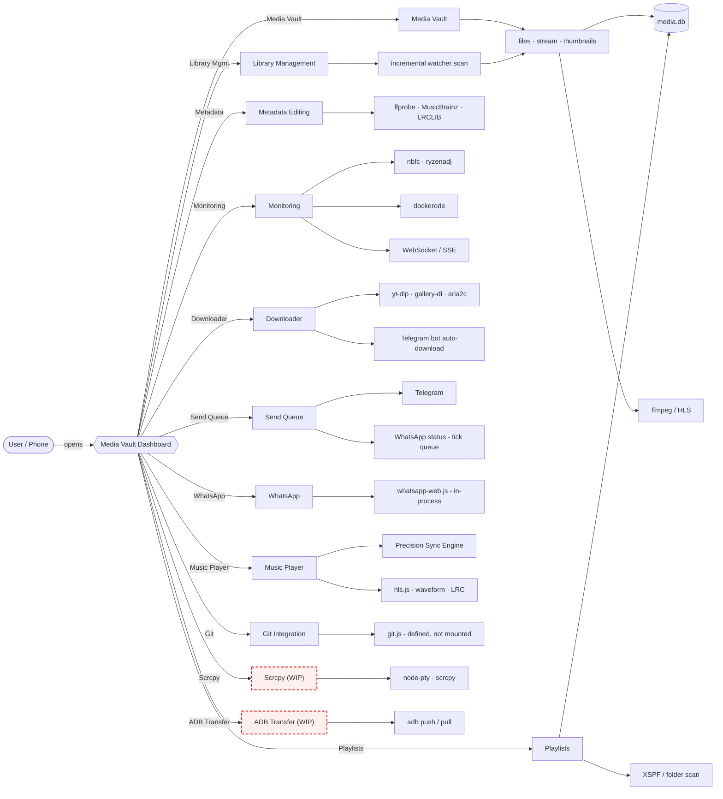

> ## 🚧 Project Status: In Progress
>
> - **Project started:** May 1, 2026
> - **Status:** Actively being worked on.
> - **Current focus (as fast as possible):**
>   - Performance optimization
>   - UI polish / beautification
>   - Bug fixing
>   - Making the logic more proper and robust
>   - Improving the menus and making them better

# Media Vault


Self-hosted media server — stream, download, manage, and monitor from one dashboard.

> ## ⚠️ IMPORTANT — Music Menu: DO NOT MODIFY THE SYNC ENGINE CARELESSLY
>
> Do not touch `frontend/src/components/Music.jsx` or its sync pipeline (`frontend/src/utils/decision/*`, `frontend/src/utils/memory/*`, `frontend/src/utils/syncCore.js`) unless you understand the whole control loop first.
>
> **Why it's dangerous.** The Music menu's MV/BG sync engine is a real-time control system that corrects millisecond-scale drift between two muted videos and the audio clock. It is *adaptive and stateful*: every ~30ms tick it reads smoothed drift (EMA, alpha 0.15), adaptive thresholds (soft = 2σ, clamp 8–40ms), confidence scores, and constraint gates, then issues `playbackRate` changes (target: keep |drift| < 10ms, landing/deadband 5ms) and hard-seeks only for gross errors (>1500ms).
>
> A careless edit **compiles cleanly but silently breaks A/V sync** — there is no build error or exception. Failures only appear at runtime:
> - Bang-bang / coarse rate switching (e.g. rate stuck at `0.850` / `1.150`),
> - Persistent drift or high sigma (sync sitting at 10ms+ forever),
> - Frame repeats / strobe loops from soft-seeks on sparse-keyframe videos.
>
> **Architecture (data → judge → action — deliberately clean & short, so the judge is never interrupted):**
> 1. **Memory layer** — per-engine drift EMA, bias, sigma, tick/decoder/scheduler telemetry (`DriftMemory`, `SchedulerMemory`, `PipelineMemory`, …).
> 2. **DerivedMetrics** — turns raw memory into facts the judge can trust: `driftMagnitude`, `driftConfidence`, `consistencyScore`, triangle MV↔BG↔Audio.
> 3. **ConstraintProvider** — hard gates that forbid actions unsafe right now (pipeline not ready, decoder unhealthy, futile seek).
> 4. **DecisionEngine (`decide`)** — picks exactly one action (HOLD / SET_RATE / SOFT_SEEK / HARD_SEEK) with a confidence value.
> 5. **ExecutionQueue** — serializes + coalesces (latest-wins per type, 100ms cooldown); the only place that calls `setRate()`/`seek()`.
> 6. **SyncCore + SyncOverlay (`SYNC DEBUG`)** — telemetry, spike recorder, decision counters, and the debug overlay used to audit judge behavior.
>
> **Before changing anything:** run `npm run build`, open the `SYNC DEBUG` overlay during playback, and verify — rate is proportional/smooth (never just two extreme values), Δ MV↔BG stays < 10ms, sigma stays low, and the judge's chosen action matches the actual drift. Never bump `rateGain`/thresholds blindly; the adaptive behavior depends on them.

> **Hardware Note:** This platform is specifically designed for AMD-based laptops. The Monitoring menu uses nbfc and ryzenadj which are hardware-specific and do not support Intel or NVIDIA systems. Other menus are hardware-agnostic.

| Information | Detail |
|-------------|--------|
| **Version** | backend v1.0.0 · frontend v1.0.0 · whatsapp-bot v1.0.0 |
| **Documentation** | See [ARCHITECTURE.md](ARCHITECTURE.md) for full technical reference |

## Table of Contents

- [About](#about)
- [Features](#features)
- [Menu Workflow](#menu-workflow)
- [Tech Stack](#tech-stack)
- [Prerequisites](#prerequisites)
- [Quick Start](#quick-start)
- [Project Structure](#project-structure)
- [API Reference](#api-reference)
- [Development](#development)
- [Codebase Metrics](#codebase-metrics)
- [Documentation](#documentation)
- [Contributing](#contributing)

## About

> **Story Behind the Menus:** This platform was built by various free AI models, with direct review by someone who is just bored and not particularly skilled at coding. Each menu was created to solve personal workflow problems.

Media Vault is a self-hosted media server born from the need to access media files without opening the laptop every time. Originally designed for personal use, it evolved into a comprehensive platform with integrated tools.

**Origin of Each Menu:**
- **Media Vault**: Created to avoid opening the laptop just to browse video, audio, and image files — access them directly from phone anywhere
- **Music Player**: Born from frustration with existing music players where previous navigation doesn't work properly (Strawberry player issue: when playing 1→5 then going back goes 5→1, but opening random track makes previous act as history, not list position — regardless of shuffle state)
- **Monitoring**: To control laptop from phone — fan speed via nbfc and clock via ryzenadj (still Linux-only, AMD-focused, under development)
- **Downloader**: Downloads from YouTube, TikTok, Instagram, Twitter/X, torrent, gallery-dl; send link to Telegram bot for auto-download to laptop with default settings (1080p, h264)
- **ADB Transfer**: Makes file transfer easier without slow file managers or memorizing terminal commands (under development)
- **Scrcpy Monitor**: Simple remote phone screen viewing (under development)
- **Send Queue**: Monitors sent/failed/cancelled files to Telegram and WA; tick-based queue system is dedicated for WA status
- **Git Integration**: Web-based Git operations without opening terminal (backend routes defined in `git.js` but **not yet mounted** in `server.js`; frontend `GitView.jsx` exists and calls `/api/git/*`, which currently returns 404)
- **WhatsApp**: WhatsApp Web pairing and bot controls, accessible from the sidebar

**Technology Stack:** Node.js, Express, SQLite, React, FFmpeg, HLS streaming, waveform visualization.

## Features

| Menu | Status | Description | Technology Used |
|------|--------|-------------|---------------|
| Media Vault | Optional | Browse and stream offline video/audio/image files seamlessly with adaptive HLS streaming, waveform visualization, and instant search | hls.js, FFmpeg, better-sqlite3 FTS, recharts, framer-motion |
| Library Management | Optional | Auto-scan, full-text search, thumbnail generation | better-sqlite3 WAL, incremental scanning |
| Playlists | Optional | XSPF import, full CRUD, drag-reorder | XSPF parser, folder-based playlists |
| Metadata Editing | Optional | Read/write audio tags, cover art, lyrics | FFprobe, MusicBrainz, LRCLIB |
| Monitoring | Optional | System stats, fan/clock control (Linux only, AMD-focused, under development) | nbfc, ryzenadj, WebSocket (real-time) |
| Downloader | Optional | Download from YouTube, TikTok, Instagram, Twitter/X, torrent, gallery-dl; send link to Telegram bot for auto-download with default settings (1080p, h264) or custom parameters | yt-dlp, gallery-dl, aria2c, Telegram bot |
| ADB Transfer | Optional | Push/pull files Android <-> laptop (concurrent workers, no overhead from file managers) | ADB, concurrent workers |
| Scrcpy Monitor | Optional | Remote phone screen viewing via external scrcpy window (zero overhead) | node-pty shell execution |
| Music Player | Optional | Dual modes: cover mode (audio only) and video mode (separate audio/video with precision sync); fixes Strawberry player navigation bug | waveform, synced LRC, hls.js, precision sync engine |
| Send Queue | Optional | Monitors sent/failed/cancelled files to Telegram and WA; tick-based queue for WA status (1-6 posts per day in 24h format) | Tick-based precision, SSE, WA/Telegram APIs |
| WhatsApp | Optional | WhatsApp Web pairing (QR), connection status, and bot/message controls | whatsapp-web.js, whatsapp-bot, /api/whatsapp |
| Git Integration | API-only (not mounted) | Full Git operations without terminal (status, branches, tags, stash, commit, push, pull, diff, file editor, tree browser); routes defined in `git.js` but not yet wired into the server; web UI (`GitView.jsx`) exists but hits 404 until routes are mounted | Simple Git wrapper |

> **Note:** All menus are still actively worked on and under development. New menus may be added in the future.

## Menu Workflow

How each sidebar menu flows from the UI to the backend and external tools:



> **Legend:** Boxes outlined in **red dashed** — **Scrcpy Monitor** and **ADB Transfer** — are *not* the current development focus. They are usable but still rough, with known bugs and incomplete UX. Current effort concentrates on Media Vault, Music sync, Monitoring, Downloader, and Send Queue polish. Git Integration routes exist but are not yet mounted (see [ARCHITECTURE.md](ARCHITECTURE.md)).

## Tech Stack

### Backend Dependencies

| Package | Version | Purpose |
|---------|---------|---------|
| better-sqlite3 | ^12.9.0 | SQLite driver (WAL mode) |
| busboy | ^1.6.0 | Multipart upload |
| compression | ^1.8.1 | Gzip/deflate |
| cors | ^2.8.5 | CORS middleware |
| dockerode | ^5.0.0 | Docker monitoring |
| express | ^4.21.0 | HTTP framework |
| fast-xml-parser | ^5.8.0 | XSPF parsing |
| mime-types | ^2.1.35 | Content-type |
| node-pty | ^1.1.0 | PTY shell |
| node-telegram-bot-api | ^1.1.0 | Telegram send + bot downloader |
| qrcode | ^1.5.4 | QR generation |
| uuid | ^10.0.0 | ID generation |
| ws | ^8.21.0 | WebSocket server |

### Frontend Dependencies

| Package | Version | Purpose |
|---------|---------|---------|
| framer-motion | ^12.40.0 | Animations |
| hls.js | ^1.5.17 | HLS video player |
| lucide-react | ^1.16.0 | Icons |
| qrcode | ^1.5.4 | QR codes |
| react | ^18.3.1 | UI framework |
| react-dom | ^18.3.1 | DOM renderer |
| react-intersection-observer | ^9.16.0 | Lazy loading |
| react-markdown | ^10.1.0 | Markdown rendering |
| react-router-dom | ^7.15.1 | Routing |
| react-virtualized-auto-sizer | ^1.0.26 | Virtual sizing |
| react-window | ^1.8.11 | Virtualized grid |
| recharts | ^3.8.1 | Charts |
| rehype-highlight | ^7.0.2 | Syntax highlighting |
| remark-gfm | ^4.0.1 | GitHub-flavored markdown |
| source-map-js | ^1.2.1 | Source maps |
| tailwindcss-animate | ^1.0.7 | Tailwind animations |
| zustand | ^5.0.13 | State management |

### WhatsApp Bot Dependencies

| Package | Version | Purpose |
|---------|---------|---------|
| better-sqlite3 | ^12.9.0 | SQLite wrapper |
| qrcode-terminal | ^0.12.0 | Terminal QR display |
| whatsapp-web.js | ^1.34.7 | WhatsApp Web API |

## External Tools

| Binary | Purpose |
|--------|---------|
| ffmpeg | Thumbnails, HLS, transcode, remux |
| ffprobe | Codec detection, metadata |
| yt-dlp | YouTube, Instagram download |
| gallery-dl | TikTok, Twitter/X, Instagram galleries |
| aria2c | Torrent download |
| adb | Android transfer |

## Prerequisites

| Requirement | Version | Purpose |
|-------------|---------|---------|
| Node.js | >= 18 | Runtime |
| ffmpeg / ffprobe | any recent | Transcode, thumbnails, HLS |
| yt-dlp | latest | Video download |
| gallery-dl | latest | Gallery download |
| aria2c | latest | Torrent / parallel |
| adb | latest | Android transfer |
| nbfc / ryzenadj | — | AMD-only fan/clock control |

## Quick Start

```bash
# 1. Clone
git clone <repo-url>
cd homelab-media-server

# 2. Backend
cd backend && npm install
cp ../.env.example ../credentials/.env   # edit as needed
npm start

# 3. Frontend (dev only)
cd frontend && npm install && npm run dev
```

> **Note:** In production, the frontend is served statically by the backend. Vite is for development only.

## Project Structure

```
homelab-media-server/
├── backend/          # Express API + media processing
├── frontend/         # React 18 SPA
├── whatsapp-bot/     # WhatsApp integration
├── data/             # media.db, download tasks, thumbnails
├── cache/            # HLS, remux, transcode cache
├── logs/             # Rotating logs
├── credentials/      # .env, auth files (gitignored)
└── docs/             # Documentation archives
```

### Backend

| Path | Description |
|------|-------------|
| `backend/src/server.js` | Entry point, Express, lifecycle |
| `backend/src/db.js` | SQLite database, FTS, settings |
| `backend/src/routes/` | 19 route modules |
| `backend/src/monitor/` | System metrics |
| `backend/src/services/` | Background service modules |
| `backend/src/utils/` | Helpers (watcher, downloader, upload) |
| `backend/src/middleware/` | Route guards |

| Route Module | Description |
|--------------|-------------|
| `adb.js` | Android transfer |
| `downloader.js` | Download management (yt-dlp, gallery-dl, aria2c) |
| `file.js` | Raw file serve (range, cache headers) |
| `files.js` | File listing, FTS search, pagination |
| `git.js` | Git operations (defined, NOT mounted — see Subsystems) |
| `jobs.js` | Background job status |
| `metadata.js` | Audio tags, covers, lyrics |
| `monitoring.js` | Stats, history, alerts |
| `playback.js` | Cache, health, config |
| `playlists.js` | XSPF import, CRUD |
| `scrcpy.js` | Scrcpy control |
| `send.js` | Telegram send |
| `services.js` | Service registry |
| `settings.js` | Config CRUD |
| `stream.js` | Video/audio streaming |
| `thumbnails.js` | Thumbnail generation |
| `upload.js` | Multipart upload |
| `videoCache.js` | Video cache management |
| `whatsapp.js` | WhatsApp bridge |

### Frontend

| Path | Description |
|------|-------------|
| `frontend/src/App.jsx` | Main application |
| `frontend/src/main.jsx` | Vite entry |
| `frontend/src/components/` | 65 components |
| `frontend/src/store/` | Zustand stores |
| `frontend/src/hooks/` | Custom hooks |
| `frontend/src/utils/` | Utility functions |
| `frontend/src/monitoring/` | Monitoring dashboard pages |
| `frontend/src/debug/` | Debug utilities and inspectors |

### WhatsApp Bot

| Path | Description |
|------|-------------|
| `whatsapp-bot/src/index.js` | Entry point |
| `whatsapp-bot/src/connection.js` | WhatsApp connection |
| `whatsapp-bot/src/listener.js` | Message handler |
| `whatsapp-bot/src/sender.js` | Outbound sender |
| `whatsapp-bot/src/db.js` | SQLite wrapper |
| `whatsapp-bot/src/utils.js` | Utilities |

### Data Directories

| Path | Description |
|------|-------------|
| `data/` | `media.db`, download tasks, thumbnails |
| `cache/` | HLS, remux, transcode cache |
| `logs/` | Rotating logs |
| `credentials/` | `.env`, auth files, WhatsApp sessions |

## API Reference

**Files & Search** (`/api/files`, `/api/search`)

| Method | Endpoint | Purpose |
|--------|----------|---------|
| GET | `/api/files` | Browse a folder with cursor pagination |
| GET | `/api/files/shuffle` | Return all playable files in random order |
| POST | `/api/files/refresh` | Run incremental scan + orphan cleanup |
| POST | `/api/files/cleanup` | Remove orphan DB entries |
| GET | `/api/files/stats` | Quick file-type counts |
| GET | `/api/files/folders/:id` | Resolve folder id to path metadata |
| GET | `/api/files/:id/previews` | Up to 4 preview file IDs for a folder |
| GET | `/api/search` | FTS file search + folder search |
| GET | `/api/search/suggest` | Autocomplete name suggestions |

**Streaming & Playback** (`/stream`)

| Method | Endpoint | Purpose |
|--------|----------|---------|
| GET | `/stream/video/:id/playback-info` | Playback decision + mobile flags |
| GET | `/stream/video/:id` | Stream video (direct/remux/transcode) |
| GET | `/stream/video/:id/hls/playlist.m3u8` | HLS playlist |
| GET | `/stream/video/:id/hls/segment-:n.ts` | HLS segment |
| GET | `/stream/video/:id/faststart` | Re-mux with +faststart |
| GET | `/stream/audio/:id` | Audio stream with ranges |

**Monitoring** (`/api/monitoring`)

| Method | Endpoint | Purpose |
|--------|----------|---------|
| GET | `/api/monitoring/stats` | Current system stats |
| GET | `/api/monitoring/overview` | Combined overview |
| GET | `/api/monitoring/history` | Historical metrics |
| GET | `/api/monitoring/disk-io/*` | Disk I/O stats |
| POST | `/api/monitoring/system/power` | Host power control |

**Downloader** (`/api/download`)

| Method | Endpoint | Purpose |
|--------|----------|---------|
| GET | `/api/download/stream` | SSE task stream |
| POST | `/api/download/start` | Create download task |
| POST | `/api/download/bulk` | Create multiple tasks |
| GET | `/api/download/list` | All tasks |
| POST | `/api/download/:id/cancel` | Cancel task |
| POST | `/api/download/:id/retry` | Retry failed task |

**Playlists** (`/api/playlists`)

| Method | Endpoint | Purpose |
|--------|----------|---------|
| GET | `/api/playlists` | All discovered playlists |
| GET | `/api/playlists/:id` | Playlist details |
| POST | `/api/playlists/create/manual` | Create from file IDs |
| POST | `/api/playlists/create/folder` | Create from folder |
| PUT | `/api/playlists/:id/tracks` | Add tracks |
| DELETE | `/api/playlists/:id/tracks/:trackId` | Remove track |

**Metadata** (`/api/metadata`)

| Method | Endpoint | Purpose |
|--------|----------|---------|
| GET | `/api/metadata/:id` | Read metadata |
| PUT | `/api/metadata/:id` | Update tags |
| PUT | `/api/metadata/:id/cover/upload` | Embed cover art |
| GET | `/api/metadata/:id/lyrics` | Get lyrics |

**Services** (`/api/services`)

| Method | Endpoint | Purpose |
|--------|----------|---------|
| GET | `/api/services` | All service statuses |
| POST | `/api/services/:name/start` | Start service |
| POST | `/api/services/:name/stop` | Stop service |

**ADB Transfer** (`/api/adb`)

| Method | Endpoint | Purpose |
|--------|----------|---------|
| GET | `/api/adb/devices` | Connected devices |
| POST | `/api/adb/push` | Push files (workers) |
| POST | `/api/adb/pull` | Pull files from device |
| GET | `/api/adb/jobs` | Transfer jobs |
| GET | `/api/adb/jobs/:id/progress` | SSE progress |

**Git** (NOT MOUNTED — `backend/src/routes/git.js`)

| Method | Endpoint | Purpose |
|--------|----------|---------|
| G | `/status` | Working tree status |
| G | `/diff` | Unstaged diff |
| G | `/diff-commit` | Commit diff |
| G | `/unpushed` | Unpushed commits |
| G | `/log` | Commit log |
| G | `/branches` | Branches |
| G | `/tags` | Tags |
| G | `/stash-list` | Stash list |
| G | `/tree` | File tree |
| G | `/file` | Read file |
| P | `/file` | Write file |
| G | `/gitignore` | Show .gitignore |
| P | `/gitignore` | Update .gitignore |
| P | `/stage` | Stage changes |
| P | `/commit` | Commit |
| P | `/push` | Push |
| P | `/pull` | Pull |
| P | `/checkout` | Checkout branch/ref |
| P | `/merge` | Merge |
| P | `/stash` | Stash |
| P | `/tag` | Create tag |

> **Note:** Git routes are defined in `backend/src/routes/git.js` but **never registered** in `backend/src/server.js`. Calls to `/api/git/*` return 404 until they are mounted. The frontend `GitView.jsx` component already calls these endpoints.

> For the complete API specification, see [ARCHITECTURE.md](ARCHITECTURE.md).

## Development

| Package | Command | Description |
|---------|---------|-------------|
| backend | `npm start` | Start server |
| backend | `npm run dev` | Auto-reload mode |
| backend | `npm run debug` | Debug mode |
| frontend | `npm run dev` | Vite dev server |
| frontend | `npm run build` | Production build |
| whatsapp-bot | `npm start` | Start bot |
| whatsapp-bot | `npm run dev` | Auto-reload mode |

> **Note:** `backend/`, `frontend/`, and `whatsapp-bot/` are independent packages (not a monorepo).

## Codebase Metrics

| Directory | Files | Lines of Code |
|-----------|-------|---------------|
| `backend/src/` | 91 | ~26,042 |
| `frontend/src/` | 193 | ~46,858 |
| `whatsapp-bot/src/` | 6 | ~921 |
| **Total** | **290** | **~73,821** |

> Note: Lines of code approximate. Does not include `node_modules`, `cache/`, `logs/`, or `data/`.

## Future Ideas

- **Authentication System**: The auth design is still under consideration — ranging from user login and multi-user support to account recovery in case a user loses their password.
- **Web Stream-based Remote Control (GSR-inspired)**: Direct frame copying from the GPU block encoder for zero-overhead screen capture.
- **Modular Web / Menu Splitting**: Break the web app into independent modules so a deployment does not need the full repo or every menu. Users could pick only 1–2 menus (e.g. just Media Vault + Music, or just Downloader) and run a lighter build with only the selected backend routes, frontend bundles, and dependencies loaded.

## Documentation

| File | Description |
|------|-------------|
| [README.md](README.md) | This file — project overview and quick start |
| [ARCHITECTURE.md](ARCHITECTURE.md) | Full technical reference (system architecture, DB schema, API routes, subsystems, monitoring, deployment) |
| `docs/` | Notes, ideas, and archived documentation |

## Contributing

- Read [ARCHITECTURE.md](ARCHITECTURE.md) for technical details
- Use `npm run dev` in each directory
- Report issues on GitHub
